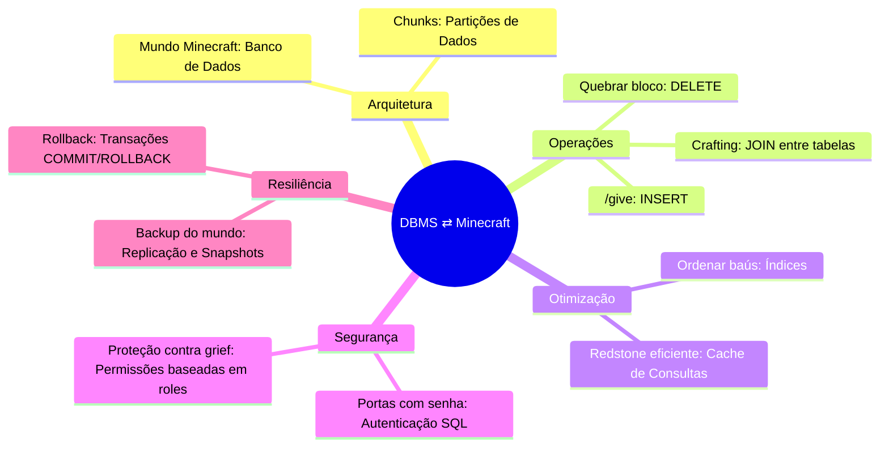

# Sistemas de Gerenciamento de Banco de Dados (DBMS)

Um **Sistema de Gerenciamento de Banco de Dados (DBMS)** é a espinha dorsal de qualquer aplicação que lida com dados estruturados. Assim como no **Minecraft**, onde cada bloco, entidade e mecanismo de redstone segue regras precisas para criar um mundo funcional, um DBMS fornece a estrutura e os mecanismos necessários para armazenar, recuperar, gerenciar e proteger dados de forma eficiente.  

## **Por que DBMS é como o Minecraft?**  

1. **Organização Estrutural**  
   - No Minecraft, você organiza seus itens em baús, categorizando recursos para acesso rápido.  
   - Em um DBMS, **tabelas** funcionam como baús, **linhas** são os itens armazenados, e **colunas** definem os atributos (ex.: tipo de bloco, durabilidade, quantidade).  

2. **Mecanismos de Busca e Consulta**  
   - Assim como usar `/give` ou procurar um diamante em cavernas, um DBMS permite **consultas SQL** (`SELECT`, `WHERE`, `JOIN`) para extrair dados exatos sob demanda.  

3. **Escalabilidade e Performance**  
   - Um mundo de Minecraft mal otimizado trava com muitas entidades.  
   - Um DBMS usa **indexação** (como chunk loading eficiente) e **otimização de consultas** para evitar lentidão.  

4. **Segurança e Integridade**  
   - Assim como proteger sua base contra creepers com paredes e tochas, um DBMS implementa:  
     - **Controle de Acesso (ACL)** – Quem pode ler/escrever dados?  
     - **Transações ACID** – Garantia de que operações críticas (ex.: troca de itens entre jogadores) não falhem no meio do caminho.  

5. **Backup e Recuperação**  
   - Assim como copiar seu mundo para evitar perdas, um DBMS oferece:  
     - **Backups automáticos**  
     - **Recuperação pontual (Point-in-Time Recovery)**  

## **Mapa Mental: DBMS em Analogia com Minecraft**  

## **Por que Aprender DBMS?**  

Dominar bancos de dados é como dominar os princípios da redstone: permite construir sistemas complexos, escaláveis e confiáveis. Seja para jogos, aplicações web ou análise de dados, um **DBMS bem projetado é a diferença entre uma estrutura frágil de madeira e uma fortaleza de netherite**.  
