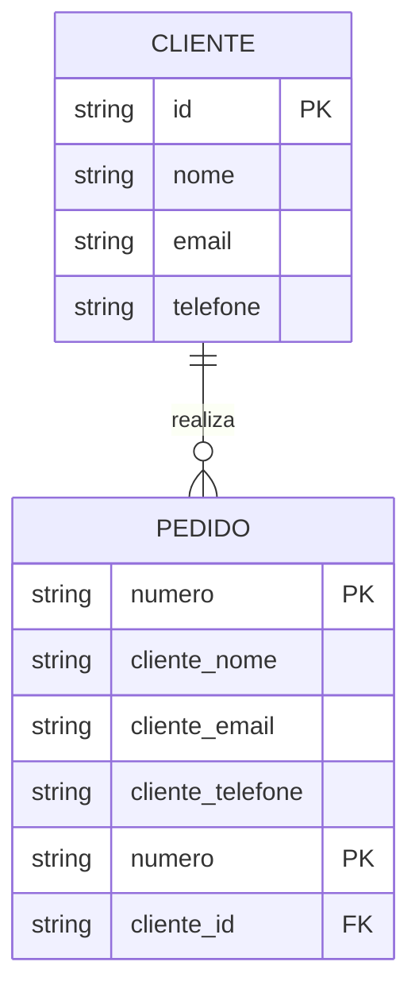
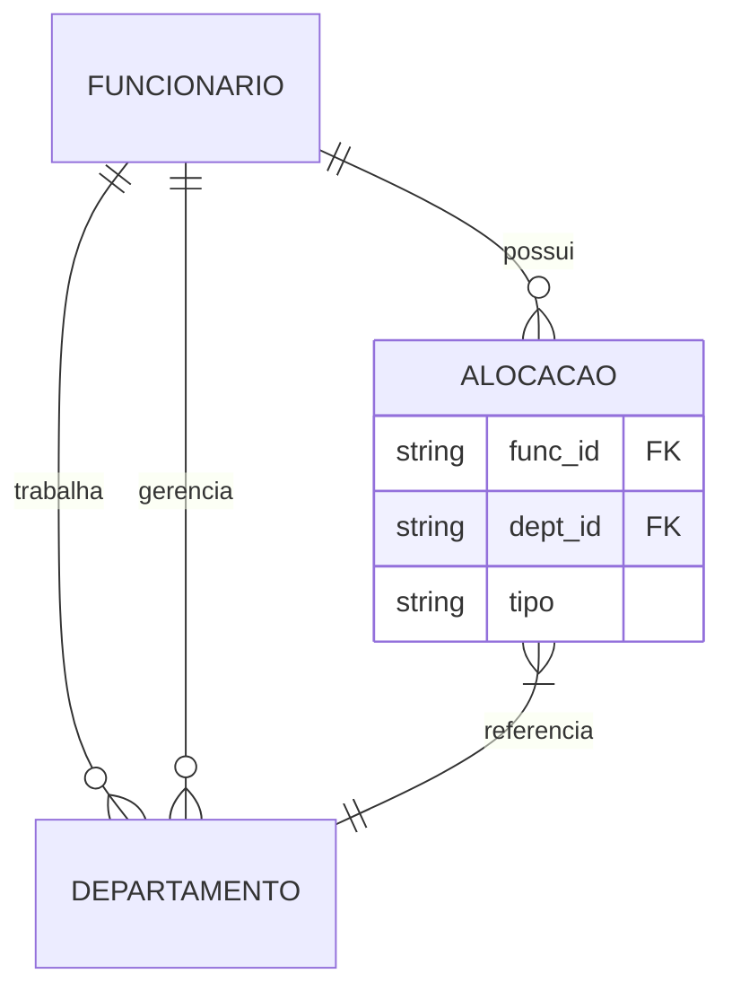
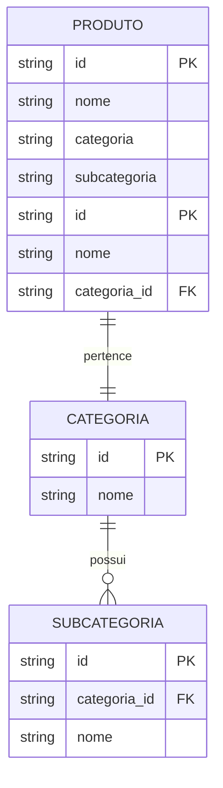
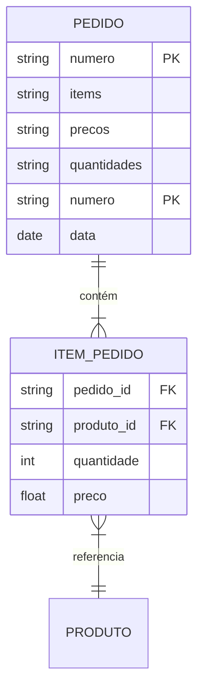

# Anti-Padrões em Modelagem ER

Anti-padrões são soluções comuns mas problemáticas que devem ser evitadas no design de modelos ER.

## Tipos de Anti-Padrões

### 1. Estruturais
- Redundância excessiva
- Normalização inadequada
- Relacionamentos ambíguos
- Chaves mal definidas

### 2. Comportamentais
- Violação de integridade
- Inconsistência de dados
- Falta de atomicidade
- Problemas de concorrência

### 3. Arquiteturais
- Acoplamento excessivo
- Falta de escalabilidade
- Complexidade desnecessária
- Falta de flexibilidade

## Anti-Padrões Comuns

### 1. Redundância de Dados

### 2. Relacionamentos Ambíguos

## Problemas e Consequências

### 1. Redundância
- Inconsistência de dados
- Anomalias de atualização
- Desperdício de espaço
- Complexidade de manutenção

### 2. Ambiguidade
- Dificuldade de entendimento
- Erros de implementação
- Problemas de integridade
- Complexidade de queries

### 3. Desnormalização Excessiva
- Duplicação de dados
- Inconsistências
- Dificuldade de manutenção
- Performance comprometida

## Como Identificar

### 1. Sinais de Alerta
- Dados duplicados
- Relacionamentos circulares
- Atributos multivalorados
- Dependências parciais

### 2. Análise de Impacto
- Performance degradada
- Dificuldade de mudança
- Erros frequentes
- Complexidade crescente

## Como Corrigir

### 1. Refatoração

### 2. Normalização

## Prevenção

### 1. Boas Práticas
- Modelagem cuidadosa
- Revisão por pares
- Testes adequados
- Documentação clara

### 2. Validação Contínua
- Análise de performance
- Revisão de estrutura
- Monitoramento de uso
- Feedback de usuários

## Checklist de Revisão

### 1. Estrutura
- [ ] Ausência de redundância
- [ ] Normalização adequada
- [ ] Relacionamentos claros
- [ ] Chaves bem definidas

### 2. Comportamento
- [ ] Integridade garantida
- [ ] Consistência mantida
- [ ] Atomicidade respeitada
- [ ] Concorrência tratada

### 3. Arquitetura
- [ ] Acoplamento controlado
- [ ] Escalabilidade possível
- [ ] Complexidade justificada
- [ ] Flexibilidade mantida

## Conclusão

Evitar anti-padrões é crucial para:
- Qualidade do sistema
- Manutenibilidade
- Performance
- Escalabilidade

Benefícios da prevenção:
- Menos bugs
- Menor custo
- Maior satisfação
- Melhor evolução