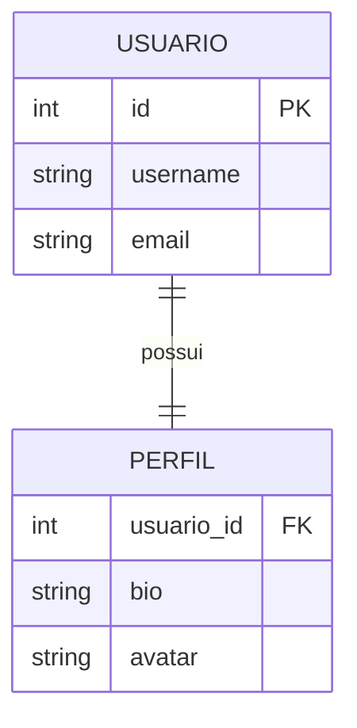
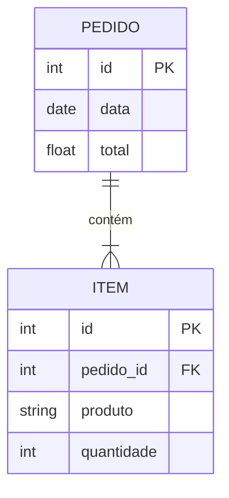
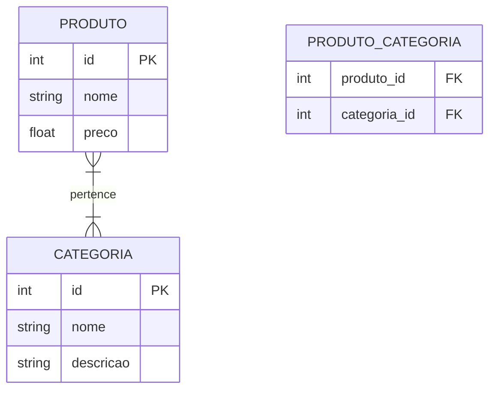

# Padrões de Associação

## One-to-One



### Implementação
```sql
CREATE TABLE usuario (
    id INT PRIMARY KEY,
    username VARCHAR(50),
    email VARCHAR(100)
);

CREATE TABLE perfil (
    usuario_id INT PRIMARY KEY,
    bio TEXT,
    avatar VARCHAR(200),
    FOREIGN KEY (usuario_id) REFERENCES usuario(id)
);
```

## One-to-Many



### Implementação
```sql
CREATE TABLE pedido (
    id INT PRIMARY KEY,
    data DATE,
    total DECIMAL(10,2)
);

CREATE TABLE item (
    id INT PRIMARY KEY,
    pedido_id INT,
    produto VARCHAR(100),
    quantidade INT,
    FOREIGN KEY (pedido_id) REFERENCES pedido(id)
);
```

## Many-to-Many



### Implementação
```sql
CREATE TABLE produto (
    id INT PRIMARY KEY,
    nome VARCHAR(100),
    preco DECIMAL(10,2)
);

CREATE TABLE categoria (
    id INT PRIMARY KEY,
    nome VARCHAR(50),
    descricao TEXT
);

CREATE TABLE produto_categoria (
    produto_id INT,
    categoria_id INT,
    PRIMARY KEY (produto_id, categoria_id),
    FOREIGN KEY (produto_id) REFERENCES produto(id),
    FOREIGN KEY (categoria_id) REFERENCES categoria(id)
);
```