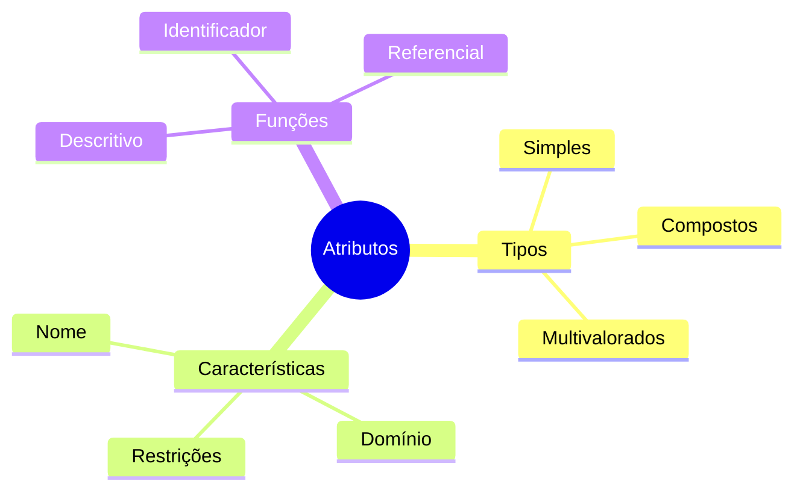
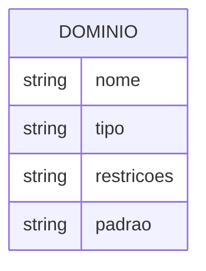
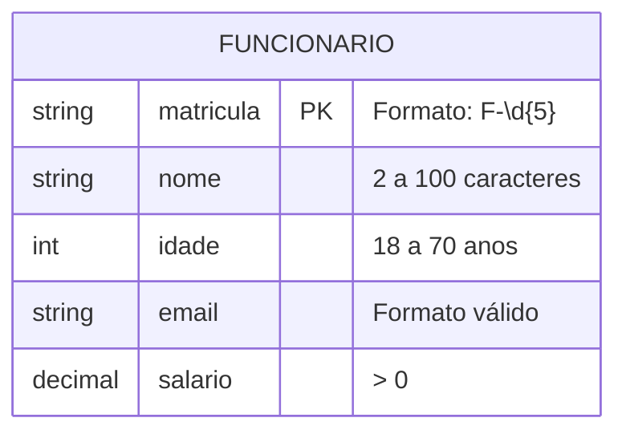
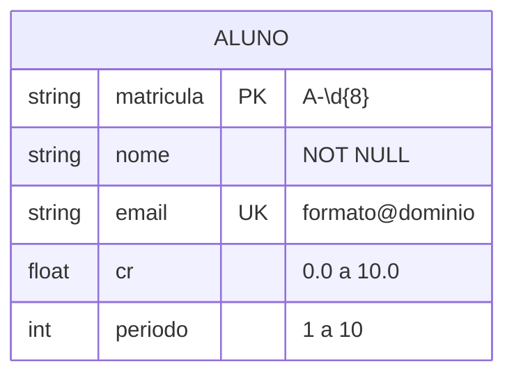
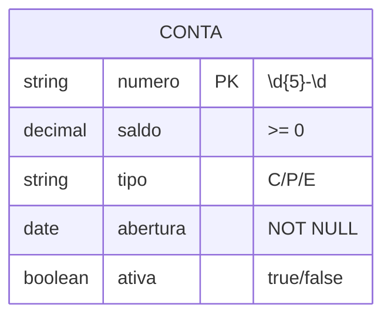

# Atributos e Domínios

## Atributos

### Definição
Um atributo é uma característica ou propriedade que descreve uma entidade.



### Classificação dos Atributos

1. **Quanto à Estrutura**
   - **Simples (Atômicos)**
     - Indivisíveis
     - Exemplo: CPF, idade
   
   - **Compostos**
     - Divisíveis em partes
     - Exemplo: endereço (rua, número, cidade)
   
   - **Multivalorados**
     - Múltiplos valores
     - Exemplo: telefones, emails

2. **Quanto à Função**
   - **Identificadores (Chaves)**
     - Chave Primária (PK)
     - Chave Estrangeira (FK)
     - Chave Única (UK)
   
   - **Descritivos**
     - Características
     - Propriedades

## Domínios

### Definição
Um domínio é o conjunto de valores possíveis para um atributo.

### Tipos de Domínios



1. **Domínios Básicos**
   - Números inteiros
   - Números reais
   - Texto
   - Data/hora
   - Booleano

2. **Domínios Personalizados**
   - Enumerações
   - Intervalos
   - Padrões

### Exemplo Prático

```sql
CREATE DOMAIN Email AS VARCHAR(100)
    CHECK (VALUE ~ '^[A-Za-z0-9._%+-]+@[A-Za-z0-9.-]+\.[A-Za-z]{2,}$');

CREATE DOMAIN Idade AS INTEGER
    CHECK (VALUE >= 0 AND VALUE <= 150);

CREATE DOMAIN StatusPedido AS VARCHAR(20)
    CHECK (VALUE IN ('Pendente', 'Aprovado', 'Cancelado'));
```

## Restrições de Domínio

### Tipos de Restrições

1. **Tipo de Dado**
   - INTEGER
   - VARCHAR
   - DATE
   - DECIMAL

2. **Intervalo de Valores**
   - CHECK constraints
   - Mínimo/Máximo
   - Enumerações

3. **Formato**
   - Expressões regulares
   - Padrões específicos
   - Máscaras

### Exemplos de Implementação



## Boas Práticas

### 1. Definição de Atributos
- Nomes significativos
- Tipos apropriados
- Restrições adequadas

### 2. Gerenciamento de Domínios
- Reutilização
- Consistência
- Documentação

### 3. Validação de Dados
- Regras de negócio
- Integridade
- Performance

## Exemplos Detalhados

### Sistema Acadêmico



### Sistema Financeiro



## Considerações Importantes

### 1. Integridade
- Validações consistentes
- Regras de negócio
- Consistência dos dados

### 2. Performance
- Tipos eficientes
- Índices apropriados
- Otimização

### 3. Manutenibilidade
- Documentação clara
- Padrões consistentes
- Evolução controlada