# Atributos

Atributos são propriedades ou características que descrevem entidades e relacionamentos em um modelo ER.

## Tipos de Atributos

### 1. Quanto à Estrutura

#### Atributos Simples
- Valores atômicos, indivisíveis
- Exemplo: CPF, idade, email

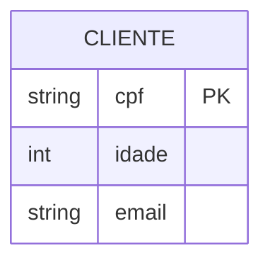

#### Atributos Compostos
- Podem ser divididos em partes menores
- Exemplo: endereço (rua, número, cidade)

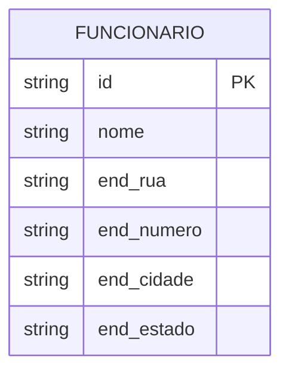

#### Atributos Multivalorados
- Podem ter múltiplos valores
- Exemplo: telefones, emails

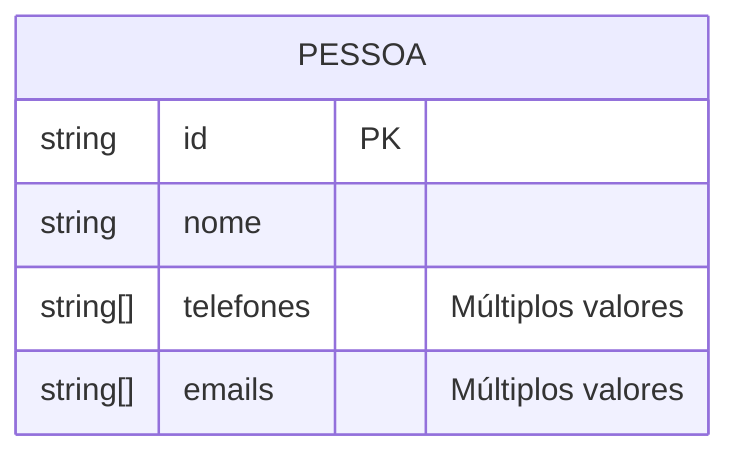

### 2. Quanto à Função

#### Atributos Identificadores (Chaves)
- **Chave Primária (PK)**
  - Identifica unicamente cada instância
  - Não pode ser nulo ou duplicado

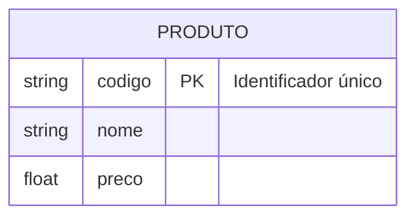

- **Chave Estrangeira (FK)**
  - Referencia chave primária de outra entidade
  - Estabelece relacionamentos

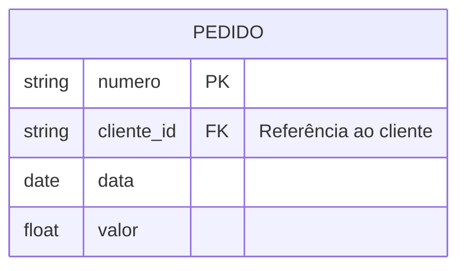

- **Chave Única (UK)**
  - Valor único mas não primário
  - Exemplo: email, matrícula

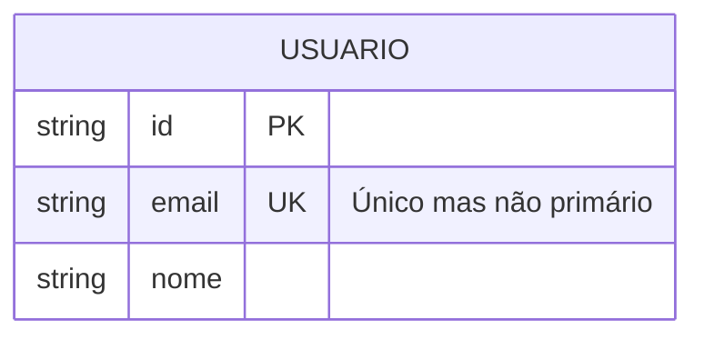

#### Atributos Descritivos
- Descrevem características
- Não são identificadores
- Exemplo: nome, descrição, data

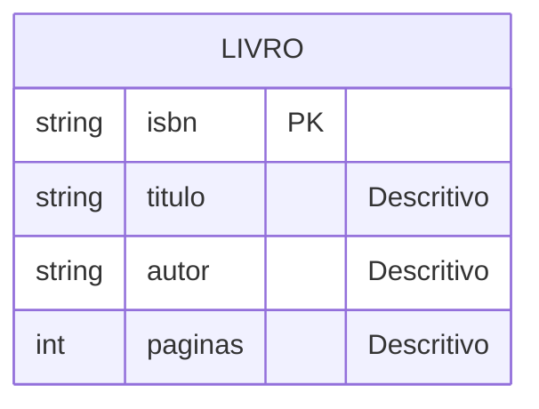

### 3. Quanto ao Valor

#### Atributos Obrigatórios
- Não podem ser nulos
- Essenciais para a entidade

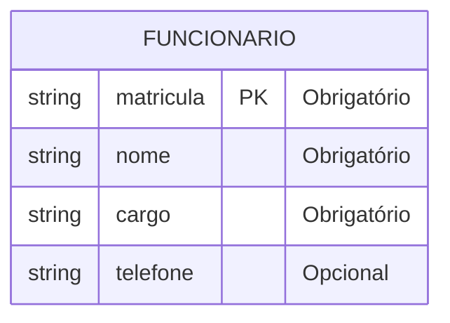

#### Atributos Opcionais
- Podem ser nulos
- Não essenciais

#### Atributos Derivados
- Calculados a partir de outros
- Exemplo: idade (calculada da data de nascimento)

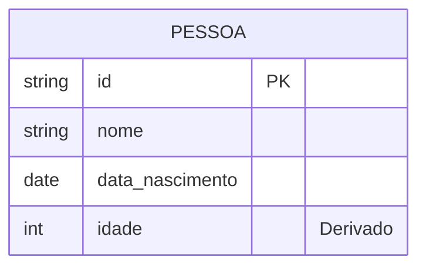

## Boas Práticas

### 1. Nomenclatura
- Use nomes significativos
- Mantenha padrão consistente
- Evite abreviações ambíguas

### 2. Tipos de Dados
- Escolha tipos apropriados
- Defina tamanhos adequados
- Considere restrições

### 3. Normalização
- Evite redundância
- Mantenha atomicidade
- Considere dependências

## Exemplos Práticos

### Sistema de Vendas

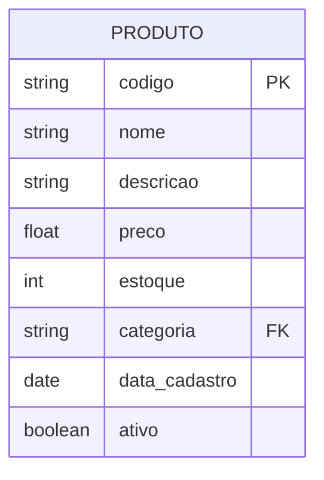

### Sistema de RH

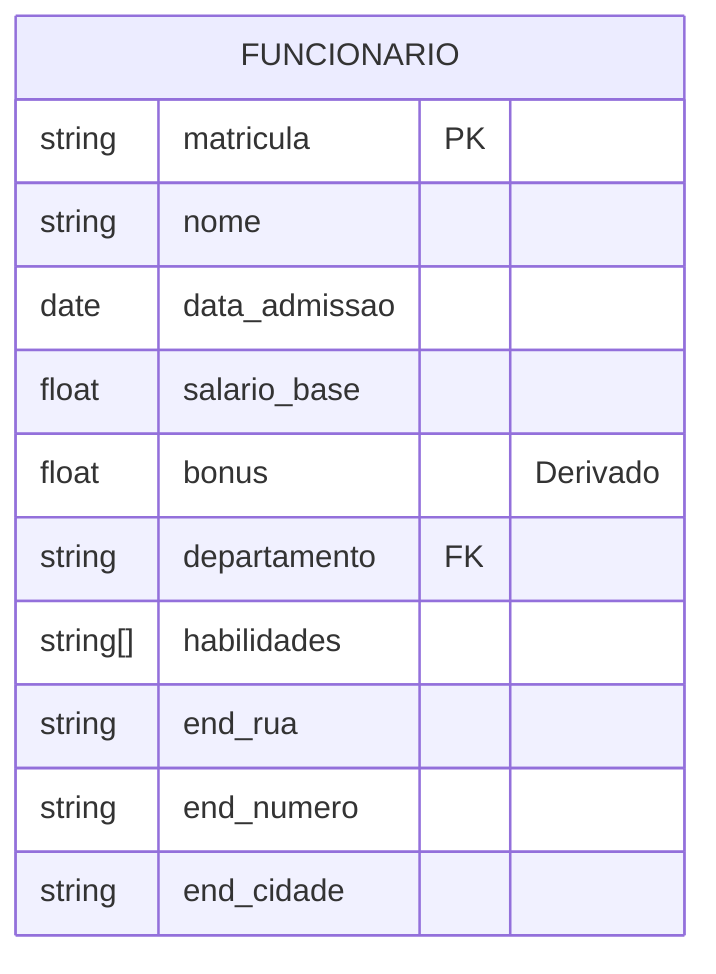

## Considerações Importantes

### 1. Integridade
- Defina restrições adequadas
- Valide valores permitidos
- Mantenha consistência

### 2. Performance
- Otimize tipos de dados
- Planeje índices
- Considere volume

### 3. Manutenibilidade
- Documente decisões
- Facilite evolução
- Mantenha simplicidade

## Padrões Comuns

### 1. Atributos de Auditoria
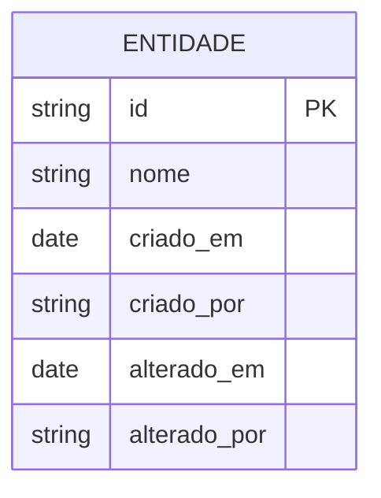

### 2. Atributos de Status
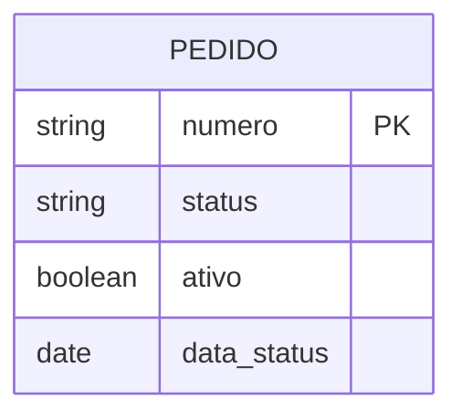

## Conclusão

Atributos são fundamentais para:
- Descrição de dados
- Integridade do modelo
- Funcionalidade do sistema
- Qualidade da informação

A modelagem adequada de atributos:
- Facilita manutenção
- Melhora performance
- Garante consistência
- Suporta evolução