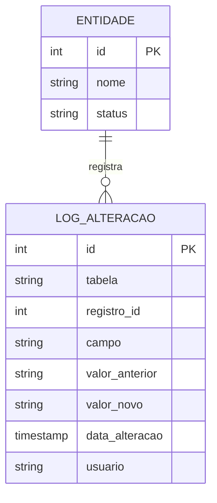
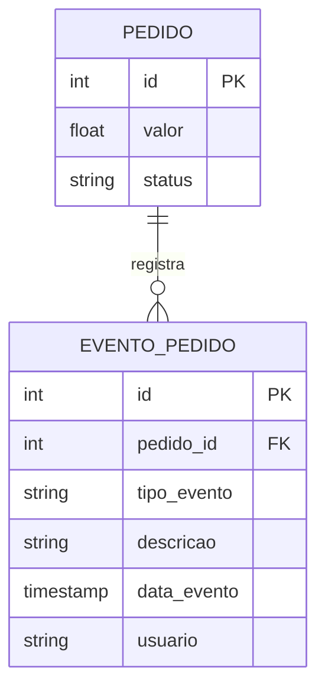
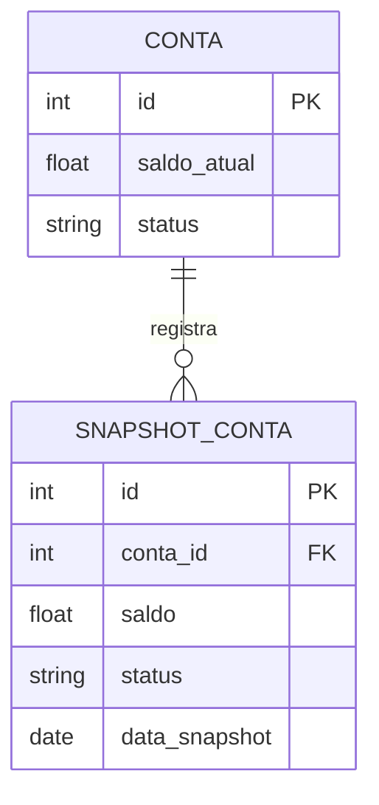

# Padrões de Auditoria

## Log de Alterações



### Implementação
```sql
CREATE TABLE log_alteracao (
    id INT PRIMARY KEY,
    tabela VARCHAR(50),
    registro_id INT,
    campo VARCHAR(50),
    valor_anterior TEXT,
    valor_novo TEXT,
    data_alteracao TIMESTAMP,
    usuario VARCHAR(50)
);

-- Trigger de exemplo
CREATE TRIGGER tr_audit_entidade
AFTER UPDATE ON entidade
FOR EACH ROW
INSERT INTO log_alteracao (
    tabela, registro_id, campo, 
    valor_anterior, valor_novo, 
    data_alteracao, usuario
) VALUES (
    'entidade', NEW.id, 'status',
    OLD.status, NEW.status,
    CURRENT_TIMESTAMP, CURRENT_USER
);
```

## Trilha de Auditoria



### Implementação
```sql
CREATE TABLE evento_pedido (
    id INT PRIMARY KEY,
    pedido_id INT,
    tipo_evento VARCHAR(50),
    descricao TEXT,
    data_evento TIMESTAMP,
    usuario VARCHAR(50),
    FOREIGN KEY (pedido_id) REFERENCES pedido(id)
);
```

## Snapshot



### Implementação
```sql
CREATE TABLE snapshot_conta (
    id INT PRIMARY KEY,
    conta_id INT,
    saldo DECIMAL(10,2),
    status VARCHAR(20),
    data_snapshot DATE,
    FOREIGN KEY (conta_id) REFERENCES conta(id)
);

-- Procedure para criar snapshot
CREATE PROCEDURE criar_snapshot_diario()
BEGIN
    INSERT INTO snapshot_conta (
        conta_id, saldo, status, data_snapshot
    )
    SELECT 
        id, saldo_atual, status, CURRENT_DATE
    FROM conta;
END;
```