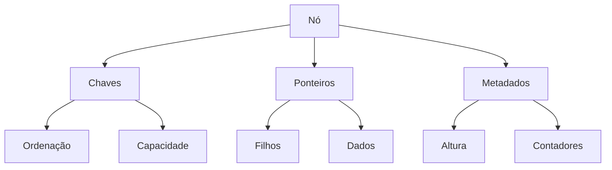

# Implementação de Árvores B

## Estrutura Básica



### Definição do Nó
```java
class BNode {
    int[] keys;          // array de chaves
    BNode[] children;    // array de ponteiros
    int keyCount;        // número de chaves
    boolean isLeaf;      // flag de folha
    int minDegree;       // grau mínimo da árvore
}

class BTree {
    BNode root;          // raiz da árvore
    int minDegree;       // grau mínimo da árvore
    
    public BTree(int degree) {
        this.root = null;
        this.minDegree = degree;
    }
}
```

### Propriedades Fundamentais
- Ordem da árvore (t)
- Número mínimo de chaves (t-1)
- Número máximo de chaves (2t-1)
- Número mínimo de filhos (t)
- Número máximo de filhos (2t)

## Operações Fundamentais

### 1. Busca
#### Algoritmo de Busca
```java
BNode search(BNode node, int key) {
    int i = 0;
    while (i < node.keyCount && key > node.keys[i]) {
        i++;
    }
    
    if (i < node.keyCount && key == node.keys[i]) {
        return node;
    }
    
    if (node.isLeaf) {
        return null;
    }
    
    return search(node.children[i], key);
}
```

#### Complexidade
- Melhor caso: O(1)
- Caso médio: O(log n)
- Pior caso: O(log n)

### 2. Inserção
#### Processo de Split
```java
void splitChild(BNode parent, int index, BNode child) {
    BNode newNode = new BNode(child.minDegree);
    newNode.isLeaf = child.isLeaf;
    newNode.keyCount = minDegree - 1;
    
    // Copiar chaves superiores para novo nó
    for (int j = 0; j < minDegree - 1; j++) {
        newNode.keys[j] = child.keys[j + minDegree];
    }
    
    // Se não for folha, copiar ponteiros correspondentes
    if (!child.isLeaf) {
        for (int j = 0; j < minDegree; j++) {
            newNode.children[j] = child.children[j + minDegree];
        }
    }
    
    child.keyCount = minDegree - 1;
    
    // Mover ponteiros do pai
    for (int j = parent.keyCount; j >= index + 1; j--) {
        parent.children[j + 1] = parent.children[j];
    }
    
    parent.children[index + 1] = newNode;
    
    // Mover chaves do pai e inserir chave mediana
    for (int j = parent.keyCount - 1; j >= index; j--) {
        parent.keys[j + 1] = parent.keys[j];
    }
    parent.keys[index] = child.keys[minDegree - 1];
    parent.keyCount++;
}
```

#### Algoritmo de Inserção
```java
void insert(int key) {
    if (root == null) {
        root = new BNode(minDegree);
        root.keys[0] = key;
        root.keyCount = 1;
        root.isLeaf = true;
    } else {
        if (root.keyCount == 2 * minDegree - 1) {
            BNode newRoot = new BNode(minDegree);
            newRoot.children[0] = root;
            splitChild(newRoot, 0, root);
            insertNonFull(newRoot, key);
            root = newRoot;
        } else {
            insertNonFull(root, key);
        }
    }
}
```

### 3. Remoção
#### Casos de Remoção
1. Remoção de chave em nó folha
2. Remoção de chave em nó interno
3. Merge de nós
4. Redistribuição de chaves

```java
void remove(BNode node, int key) {
    int idx = findKey(node, key);
    
    if (idx < node.keyCount && node.keys[idx] == key) {
        if (node.isLeaf) {
            removeFromLeaf(node, idx);
        } else {
            removeFromNonLeaf(node, idx);
        }
    } else {
        if (node.isLeaf) {
            return;  // Chave não encontrada
        }
        
        boolean flag = (idx == node.keyCount);
        
        if (node.children[idx].keyCount < minDegree) {
            fill(node, idx);
        }
        
        if (flag && idx > node.keyCount) {
            remove(node.children[idx - 1], key);
        } else {
            remove(node.children[idx], key);
        }
    }
}
```

## Otimizações Avançadas

### 1. Cache-Conscious
#### Alinhamento de Memória
```java
class CacheOptimizedNode {
    private static final int CACHE_LINE_SIZE = 64;
    private long[] keys;  // Alinhado em 64 bytes
    private long[] children;
    
    public CacheOptimizedNode(int degree) {
        keys = new long[2 * degree - 1];
        children = new long[2 * degree];
    }
}
```

#### Técnicas de Prefetching
- Software prefetching
- Hardware prefetching hints
- Cache line padding

### 2. Concorrência
#### Locks Granulares
```java
class ConcurrentBNode {
    private ReentrantReadWriteLock lock;
    private volatile boolean isDeleted;
    
    public void acquireReadLock() {
        lock.readLock().lock();
    }
    
    public void acquireWriteLock() {
        lock.writeLock().lock();
    }
}
```

#### Versioning
- MVCC (Multi-Version Concurrency Control)
- Version chains
- Garbage collection

## Variantes de Implementação

### 1. Copy-on-Write
```java
class COWBNode {
    private final int[] keys;
    private final BNode[] children;
    private final AtomicReference<COWBNode> next;
    
    public COWBNode copy() {
        COWBNode newNode = new COWBNode(keys.clone(), 
                                      children.clone());
        return newNode;
    }
}
```

### 2. Bulk Loading
#### Algoritmo Bottom-up
```java
void bulkLoad(int[] sortedKeys) {
    int leafSize = 2 * minDegree - 1;
    List<BNode> leaves = new ArrayList<>();
    
    // Criar nós folha
    for (int i = 0; i < sortedKeys.length; i += leafSize) {
        BNode leaf = new BNode(minDegree);
        leaf.isLeaf = true;
        int count = Math.min(leafSize, 
                           sortedKeys.length - i);
        System.arraycopy(sortedKeys, i, 
                        leaf.keys, 0, count);
        leaf.keyCount = count;
        leaves.add(leaf);
    }
    
    // Construir níveis superiores
    buildUpperLevels(leaves);
}
```

## Estruturas de Suporte

### 1. Buffer Management
#### Política de Cache
```java
class BufferPool {
    private final int capacity;
    private final Map<Long, BNode> pages;
    private final LRUCache<Long> lru;
    
    public BNode getPage(long pageId) {
        BNode page = pages.get(pageId);
        if (page != null) {
            lru.access(pageId);
            return page;
        }
        return loadFromDisk(pageId);
    }
}
```

### 2. Recovery
#### Write-Ahead Logging
```java
class LogRecord {
    enum Type { INSERT, DELETE, SPLIT, MERGE }
    private final Type type;
    private final long pageId;
    private final int key;
    private final byte[] beforeImage;
    private final byte[] afterImage;
}
```

## Aspectos Práticos

### 1. Monitoramento
#### Métricas Chave
- Altura da árvore
- Fator de ocupação
- Taxa de split/merge
- Latência de operações

### 2. Manutenção
#### Rebalanceamento Adaptativo
```java
void rebalance(BNode node) {
    if (node.keyCount < minDegree - 1) {
        mergeOrRedistribute(node);
    } else if (node.keyCount > 2 * minDegree - 1) {
        split(node);
    }
    
    if (!node.isLeaf) {
        for (int i = 0; i <= node.keyCount; i++) {
            rebalance(node.children[i]);
        }
    }
}
```

## Estruturas de Dados Auxiliares

### 1. Iterator
```java
class BTreeIterator implements Iterator<Integer> {
    private final Stack<BNode> path;
    private final Stack<Integer> indices;
    
    public boolean hasNext() {
        return !path.isEmpty();
    }
    
    public Integer next() {
        BNode current = path.peek();
        int idx = indices.peek();
        
        int key = current.keys[idx];
        advanceToNext();
        return key;
    }
}
```

### 2. Range Scan
```java
List<Integer> rangeSearch(int start, int end) {
    List<Integer> result = new ArrayList<>();
    rangeSearchRecursive(root, start, end, result);
    return result;
}

void rangeSearchRecursive(BNode node, int start, 
                         int end, List<Integer> result) {
    int i = 0;
    
    while (i < node.keyCount && node.keys[i] < start) {
        i++;
    }
    
    while (i < node.keyCount && node.keys[i] <= end) {
        if (!node.isLeaf) {
            rangeSearchRecursive(node.children[i], 
                               start, end, result);
        }
        result.add(node.keys[i]);
        i++;
    }
    
    if (!node.isLeaf && i <= node.keyCount) {
        rangeSearchRecursive(node.children[i], 
                           start, end, result);
    }
}
```