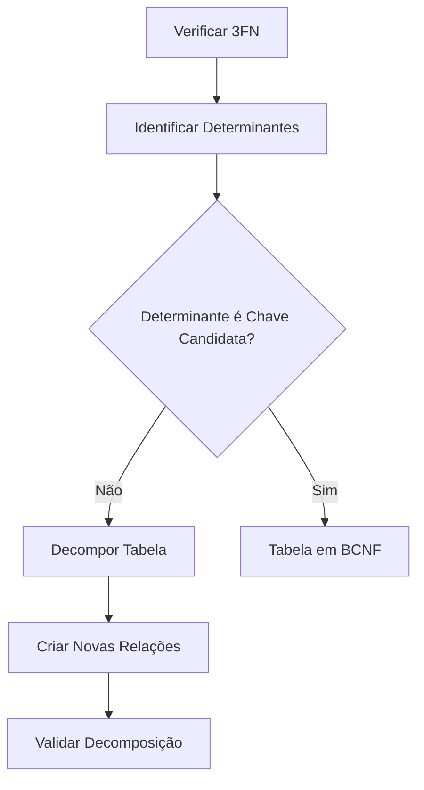

# Forma Normal de Boyce-Codd (BCNF)

## Definição

A Forma Normal de Boyce-Codd (BCNF) é uma versão mais rigorosa da 3FN que exige:
1. A tabela deve estar na 3FN
2. Toda dependência funcional não-trivial deve ser determinada por uma chave candidata

## Conceitos Fundamentais

### 1. Dependência por Chave Candidata
- Todos os determinantes devem ser chaves candidatas
- Elimina anomalias remanescentes da 3FN
- Garante maior integridade dos dados

### 2. Determinantes
- Atributos que determinam funcionalmente outros atributos
- Devem ser chaves candidatas
- Base para identificação de violações BCNF

## Exemplos Práticos

### Exemplo 1: Professor e Disciplina

#### Violação da BCNF
```sql
-- Tabela não normalizada
CREATE TABLE Professor_Disciplina (
    professor_id INT,
    disciplina VARCHAR(100),
    departamento VARCHAR(50),
    PRIMARY KEY (professor_id, disciplina)
);

-- Problema: departamento determina disciplina, mas não é chave candidata
```

#### Aplicação da BCNF
```sql
-- Tabelas normalizadas
CREATE TABLE Professor_Departamento (
    professor_id INT PRIMARY KEY,
    departamento VARCHAR(50)
);

CREATE TABLE Departamento_Disciplina (
    departamento VARCHAR(50),
    disciplina VARCHAR(100),
    PRIMARY KEY (departamento, disciplina)
);
```

### Exemplo 2: Estudante e Curso

#### Violação da BCNF
```sql
-- Tabela não normalizada
CREATE TABLE Estudante_Curso (
    estudante_id INT,
    curso_id INT,
    professor VARCHAR(100),
    disciplina VARCHAR(100),
    PRIMARY KEY (estudante_id, curso_id),
    -- professor determina disciplina, mas não é chave
);
```

#### Aplicação da BCNF
```sql
-- Tabelas normalizadas
CREATE TABLE Professor_Disciplina (
    professor VARCHAR(100) PRIMARY KEY,
    disciplina VARCHAR(100)
);

CREATE TABLE Estudante_Curso (
    estudante_id INT,
    curso_id INT,
    professor VARCHAR(100),
    PRIMARY KEY (estudante_id, curso_id),
    FOREIGN KEY (professor) REFERENCES Professor_Disciplina(professor)
);
```

## Processo de Normalização

### 1. Identificação de Violações


### 2. Passos para Normalização
1. Confirmar 3FN
2. Identificar todos os determinantes
3. Verificar se são chaves candidatas
4. Decompor quando necessário
5. Validar preservação de dependências

## Benefícios

### 1. Integridade
- Eliminação de anomalias
- Consistência garantida
- Dependências bem definidas

### 2. Design
- Estrutura mais limpa
- Relacionamentos claros
- Maior facilidade de manutenção

## Considerações Práticas

### 1. Implementação
```sql
-- Exemplo de migração para BCNF
INSERT INTO Professor_Departamento (professor_id, departamento)
SELECT DISTINCT professor_id, departamento
FROM professor_disciplina_antiga;

INSERT INTO Departamento_Disciplina (departamento, disciplina)
SELECT DISTINCT departamento, disciplina
FROM professor_disciplina_antiga;
```

### 2. Performance
- Avaliação de joins necessários
- Impacto em consultas complexas
- Balanceamento com requisitos

## Checklist de Validação

### 1. Verificação
- [ ] Tabela está em 3FN?
- [ ] Determinantes identificados?
- [ ] Chaves candidatas definidas?
- [ ] Decomposição necessária?

### 2. Testes
- [ ] Preservação de dados
- [ ] Integridade mantida
- [ ] Consultas eficientes
- [ ] Atualizações consistentes

## Anti-Padrões

### 1. Violações Comuns
```sql
-- Anti-padrão: Determinante não-chave
CREATE TABLE Projeto (
    projeto_id INT,
    gerente_id INT,
    equipe_id INT,
    -- gerente determina equipe, mas não é chave
    PRIMARY KEY (projeto_id)
);

-- Correção
CREATE TABLE Gerente_Equipe (
    gerente_id INT PRIMARY KEY,
    equipe_id INT
);

CREATE TABLE Projeto (
    projeto_id INT PRIMARY KEY,
    gerente_id INT,
    FOREIGN KEY (gerente_id) REFERENCES Gerente_Equipe(gerente_id)
);
```

### 2. Soluções
- Identificar determinantes não-chave
- Decompor corretamente
- Manter rastreabilidade
- Documentar decisões

## Conclusão

A BCNF é importante para:
- Garantir design robusto
- Eliminar anomalias
- Manter integridade
- Facilitar evolução

Deve ser aplicada considerando:
- Complexidade do domínio
- Requisitos de consulta
- Necessidades de performance
- Manutenibilidade