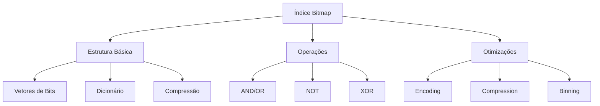
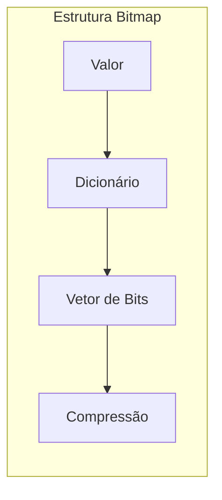
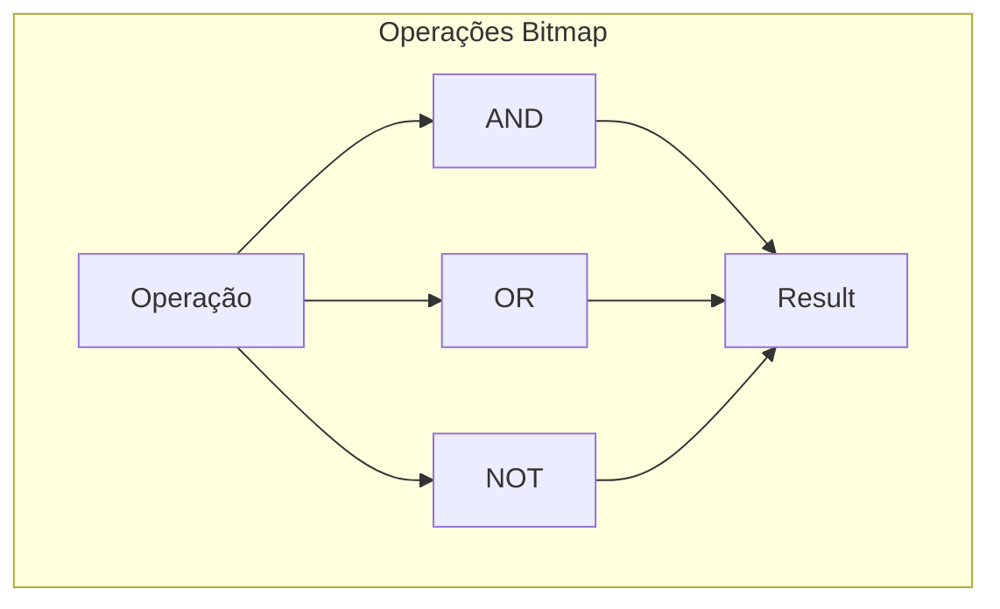
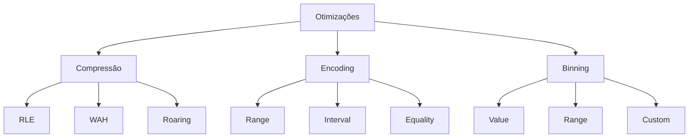
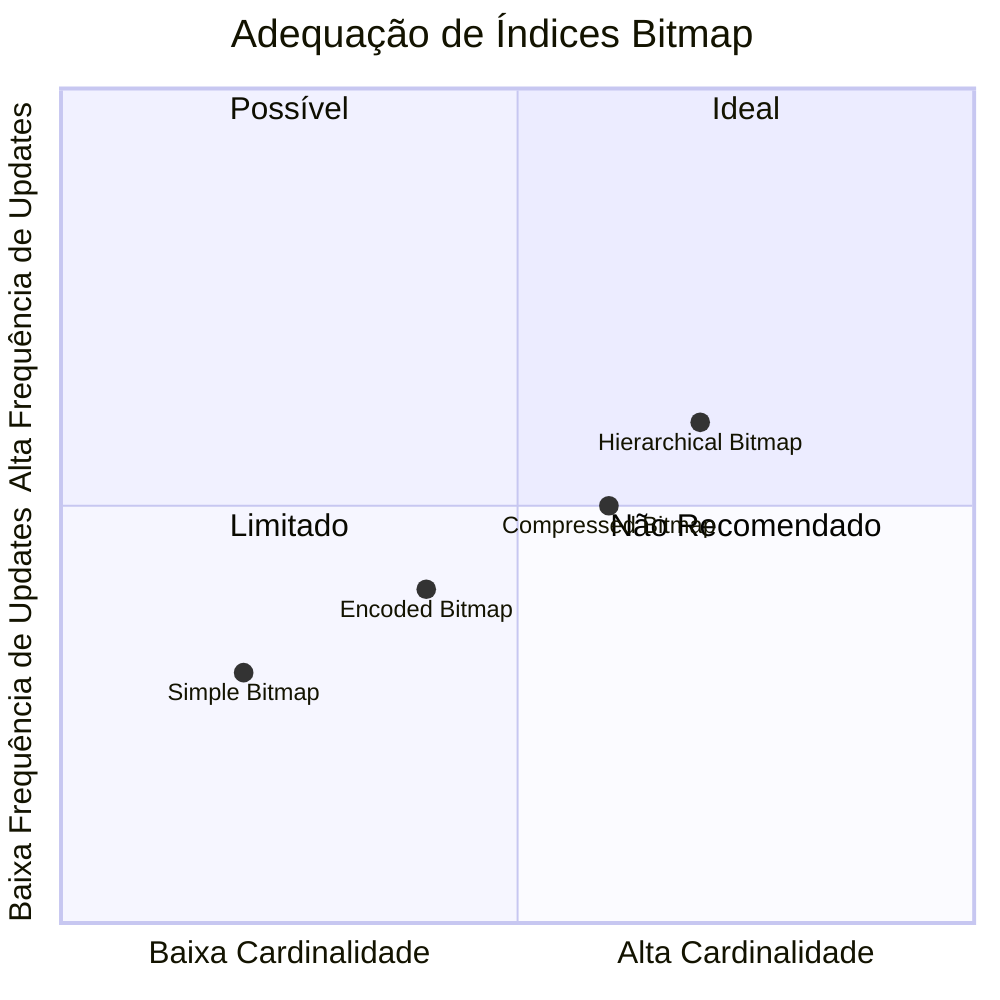
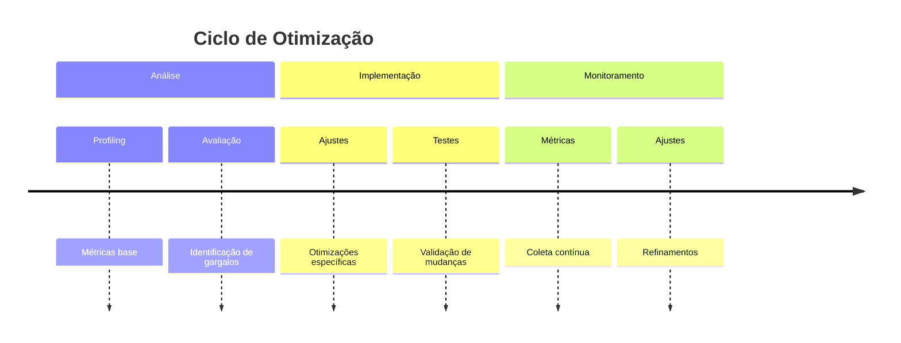
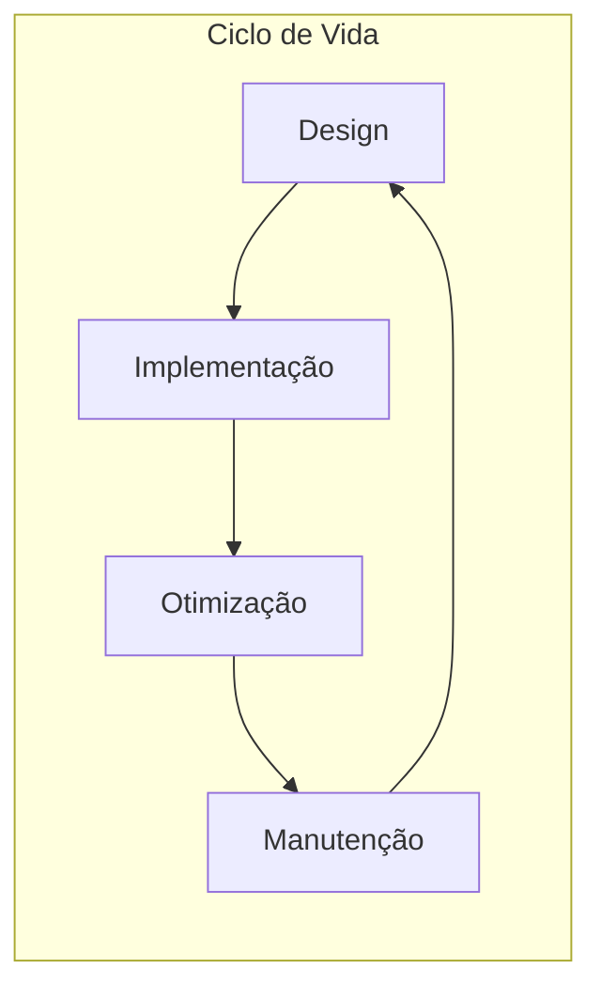

# Índices Bitmap

Os índices bitmap são estruturas especializadas que utilizam vetores de bits para representar a presença ou ausência de valores em colunas, sendo particularmente eficientes para colunas com baixa cardinalidade.

## Fundamentos

### 1. Estrutura Básica
- Mapeamento valor-bit
- Vetores binários
- Dicionário de valores
- Metadata

### 2. Tipos de Bitmap
- Simple bitmap
- Encoded bitmap
- Compressed bitmap
- Hierarchical bitmap

## Operações Fundamentais

### 1. Operações Lógicas
- AND (Interseção)
- OR (União)
- NOT (Complemento)
- XOR (Diferença simétrica)

### 2. Manipulação
- Set bit
- Clear bit
- Flip bit
- Count bits

## Otimizações

### 1. Técnicas de Compressão
- Run-length encoding
- Word-aligned hybrid
- Roaring bitmap
- EWAH compression

### 2. Estratégias de Encoding
- Range encoding
- Interval encoding
- Equality encoding
- Range-equality encoding

## Casos de Uso

### 1. Cenários Ideais
- Baixa cardinalidade
- Consultas analíticas
- Operações em lote
- Data warehousing

### 2. Limitações
- Alta cardinalidade
- Frequentes atualizações
- Restrições de memória
- Overhead de manutenção

## Performance e Otimização

### 1. Métricas de Avaliação
- Densidade do bitmap
- Taxa de compressão
- Tempo de resposta
- Overhead de memória

### 2. Estratégias de Otimização
- Binning
- Particionamento
- Caching
- Paralelização

## Implementação Prática

### 1. Considerações de Design
- Estrutura de armazenamento
- Estratégias de atualização
- Gerenciamento de memória
- Concorrência

### 2. Manutenção
- Reconstrução
- Compactação
- Estatísticas
- Monitoramento

