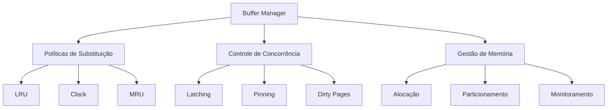
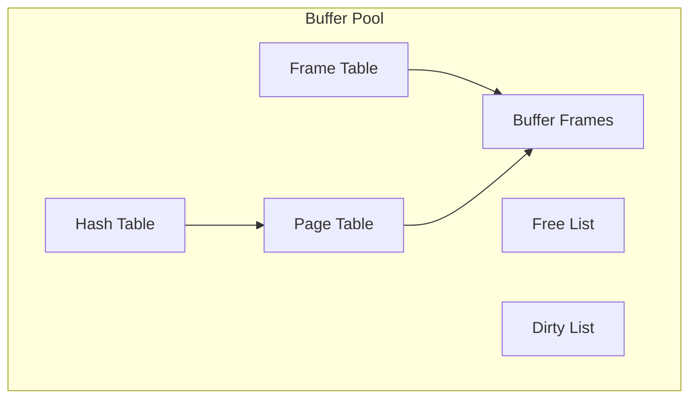
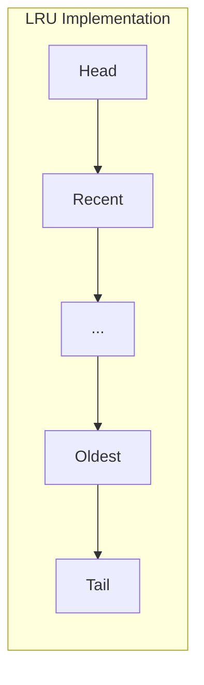
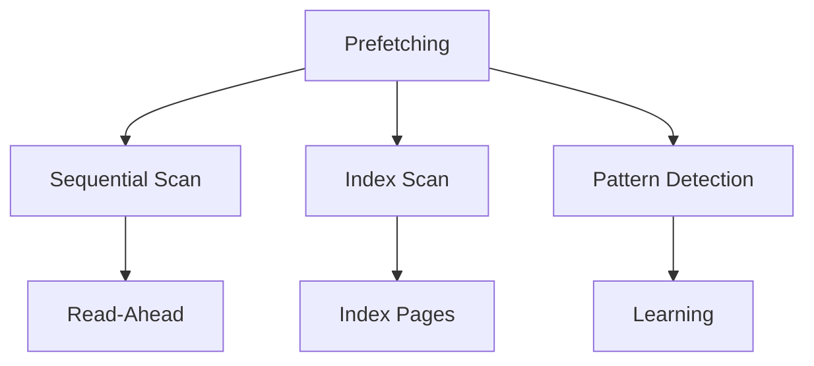
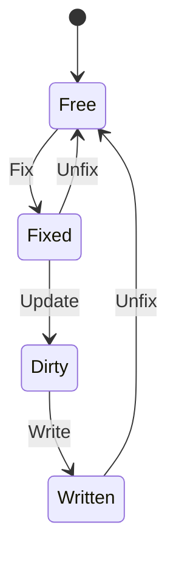
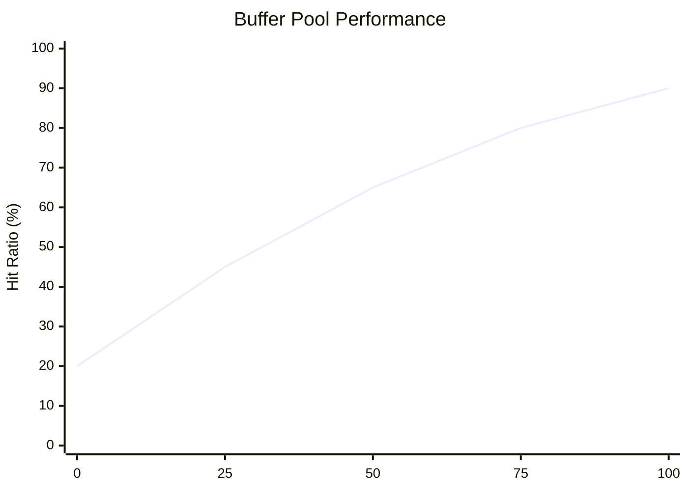
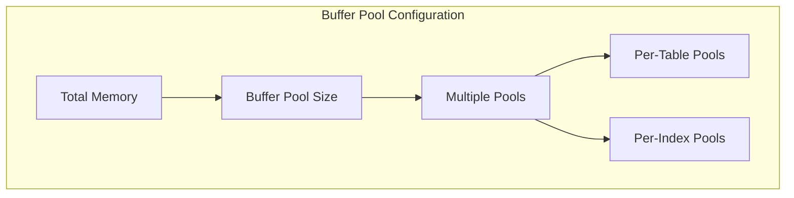

# Gerenciamento de Buffer

O gerenciamento de buffer é um componente crítico dos sistemas de banco de dados, atuando como intermediário entre a memória principal e o armazenamento em disco.

## Arquitetura do Buffer Pool

### 1. Estruturas Principais
- Frame Table
- Page Table
- Hash Table
- Free List
- Dirty List

### 2. Componentes de Controle
- Descritores de página
- Contadores de pin
- Bits de estado
- Timestamps

## Políticas de Substituição

### 1. Algoritmos Básicos
- LRU (Least Recently Used)
- Clock
- MRU (Most Recently Used)
- Random

### 2. Algoritmos Avançados
- LRU-K
- 2Q
- ARC (Adaptive Replacement Cache)
- CLOCK-Pro

## Otimizações de Performance

### 1. Técnicas de Prefetching
- Sequential
- Index-based
- Pattern-based
- Adaptive

### 2. Write Strategies
- Force/No-Force
- Steal/No-Steal
- Group Commit
- Background Writing

## Controle de Concorrência

### 1. Mecanismos de Latch
- Shared latches
- Exclusive latches
- Latch queuing
- Deadlock prevention

### 2. Buffer Fix
- Pin count
- Fix duration
- Unfix operations
- Reference counting

## Monitoramento e Diagnóstico

### 1. Métricas Principais
- Hit ratio
- Buffer utilization
- Write frequency
- Eviction rate

### 2. Ferramentas de Análise
- Buffer pool statistics
- Page access patterns
- I/O monitoring
- Memory pressure

## Configuração e Tuning

### 1. Parâmetros Críticos
- Buffer pool size
- Page size
- Number of partitions
- Write threshold

### 2. Otimizações Específicas
- Multiple buffer pools
- Page compression
- Memory-mapped I/O
- Direct I/O

## Recuperação e Consistência

### 1. Recovery Integration
- Checkpoint processing
- Redo logging
- Undo logging
- Recovery actions

### 2. Consistency Management
- Page consistency
- Buffer coherency
- Cache invalidation
- Version control

## Tendências Modernas

### 1. Novas Tecnologias
- Non-volatile memory
- Hardware transactional memory
- RDMA-aware buffering
- Smart storage

### 2. Otimizações Emergentes
- ML-based prediction
- Adaptive algorithms
- Hybrid storage integration
- Cloud-optimized buffering

## Conclusão

O gerenciamento eficiente do buffer é fundamental para o desempenho do banco de dados. A escolha e configuração adequada das políticas e mecanismos apresentados impacta diretamente na eficiência do sistema.

## Referências

1. "Database Management Systems" - Ramakrishnan e Gehrke
2. "Transaction Processing: Concepts and Techniques" - Gray e Reuter
3. "PostgreSQL Buffer Management" - Documentation
4. "MySQL InnoDB Buffer Pool" - Technical Documentation