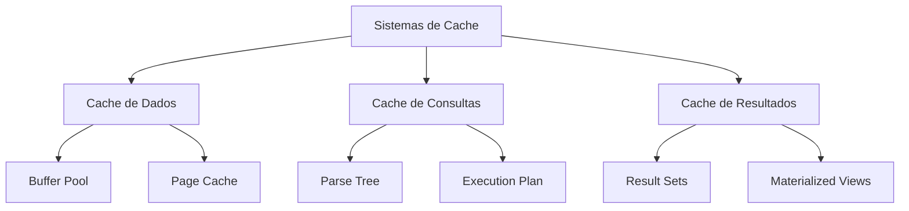
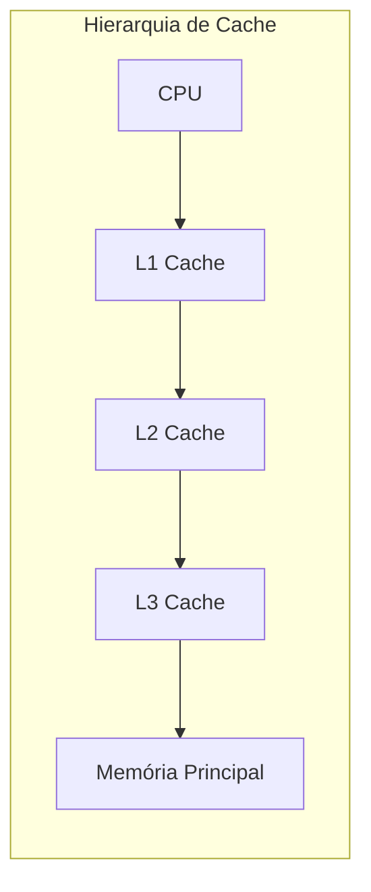
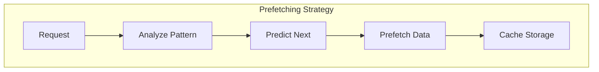
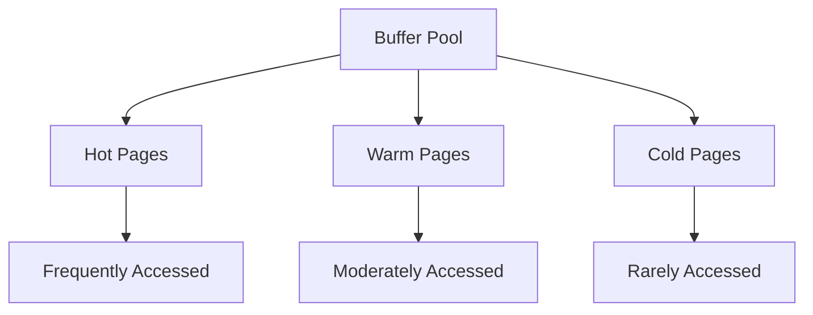
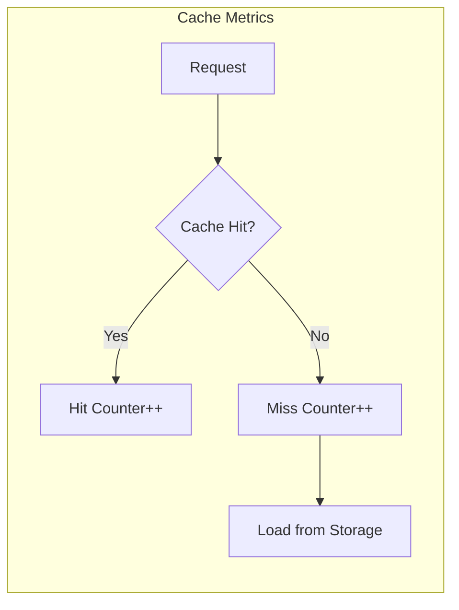
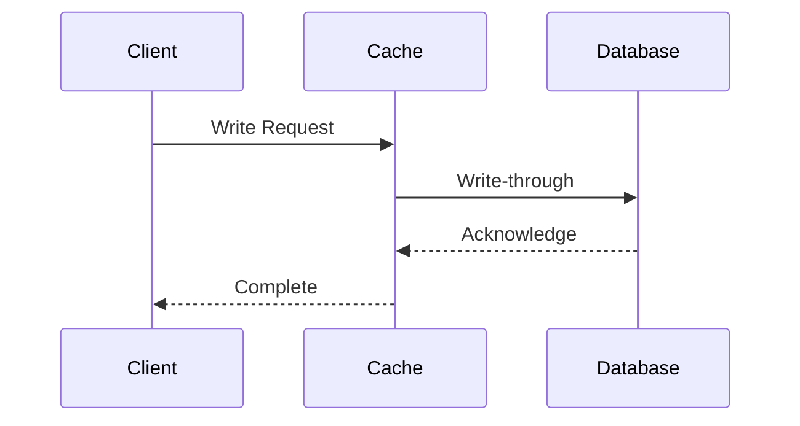
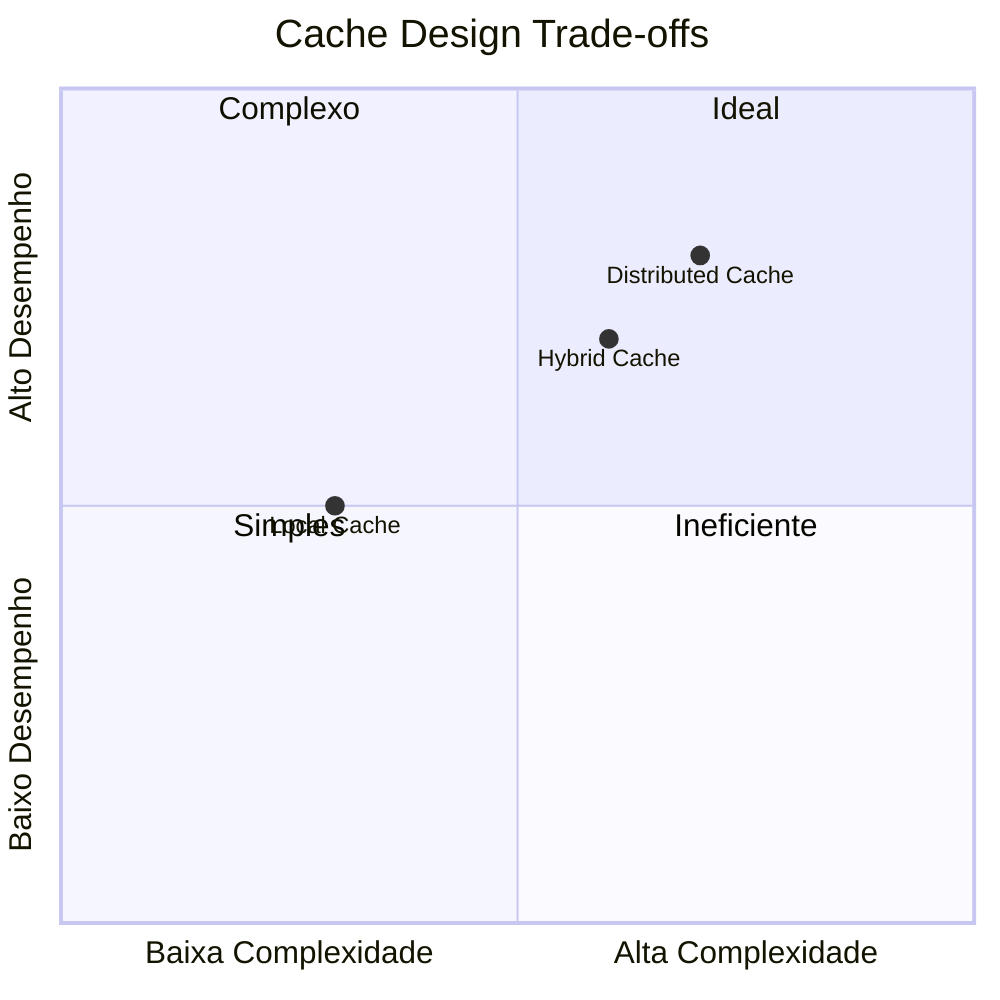
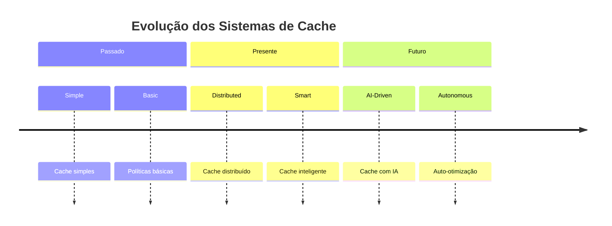

# Sistemas de Cache

Os sistemas de cache são componentes críticos que otimizam o acesso a dados, reduzindo a latência e melhorando o desempenho geral do sistema de banco de dados.



## Arquitetura de Cache

### 1. Níveis de Cache
- **Cache L1/L2/L3**
  - Hierarquia
  - Latência
  - Capacidade
  - Políticas



### 2. Buffer Pool
- Estrutura interna
- Gestão de páginas
- Dirty pages
- Clean pages

## Políticas de Cache

### 1. Algoritmos de Substituição
- **LRU (Least Recently Used)**
```java
class LRUCache<K,V> {
    private final int capacity;
    private LinkedHashMap<K,V> cache;
    
    public LRUCache(int capacity) {
        this.capacity = capacity;
        this.cache = new LinkedHashMap<K,V>(capacity, 0.75f, true) {
            protected boolean removeEldestEntry(Map.Entry<K,V> eldest) {
                return size() > capacity;
            }
        };
    }
}
```

- **Clock Algorithm**
```java
class ClockCache {
    private Page[] buffer;
    private int hand = 0;
    
    public Page findVictim() {
        while (true) {
            if (buffer[hand].referenceBit == 0) {
                return buffer[hand];
            }
            buffer[hand].referenceBit = 0;
            hand = (hand + 1) % buffer.length;
        }
    }
}
```

### 2. Estratégias de Prefetching
- Sequential prefetch
- Index-based prefetch
- Pattern-based prefetch
- Adaptive prefetch



## Otimizações

### 1. Cache-Conscious Design
- **Estruturas de Dados**
  - Alinhamento de memória
  - Localidade espacial
  - Localidade temporal
  - Cache line padding

```java
class CacheAlignedStruct {
    private static final int CACHE_LINE = 64;
    
    @Align(CACHE_LINE)
    private long[] data;
    
    private int pad; // Ensure alignment
}
```

### 2. Técnicas Avançadas
- **Particionamento**


## Monitoramento e Diagnóstico

### 1. Métricas de Performance
- **Indicadores Chave**
  - Hit ratio
  - Miss ratio
  - Eviction rate
  - Response time



### 2. Ferramentas de Análise
- Cache profilers
- Memory analyzers
- Performance counters
- Monitoring tools

## Implementação Prática

### 1. Cache Distribuído
```java
interface DistributedCache {
    void put(String key, Object value);
    Object get(String key);
    void invalidate(String key);
    void clear();
}

class RedisCache implements DistributedCache {
    private RedisClient client;
    
    public void put(String key, Object value) {
        client.set(key, serialize(value));
    }
    
    public Object get(String key) {
        byte[] data = client.get(key);
        return deserialize(data);
    }
}
```

### 2. Consistência e Sincronização
- Write-through vs Write-back
- Cache coherence
- Invalidation strategies
- Replication



## Considerações de Design

### 1. Trade-offs
- Tamanho vs Performance
- Consistência vs Latência
- Complexidade vs Flexibilidade
- Custo vs Benefício



### 2. Best Practices
- Cache warming
- Eviction policies
- Error handling
- Monitoring setup

## Tendências e Inovações

### 1. Tecnologias Emergentes
- AI/ML para cache prediction
- Hardware-assisted caching
- Persistent memory caching
- Smart prefetching

### 2. Futuras Direções
- Cache automation
- Self-tuning systems
- Intelligent prefetching
- Hybrid architectures

