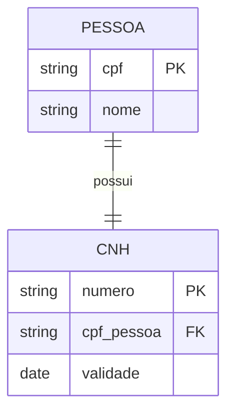
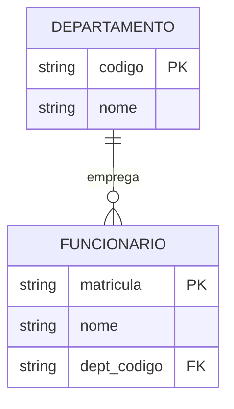
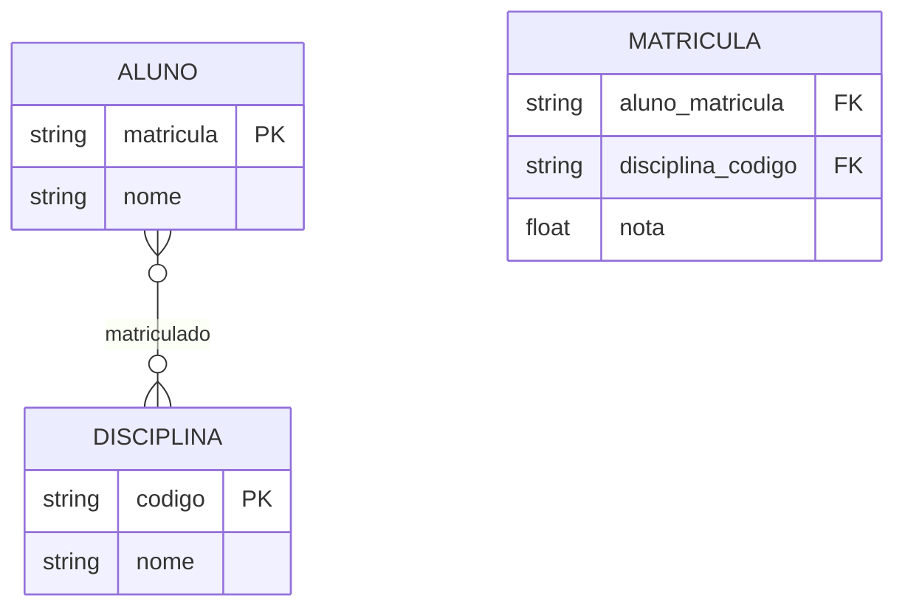
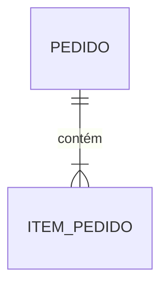
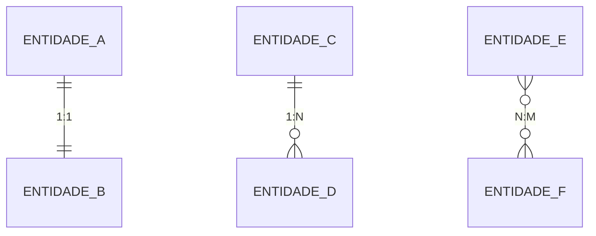
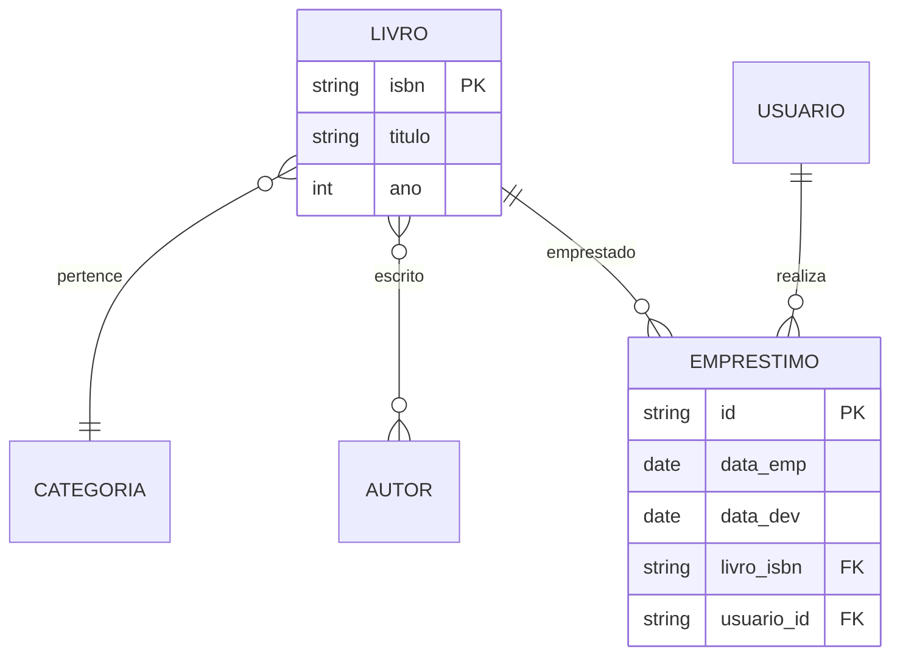
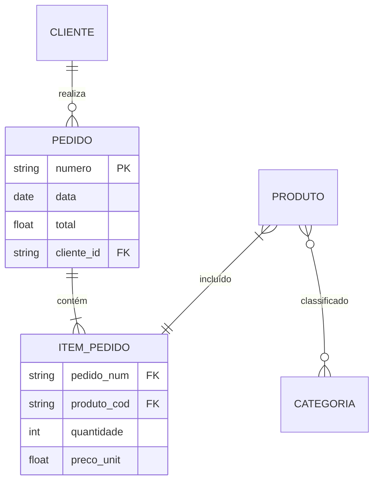

# Cardinalidade

A cardinalidade é um conceito fundamental na modelagem ER que define o número de instâncias de uma entidade que podem se relacionar com instâncias de outra entidade.

## Tipos de Cardinalidade

### 1. Um-para-Um (1:1)

- Cada instância de uma entidade está associada a no máximo uma instância da outra entidade
- Representada como: `||--||`

#### Exemplos Práticos (1:1)
- Pessoa ↔ CPF
- Funcionário ↔ Matrícula
- País ↔ Capital

### 2. Um-para-Muitos (1:N)

- Uma instância de uma entidade pode estar associada a várias instâncias da outra entidade
- Representada como: `||--o{` ou `||--|{`

#### Exemplos Práticos (1:N)
- Departamento → Funcionários
- Cliente → Pedidos
- Professor → Turmas

### 3. Muitos-para-Muitos (N:M)

- Várias instâncias de uma entidade podem estar associadas a várias instâncias da outra entidade
- Representada como: `}o--o{`

#### Exemplos Práticos (N:M)
- Alunos ↔ Disciplinas
- Produtos ↔ Fornecedores
- Autores ↔ Livros

## Participação

### Participação Total
- Todas as instâncias da entidade participam do relacionamento
- Representada por linha dupla: `||`

### Participação Parcial
- Algumas instâncias podem não participar do relacionamento
- Representada por linha com círculo: `o{`

## Restrições de Cardinalidade

### Mínima
- Número mínimo de instâncias relacionadas
- Exemplo: zero (opcional) ou um (obrigatório)

### Máxima
- Número máximo de instâncias relacionadas
- Exemplo: um ou muitos (n)

## Notações Comuns

### 1. Notação Crow's Foot

### 2. Notação Chen
- (1,1) : Exatamente um
- (0,1) : Zero ou um
- (1,N) : Um ou mais
- (0,N) : Zero ou mais

## Exemplos Complexos

### Sistema de Biblioteca

### Sistema de E-commerce

## Boas Práticas

### 1. Análise de Requisitos
- Entenda regras de negócio
- Identifique restrições
- Valide com stakeholders

### 2. Modelagem
- Escolha cardinalidade apropriada
- Considere participação
- Documente decisões

### 3. Implementação
- Planeje chaves estrangeiras
- Defina índices adequados
- Implemente restrições

## Considerações Importantes

### 1. Performance
- Impacto em consultas
- Estratégias de indexação
- Otimização de joins

### 2. Manutenibilidade
- Flexibilidade para mudanças
- Documentação clara
- Padrões consistentes

### 3. Integridade
- Regras de negócio
- Consistência dos dados
- Validações necessárias

## Conclusão

A cardinalidade é essencial para:
- Estruturação correta dos dados
- Integridade do modelo
- Performance do sistema
- Manutenibilidade do código

Uma modelagem adequada de cardinalidade:
- Reflete regras de negócio
- Facilita implementação
- Previne problemas futuros
- Melhora qualidade dos dados