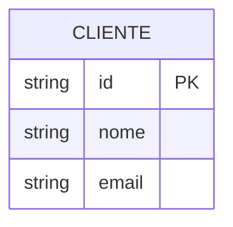
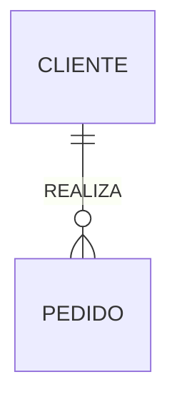
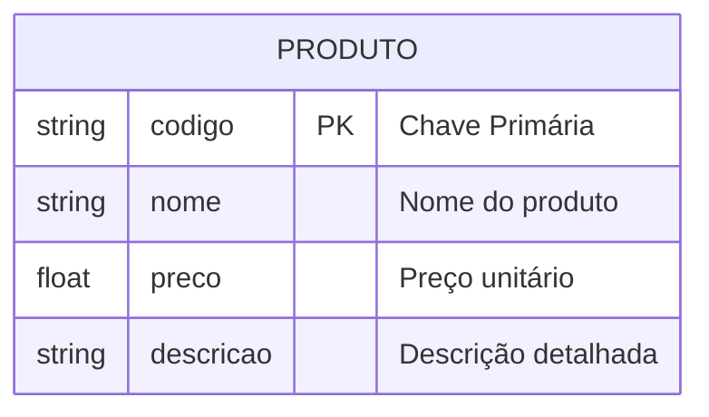
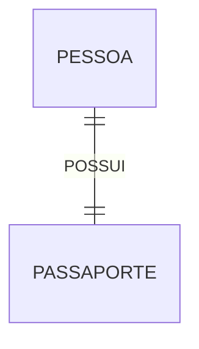
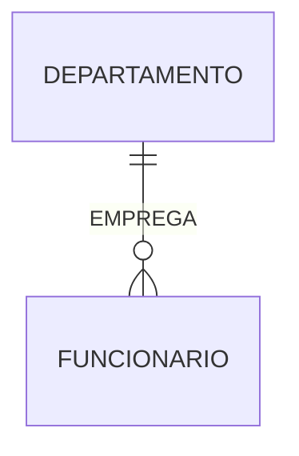
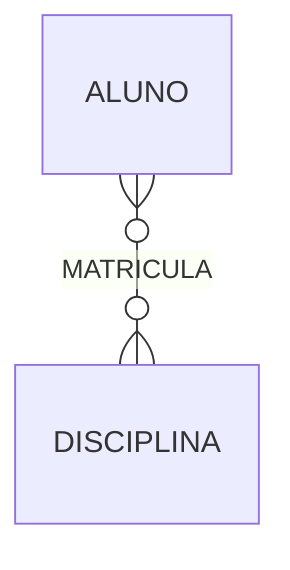
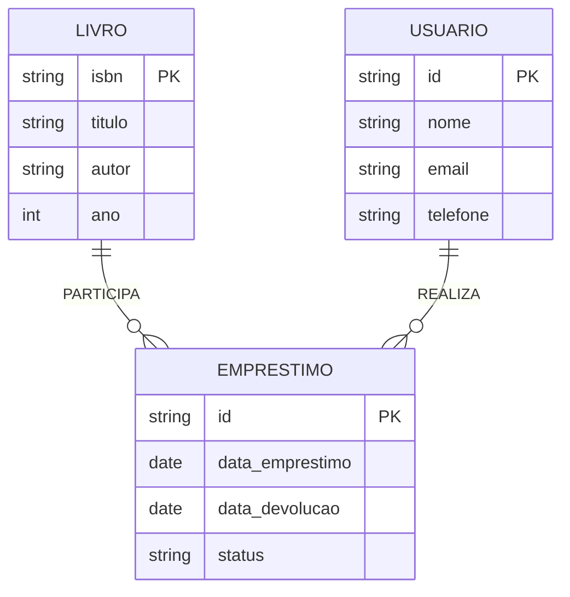
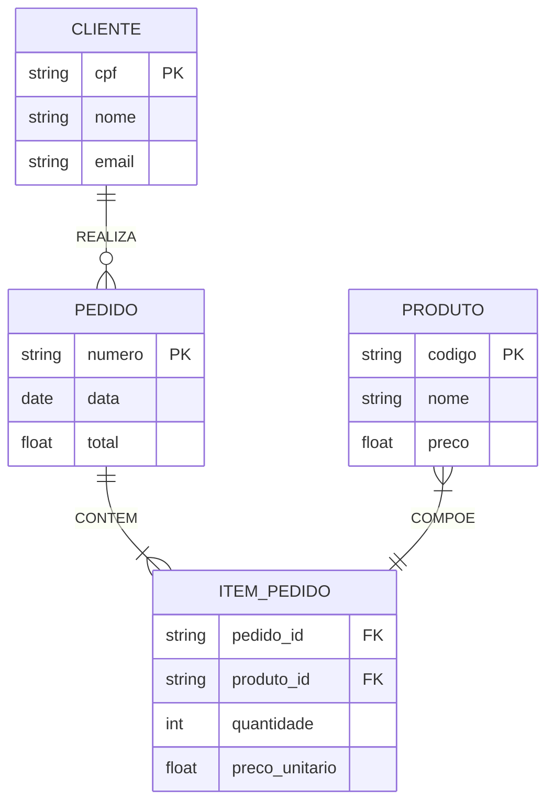

# Notação de Chen

A notação de Chen, desenvolvida por Peter Chen em 1976, é uma das notações mais tradicionais e didáticas para modelagem Entidade-Relacionamento (ER).

## Elementos Básicos

### 1. Entidades

- Representadas por retângulos
- Nome em MAIÚSCULAS
- Singular
- Substantivos

### 2. Relacionamentos

- Representados por losangos
- Verbos no presente
- MAIÚSCULAS
- Conectam entidades

### 3. Atributos

#### Tipos de Atributos
- **Simples**: valor único
- **Compostos**: múltiplos componentes
- **Multivalorados**: múltiplos valores
- **Derivados**: calculados
- **Chave**: identificador único

## Cardinalidade

### 1. Um-para-Um (1:1)

### 2. Um-para-Muitos (1:N)

### 3. Muitos-para-Muitos (N:M)

## Exemplos Detalhados

### 1. Sistema de Biblioteca

### 2. Sistema de Vendas

## Regras de Modelagem

### 1. Entidades
- Nomes significativos
- Singular
- MAIÚSCULAS
- Substantivos

### 2. Relacionamentos
- Verbos no presente
- MAIÚSCULAS
- Direção clara
- Significado preciso

### 3. Atributos
- Nomes descritivos
- Tipos apropriados
- Domínios definidos
- Chaves identificadas

## Boas Práticas

### 1. Nomenclatura
- Consistente
- Clara
- Significativa
- Padronizada

### 2. Layout
- Organizado
- Espaçado
- Legível
- Hierárquico

### 3. Documentação
- Completa
- Atualizada
- Acessível
- Versionada

## Vantagens da Notação Chen

1. **Clareza**
   - Elementos distintos
   - Fácil leitura
   - Visual intuitivo
   - Sem ambiguidade

2. **Didática**
   - Ótima para ensino
   - Fácil aprendizado
   - Conceitos claros
   - Exemplos simples

3. **Detalhamento**
   - Atributos visíveis
   - Cardinalidade explícita
   - Relacionamentos claros
   - Restrições evidentes

## Limitações

1. **Espaço**
   - Diagramas grandes
   - Muitos elementos
   - Layout complexo
   - Difícil organização

2. **Complexidade**
   - Modelos extensos
   - Muitos atributos
   - Relacionamentos complexos
   - Manutenção trabalhosa

## Ferramentas de Suporte

### 1. Software Específico
- Draw.io
- Lucidchart
- Visual Paradigm
- ERDPlus
- MySQL Workbench

### 2. Recursos Online
- Editores web
- Plugins IDE
- Geradores
- Conversores

## Conclusão

A notação de Chen é ideal para:
- Ensino de modelagem
- Documentação detalhada
- Comunicação clara
- Projetos didáticos

Pontos-chave:
- Clareza visual
- Padrões consistentes
- Documentação completa
- Manutenção regular