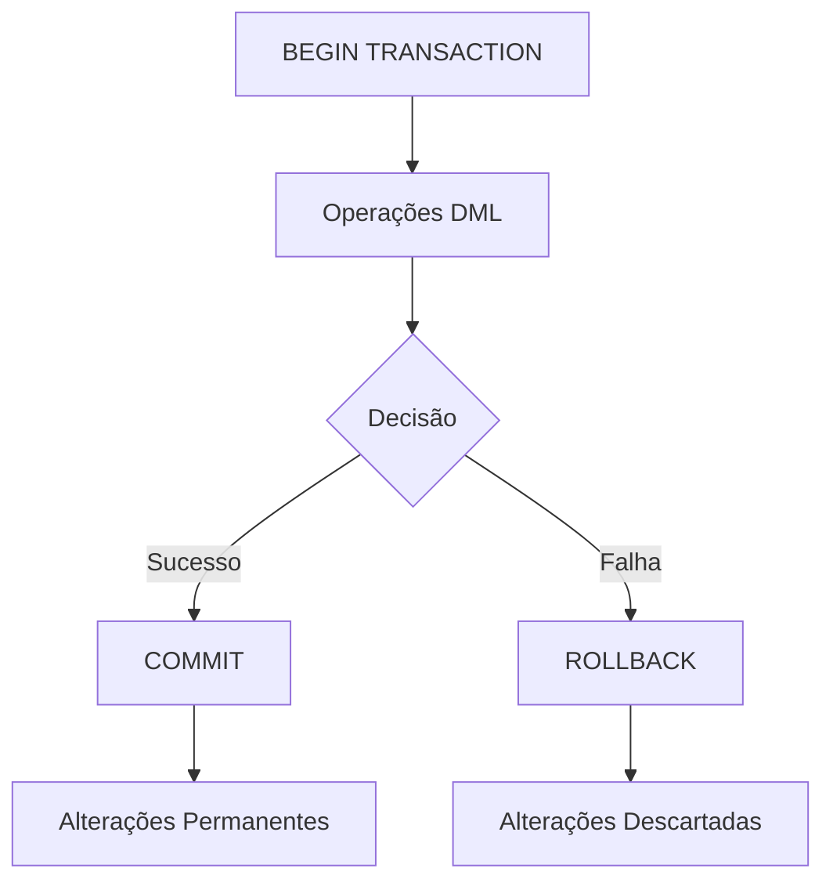

# Commit e Rollback

## Visão Geral

Os comandos `COMMIT` e `ROLLBACK` são fundamentais para o controle transacional em bancos de dados. Eles determinam o destino final das operações realizadas dentro de uma transação.



## Comando COMMIT

O comando `COMMIT` finaliza a transação atual e torna permanentes todas as alterações realizadas desde o início da transação.

### Sintaxe

```sql
COMMIT [TRANSACTION];
-- ou simplesmente
COMMIT;
```

### Efeitos do COMMIT

1. **Persistência**: Todas as alterações se tornam permanentes no banco de dados
2. **Visibilidade**: As alterações se tornam visíveis para outras transações
3. **Liberação de Bloqueios**: Todos os bloqueios adquiridos pela transação são liberados
4. **Pontos de Salvamento**: Todos os savepoints criados na transação são descartados
5. **Finalização**: A transação é encerrada e uma nova transação é iniciada automaticamente em alguns SGBDs

### Exemplos de COMMIT

#### Exemplo Básico

```sql
BEGIN;
    INSERT INTO clientes (nome, email) 
    VALUES ('Maria Silva', 'maria@email.com');
    
    UPDATE produtos 
    SET estoque = estoque - 1 
    WHERE id = 101;
COMMIT;
```

#### Commit Condicional

```sql
BEGIN;
    UPDATE contas 
    SET saldo = saldo - 1000 
    WHERE id = 1;
    
    UPDATE contas 
    SET saldo = saldo + 1000 
    WHERE id = 2;
    
    -- Verificar se ambas as contas existem
    IF (SELECT COUNT(*) FROM contas WHERE id IN (1, 2)) = 2 THEN
        COMMIT;
    ELSE
        ROLLBACK;
    END IF;
```

## Comando ROLLBACK

O comando `ROLLBACK` desfaz todas as alterações realizadas desde o início da transação ou desde um ponto de salvamento específico.

### Sintaxe

```sql
ROLLBACK [TRANSACTION];
-- ou simplesmente
ROLLBACK;

-- Para rollback parcial até um savepoint
ROLLBACK [TRANSACTION] TO [SAVEPOINT] savepoint_name;
```

### Efeitos do ROLLBACK

1. **Reversão**: Todas as alterações são desfeitas
2. **Liberação de Bloqueios**: Todos os bloqueios adquiridos pela transação são liberados
3. **Pontos de Salvamento**: Todos os savepoints são descartados (exceto em rollback parcial)
4. **Finalização**: A transação é encerrada e uma nova transação é iniciada automaticamente em alguns SGBDs

### Exemplos de ROLLBACK

#### Rollback Completo

```sql
BEGIN;
    DELETE FROM pedidos WHERE cliente_id = 101;
    
    -- Ops, não era para excluir todos os pedidos!
    ROLLBACK;
```

#### Rollback com Tratamento de Erros

```sql
BEGIN;
    DECLARE EXIT HANDLER FOR SQLEXCEPTION
    BEGIN
        ROLLBACK;
        SELECT 'Transação abortada devido a erro' AS mensagem;
    END;
    
    UPDATE produtos SET preco = preco * 1.1;
    INSERT INTO log_alteracoes (tabela, descricao) 
    VALUES ('produtos', 'Aumento de 10% nos preços');
    
    COMMIT;
END;
```

## Commit vs. Rollback: Quando Usar

### Use COMMIT quando:

1. **Operações Bem-Sucedidas**: Todas as operações foram concluídas com sucesso
2. **Dados Válidos**: Os dados estão em um estado consistente
3. **Ponto de Finalização**: Você atingiu um ponto lógico de conclusão no processamento

### Use ROLLBACK quando:

1. **Erros Detectados**: Ocorreram erros durante o processamento
2. **Dados Inválidos**: Os dados não atendem às regras de negócio ou restrições
3. **Operação Cancelada**: O usuário ou o sistema decidiu cancelar a operação
4. **Teste ou Simulação**: Você está apenas testando ou simulando operações

## Auto-Commit

Muitos SGBDs e ferramentas de cliente possuem um modo "auto-commit" que automaticamente confirma cada instrução SQL individual como uma transação separada.

### Habilitando/Desabilitando Auto-Commit

```sql
-- PostgreSQL
SET autocommit = ON; -- ou OFF

-- MySQL
SET autocommit = 1; -- ou 0

-- SQL Server
SET IMPLICIT_TRANSACTIONS OFF; -- auto-commit ON
SET IMPLICIT_TRANSACTIONS ON;  -- auto-commit OFF

-- Oracle
-- Sempre requer COMMIT explícito, exceto para DDL
```

### Implicações do Auto-Commit

- **Vantagens**: Simplicidade, menor risco de deixar transações abertas
- **Desvantagens**: Perda de atomicidade para operações múltiplas, potencial redução de desempenho

## Commit Implícito

Algumas operações podem causar um commit implícito, mesmo dentro de uma transação explícita:

1. **Comandos DDL**: CREATE, ALTER, DROP, etc.
2. **Comandos DCL**: GRANT, REVOKE, etc.
3. **Comandos de Administração**: ANALYZE, VACUUM, etc.
4. **Conexão/Desconexão**: Dependendo do SGBD e configuração

```sql
BEGIN;
    INSERT INTO tabela1 VALUES (1, 'teste');
    
    -- Em muitos SGBDs, isto causa um commit implícito
    CREATE INDEX idx_tabela1 ON tabela1(coluna1);
    
    -- Esta operação já estará em uma nova transação
    UPDATE tabela2 SET coluna1 = 'valor';
COMMIT;
```

## Práticas Recomendadas

### 1. Transações Curtas e Focadas

```sql
-- Preferível: Transações pequenas e focadas
BEGIN;
    UPDATE estoque SET quantidade = quantidade - 10 WHERE produto_id = 101;
    INSERT INTO movimentos (produto_id, quantidade, tipo) VALUES (101, 10, 'SAÍDA');
COMMIT;

BEGIN;
    -- Outra operação lógica separada
    UPDATE faturamento SET total = total + 1000 WHERE mes = CURRENT_MONTH;
COMMIT;
```

### 2. Tratamento Adequado de Erros

```sql
BEGIN;
    SAVEPOINT antes_operacoes_criticas;
    
    -- Tente executar operações críticas
    UPDATE contas SET saldo = saldo - 5000 WHERE id = 101;
    
    -- Verifique se a conta tem saldo suficiente
    IF (SELECT saldo FROM contas WHERE id = 101) < 0 THEN
        -- Desfaça apenas as operações críticas
        ROLLBACK TO antes_operacoes_criticas;
        -- Continue com outras operações
    ELSE
        -- Prossiga com o restante da transação
    END IF;
    
    -- Operações não críticas
    INSERT INTO log_atividades (descricao) VALUES ('Tentativa de saque');
    
COMMIT;
```

### 3. Evite Transações de Longa Duração

```sql
-- Evite:
BEGIN;
    -- Processamento em lote de milhões de registros
    UPDATE grande_tabela SET status = 'PROCESSADO' WHERE status = 'PENDENTE';
    -- Pode levar muito tempo e bloquear outros processos
COMMIT;

-- Prefira:
DO $$
DECLARE
    batch_size INT := 1000;
    total_updated INT := 0;
BEGIN
    LOOP
        BEGIN
            UPDATE grande_tabela 
            SET status = 'PROCESSADO' 
            WHERE id IN (
                SELECT id 
                FROM grande_tabela 
                WHERE status = 'PENDENTE' 
                LIMIT batch_size
            );
            
            GET DIAGNOSTICS total_updated = ROW_COUNT;
            
            EXIT WHEN total_updated = 0;
            
            COMMIT;
        END;
    END LOOP;
END $$;
```

## Conclusão

Os comandos `COMMIT` e `ROLLBACK` são ferramentas essenciais para garantir a integridade dos dados em sistemas de banco de dados. Eles permitem que os desenvolvedores controlem precisamente quando as alterações devem ser aplicadas permanentemente ou descartadas.

O uso adequado desses comandos, combinado com uma estratégia bem planejada de transações, é fundamental para desenvolver aplicações robustas que mantenham a consistência dos dados mesmo em cenários de falha ou concorrência.