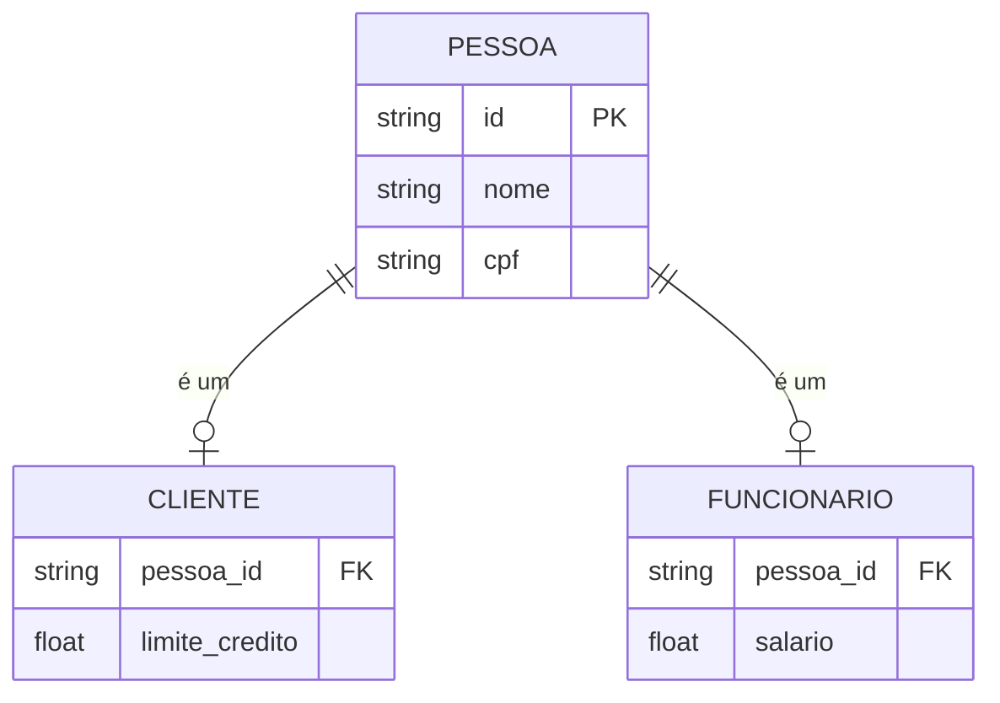
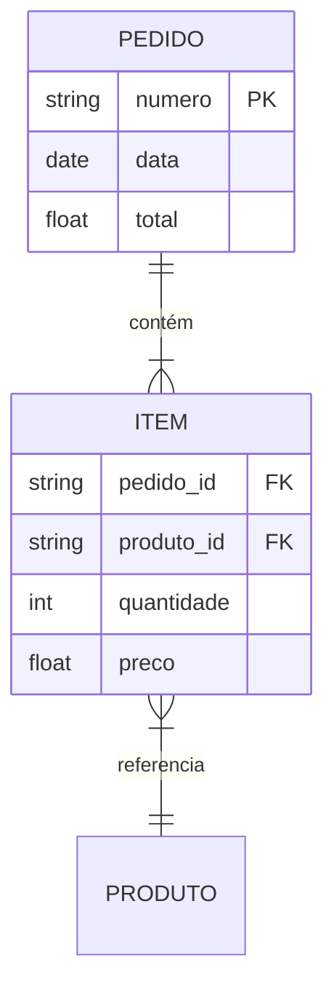
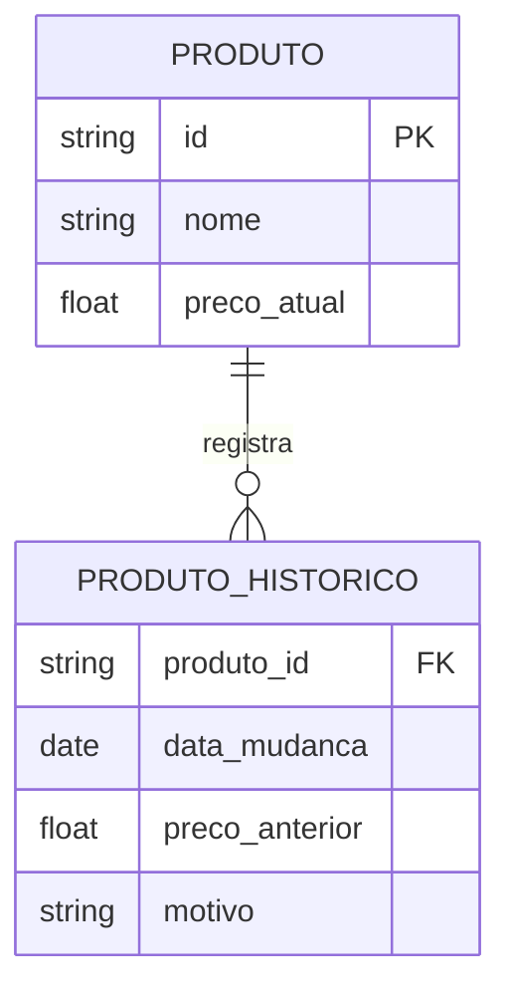
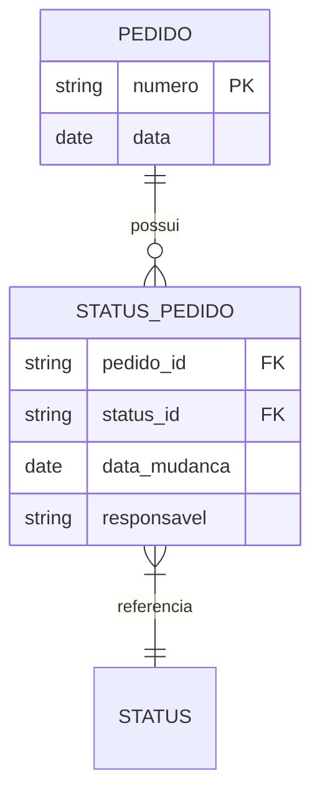
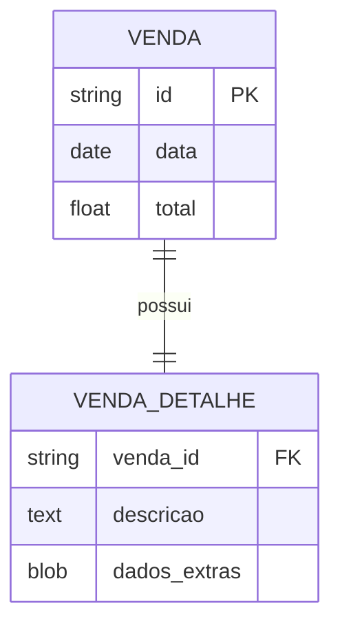
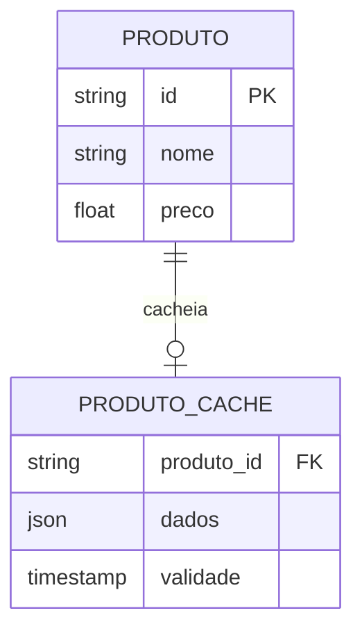

# Padrões Comuns em Modelagem ER

Os padrões de modelagem ER são soluções comprovadas para problemas recorrentes no design de bancos de dados.

## Categorias de Padrões

### 1. Padrões Estruturais
- Organização de entidades
- Relacionamentos comuns
- Hierarquias
- Composições

### 2. Padrões Comportamentais
- Histórico de mudanças
- Workflows
- Estados e transições
- Auditoria

### 3. Padrões Arquiteturais
- Particionamento
- Distribuição
- Replicação
- Cache

## Padrões Estruturais Comuns

### 1. Hierarquia de Tipos

### 2. Composição

## Padrões Comportamentais

### 1. Histórico de Mudanças

### 2. Workflow

## Padrões Arquiteturais

### 1. Particionamento

### 2. Cache

## Implementação dos Padrões

### 1. Seleção
- Análise do problema
- Avaliação de alternativas
- Consideração de trade-offs
- Validação da escolha

### 2. Adaptação
- Customização para contexto
- Ajustes necessários
- Validação de mudanças
- Documentação

### 3. Integração
- Combinação de padrões
- Resolução de conflitos
- Otimização global
- Testes integrados

## Benefícios

### 1. Desenvolvimento
- Soluções provadas
- Menor tempo de design
- Menos erros
- Melhor manutenção

### 2. Performance
- Otimizações conhecidas
- Escalabilidade planejada
- Eficiência comprovada
- Previsibilidade

### 3. Manutenção
- Padrões conhecidos
- Documentação padrão
- Facilidade de mudança
- Menor complexidade

## Conclusão

Os padrões ER oferecem:
- Soluções testadas
- Economia de tempo
- Qualidade comprovada
- Base para inovação

Sua aplicação resulta em:
- Designs robustos
- Implementações eficientes
- Manutenção facilitada
- Sistemas escaláveis