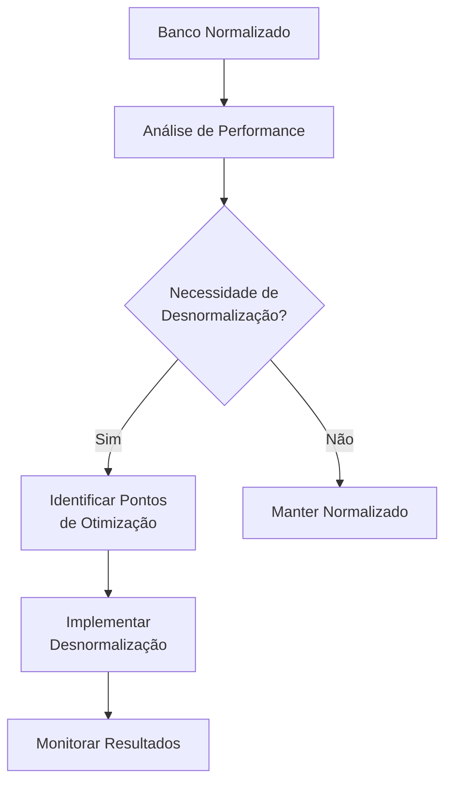
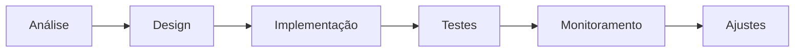
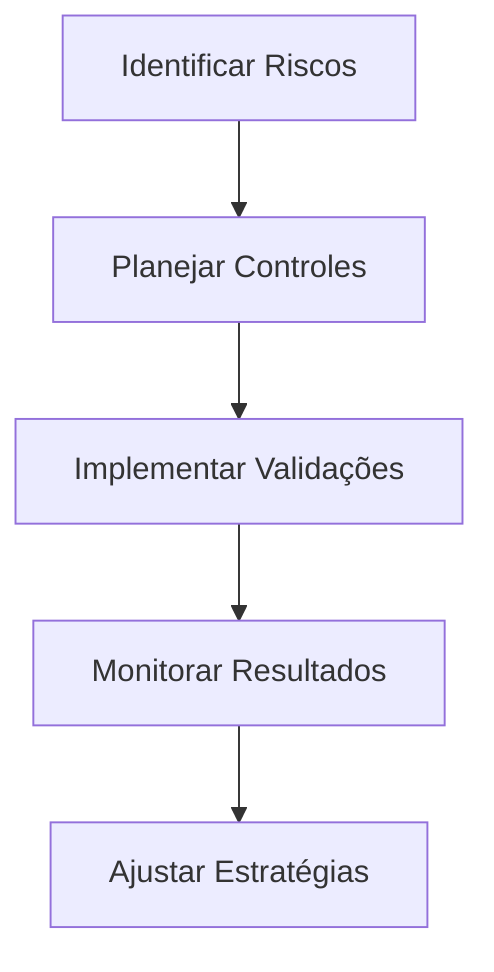

# Guia Completo de Desnormalização

## Introdução

A desnormalização é uma estratégia deliberada de otimização que introduz redundância controlada em um banco de dados normalizado para melhorar a performance de leitura e simplificar consultas.

## Fundamentos

### 1. Conceitos Básicos


### 2. Pré-requisitos
- Compreensão das formas normais
- Análise de performance atual
- Identificação de gargalos
- Métricas de baseline

## Técnicas de Desnormalização

### 1. Duplicação de Dados
```sql
-- Antes (Normalizado)
CREATE TABLE Cliente (
    id INT PRIMARY KEY,
    nome VARCHAR(100),
    endereco VARCHAR(200)
);

CREATE TABLE Pedido (
    id INT PRIMARY KEY,
    cliente_id INT,
    data_pedido DATE,
    FOREIGN KEY (cliente_id) REFERENCES Cliente(id)
);

-- Depois (Desnormalizado)
CREATE TABLE Pedido (
    id INT PRIMARY KEY,
    cliente_id INT,
    cliente_nome VARCHAR(100),
    cliente_endereco VARCHAR(200),
    data_pedido DATE,
    FOREIGN KEY (cliente_id) REFERENCES Cliente(id)
);
```

### 2. Tabelas Agregadas
```sql
-- Antes (Normalizado)
CREATE TABLE Venda (
    id INT PRIMARY KEY,
    produto_id INT,
    quantidade INT,
    valor DECIMAL(10,2),
    data_venda DATE
);

-- Depois (Desnormalizado)
CREATE TABLE Venda_Diaria (
    data DATE PRIMARY KEY,
    total_vendas INT,
    valor_total DECIMAL(10,2),
    media_valor DECIMAL(10,2)
);
```

### 3. Campos Calculados
```sql
-- Antes (Normalizado)
CREATE TABLE Pedido_Item (
    pedido_id INT,
    produto_id INT,
    quantidade INT,
    valor_unitario DECIMAL(10,2)
);

-- Depois (Desnormalizado)
CREATE TABLE Pedido_Item (
    pedido_id INT,
    produto_id INT,
    quantidade INT,
    valor_unitario DECIMAL(10,2),
    valor_total DECIMAL(10,2),
    percentual_pedido DECIMAL(5,2)
);
```

## Estratégias de Implementação

### 1. Análise de Requisitos
- Identificar padrões de acesso
- Avaliar frequência de leituras vs escritas
- Mapear consultas críticas
- Definir métricas de sucesso

### 2. Planejamento


### 3. Implementação Gradual
1. Começar com mudanças pequenas
2. Testar extensivamente
3. Medir impacto
4. Ajustar conforme necessário

## Casos de Uso

### 1. E-Commerce
```sql
-- Desnormalização para catálogo de produtos
CREATE TABLE Produto_Catalogo (
    id INT PRIMARY KEY,
    nome VARCHAR(100),
    preco DECIMAL(10,2),
    categoria_nome VARCHAR(50),
    marca_nome VARCHAR(50),
    qtd_estoque INT,
    media_avaliacoes DECIMAL(3,2),
    total_vendas INT
);
```

### 2. Business Intelligence
```sql
-- Tabela desnormalizada para relatórios
CREATE TABLE Vendas_Analitico (
    data DATE,
    vendedor_nome VARCHAR(100),
    regiao VARCHAR(50),
    produto_categoria VARCHAR(50),
    total_vendas DECIMAL(10,2),
    qtd_itens INT,
    margem_lucro DECIMAL(5,2)
);
```

## Manutenção e Monitoramento

### 1. Sincronização de Dados
```sql
-- Trigger para manter dados sincronizados
CREATE TRIGGER atualiza_pedido_cliente
AFTER UPDATE ON Cliente
FOR EACH ROW
BEGIN
    UPDATE Pedido
    SET cliente_nome = NEW.nome,
        cliente_endereco = NEW.endereco
    WHERE cliente_id = NEW.id;
END;
```

### 2. Monitoramento
- Performance de queries
- Uso de espaço em disco
- Consistência de dados
- Tempo de processamento

## Boas Práticas

### 1. Documentação
- Justificativa para desnormalização
- Mapeamento de dependências
- Procedimentos de manutenção
- Impacto nas aplicações

### 2. Testes
```sql
-- Exemplo de validação de consistência
CREATE PROCEDURE validar_consistencia()
BEGIN
    SELECT p.cliente_nome, c.nome,
           CASE 
               WHEN p.cliente_nome <> c.nome THEN 'Inconsistente'
               ELSE 'OK'
           END as status
    FROM Pedido p
    JOIN Cliente c ON p.cliente_id = c.id;
END;
```

## Riscos e Mitigações

### 1. Riscos Comuns
- Inconsistência de dados
- Aumento do espaço em disco
- Complexidade de manutenção
- Performance de escritas

### 2. Estratégias de Mitigação


## Conclusão

### 1. Quando Desnormalizar
- Alta carga de leitura
- Relatórios complexos
- Dados históricos
- Performance crítica

### 2. Quando Evitar
- Dados altamente voláteis
- Consistência crítica
- Recursos limitados
- Manutenção complexa

## Checklist de Implementação

### 1. Preparação
- [ ] Análise de requisitos completa
- [ ] Métricas baseline estabelecidas
- [ ] Plano de implementação definido
- [ ] Estratégia de rollback preparada

### 2. Execução
- [ ] Testes de performance realizados
- [ ] Procedimentos de sincronização implementados
- [ ] Documentação atualizada
- [ ] Monitoramento configurado

### 3. Pós-Implementação
- [ ] Validação de consistência
- [ ] Verificação de performance
- [ ] Treinamento da equipe
- [ ] Revisão de procedimentos