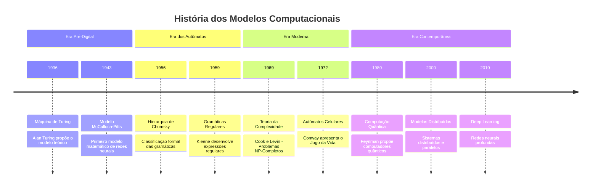

# Modelos Computacionais

```ascii
╔══════════════════════════════════════════════════════════════╗
║  COMPUTATIONAL.MODELS >> NEURAL.MATRIX                       ║
║  STATUS: ACTIVE                                             ║
╚══════════════════════════════════════════════════════════════╝
```

## História dos Modelos Computacionais

A evolução dos modelos computacionais representa uma jornada fascinante através do desenvolvimento do pensamento matemático e da ciência da computação. Esta história nos mostra como evoluímos de conceitos puramente teóricos para implementações práticas que revolucionaram o mundo.



### Era Pré-Digital (1936-1956)
A era pré-digital foi marcada por avanços teóricos fundamentais. Em 1936, Alan Turing apresentou seu modelo abstrato de computação, a Máquina de Turing, que se tornaria a base da ciência da computação moderna. Este modelo demonstrou, pela primeira vez, os limites fundamentais do que pode ser computado.

Em 1943, Warren McCulloch e Walter Pitts introduziram o primeiro modelo matemático de redes neurais, estabelecendo as bases para o que viria a se tornar a área de inteligência artificial. Este modelo simplificado de neurônios artificiais mostrou como elementos básicos poderiam realizar computações complexas.

### Era dos Autômatos (1956-1969)
Em 1956, Noam Chomsky revolucionou a compreensão das linguagens formais ao introduzir sua hierarquia de gramáticas. Esta classificação não apenas impactou a linguística, mas também forneceu fundamentos essenciais para o desenvolvimento de linguagens de programação e compiladores.

Stephen Kleene, em 1959, desenvolveu a teoria das expressões regulares, que se tornaria uma ferramenta fundamental na computação moderna, especialmente no processamento de texto e análise léxica.

### Era Moderna (1969-1980)
A teoria da complexidade ganhou forma com Stephen Cook e Leonid Levin, que independentemente descobriram a classe de problemas NP-Completos em 1969. Esta descoberta estabeleceu bases fundamentais para entender a dificuldade intrínseca de problemas computacionais.

John Conway, em 1972, criou o "Jogo da Vida", um autômato celular que demonstrou como regras simples podem gerar comportamentos complexos, influenciando campos desde a biologia computacional até a física digital.

### Era Contemporânea (1980-presente)
Richard Feynman propôs a ideia de computação quântica em 1980, abrindo um novo campo de possibilidades computacionais. Este conceito revolucionário sugeriu que princípios da mecânica quântica poderiam ser utilizados para realizar cálculos de maneira fundamentalmente diferente.

Os anos 2000 viram a ascensão de modelos distribuídos, essenciais para a era da internet e computação em nuvem. O desenvolvimento de sistemas distribuídos trouxe novos desafios e paradigmas para a computação.

A partir de 2010, o deep learning emergiu como uma força transformadora, com redes neurais profundas alcançando resultados sem precedentes em tarefas como reconhecimento de padrões, processamento de linguagem natural e visão computacional.


## Introdução aos Modelos Computacionais

Os modelos computacionais são abstrações matemáticas que nos permitem compreender e analisar o processo de computação. Eles fornecem uma base teórica fundamental para entender os limites e capacidades dos sistemas computacionais.


## Hierarquia de Chomsky

A hierarquia de Chomsky, proposta por Noam Chomsky em 1956, classifica as linguagens formais e suas gramáticas correspondentes em quatro níveis distintos. Esta classificação é fundamental para compreender a complexidade computacional e os recursos necessários para processar diferentes tipos de linguagens.

### Tipo 0: Gramáticas Irrestritas
- **Definição**: São as gramáticas mais gerais, sem restrições nas regras de produção
- **Poder Computacional**: Equivalente a uma Máquina de Turing
- **Características**:
  - Podem gerar qualquer linguagem recursivamente enumerável
  - Não há garantia de que um programa termine
  - Requerem recursos computacionais ilimitados

### Tipo 1: Gramáticas Sensíveis ao Contexto
- **Definição**: As regras de produção podem depender do contexto
- **Poder Computacional**: Equivalente a um autômato limitado linearmente
- **Aplicações**:
  - Processamento de linguagens naturais
  - Análise de estruturas linguísticas complexas
  - Sistemas que requerem sensibilidade ao contexto

### Tipo 2: Gramáticas Livres de Contexto
- **Definição**: Regras de produção com um não-terminal à esquerda
- **Poder Computacional**: Equivalente a um autômato com pilha
- **Importância**:
  - Base para linguagens de programação
  - Análise sintática
  - Compiladores e interpretadores

### Tipo 3: Gramáticas Regulares
- **Definição**: A forma mais restrita de gramática
- **Poder Computacional**: Equivalente a autômatos finitos
- **Aplicações Práticas**:
  - Expressões regulares
  - Análise léxica
  - Reconhecimento de padrões simples

## Máquina de Turing

```ascii
[TAPE] ... □ □ 1 0 1 [1] 0 1 □ □ ...
```

A Máquina de Turing é o modelo computacional mais poderoso, servindo como base para a teoria da computação. Suas características fundamentais incluem:

### Componentes Essenciais
1. **Fita Infinita**
   - Memória ilimitada em ambas as direções
   - Dividida em células que podem conter símbolos
   - Inicialmente preenchida com símbolos em branco

2. **Cabeçote de Leitura/Escrita**
   - Move-se pela fita
   - Pode ler e modificar símbolos
   - Movimento bidirecional

3. **Conjunto de Estados**
   - Estado inicial definido
   - Estados de aceitação e rejeição
   - Estados de transição

4. **Função de Transição**
   - Define o comportamento da máquina
   - Mapeia estado atual e símbolo lido para:
     - Novo estado
     - Símbolo a ser escrito
     - Direção do movimento

## Autômatos Finitos

Os autômatos finitos são modelos computacionais mais simples, mas extremamente úteis para várias aplicações práticas.

### Autômato Finito Determinístico (DFA)
- Cada transição leva a exatamente um estado
- Estado inicial único
- Conjunto de estados finais definido
- Sem transições vazias (ε-transições)

### Autômato Finito Não-Determinístico (NFA)
- Pode ter múltiplas transições para o mesmo input
- Permite ε-transições
- Pode ser convertido para DFA
- Mais flexível para design inicial

## Aplicações Práticas

### 1. Compiladores e Interpretadores
- Análise léxica usando autômatos finitos
- Análise sintática com gramáticas livres de contexto
- Geração de código usando transformações sistemáticas

### 2. Processamento de Linguagem Natural
- Reconhecimento de padrões
- Análise sintática
- Processamento de texto

### 3. Verificação de Sistemas
- Modelagem de protocolos
- Verificação de propriedades
- Análise de segurança

## Conclusão

```ascii
╔═══════════════════════════════════════════════════════════════╗
║ "A compreensão dos modelos computacionais é fundamental     ║
║  para o desenvolvimento de sistemas eficientes e robustos." ║
╚═══════════════════════════════════════════════════════════════╝
```

Os modelos computacionais fornecem a base teórica necessária para compreender os limites e possibilidades da computação. Seu estudo é essencial para o desenvolvimento de sistemas complexos e para a compreensão das capacidades e limitações dos diferentes tipos de sistemas computacionais.