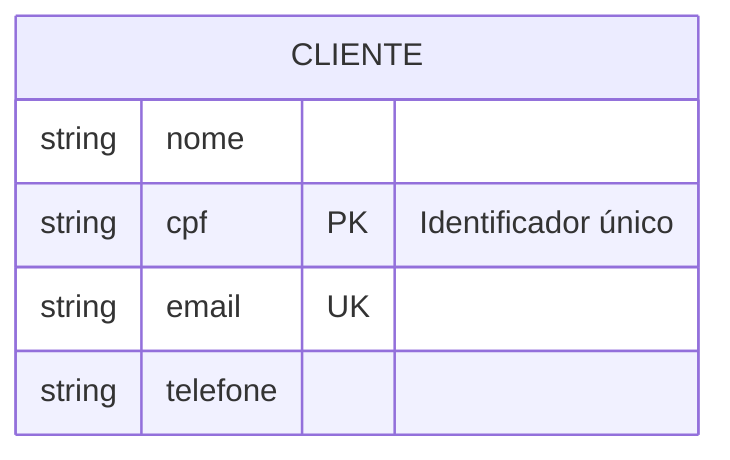
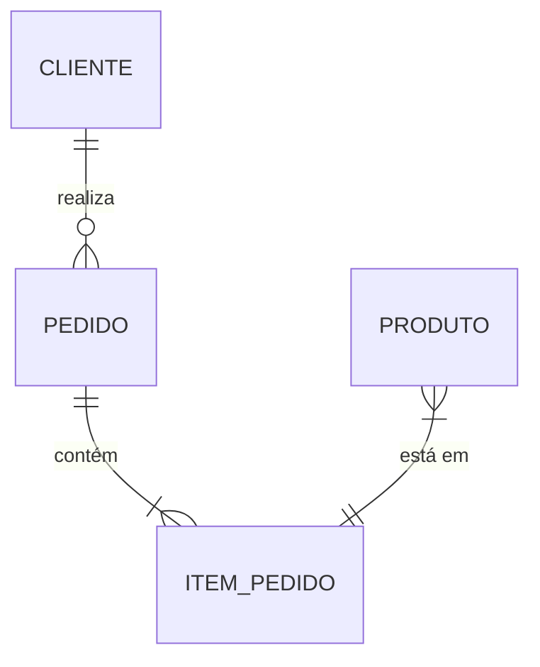
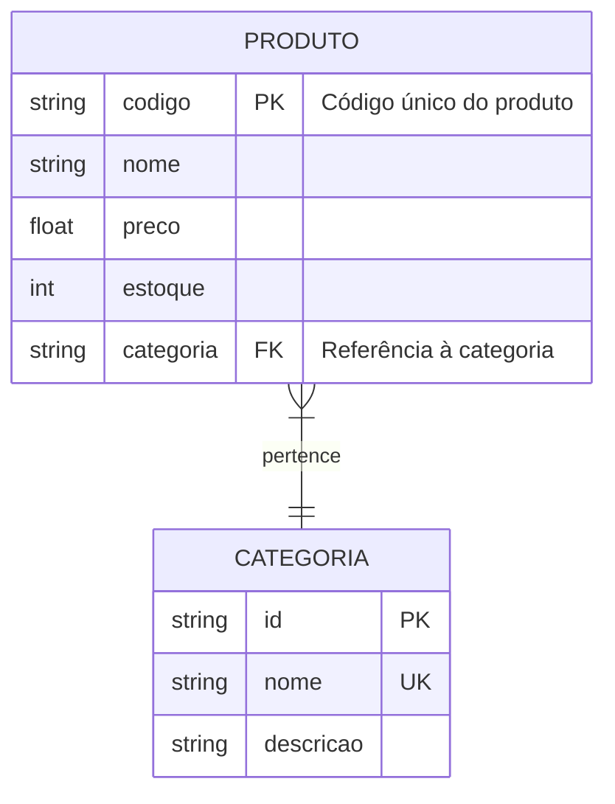
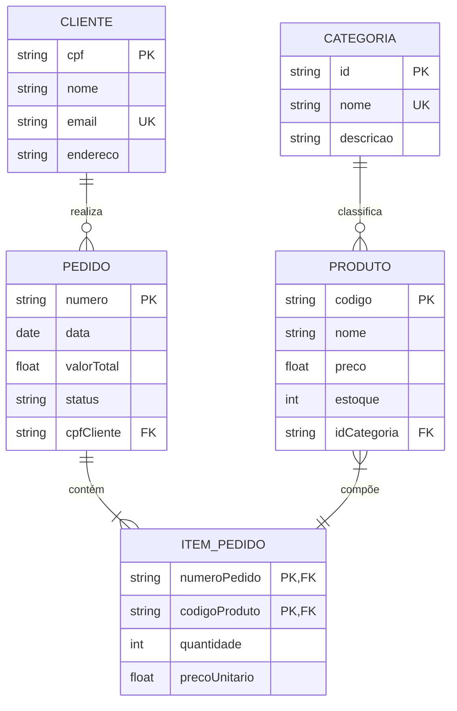
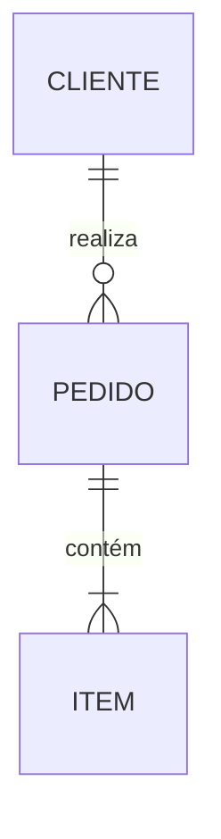

# Modelagem Conceitual

## Diagramas Entidade-Relacionamento (ER)

Os diagramas Entidade-Relacionamento (ER) são uma ferramenta fundamental para modelagem conceitual de dados. Eles descrevem as relações entre diferentes entidades em um domínio específico de conhecimento.

### Componentes Básicos

#### 1. Entidades
Uma entidade representa um objeto ou conceito do mundo real. Por convenção, os nomes das entidades são escritos em maiúsculas e no singular.

#### 2. Relacionamentos
Os relacionamentos descrevem como as entidades se conectam entre si. A cardinalidade indica quantas instâncias de uma entidade podem se relacionar com outra.

##### Tipos de Cardinalidade:
- `||--||` : Exatamente um para um
- `||--o{` : Um para muitos (zero ou mais)
- `||--|{` : Um para muitos (pelo menos um)
- `}o--o{` : Muitos para muitos (zero ou mais)

#### 3. Atributos
Os atributos são características que descrevem uma entidade.

Tipos de Atributos:
- `PK` : Chave Primária
- `FK` : Chave Estrangeira
- `UK` : Chave Única

### Exemplo Completo de Modelagem

Vamos modelar um sistema de e-commerce:

### Boas Práticas

1. **Nomenclatura**
   - Use nomes significativos
   - Mantenha consistência
   - Evite abreviações ambíguas

2. **Cardinalidade**
   - Defina claramente as restrições
   - Considere casos extremos
   - Documente as regras de negócio

3. **Atributos**
   - Identifique chaves primárias
   - Estabeleça chaves estrangeiras
   - Defina atributos obrigatórios

### Direções do Diagrama

Os diagramas ER podem ser orientados em diferentes direções:

### Estilização

É possível personalizar a aparência dos diagramas:

## Conclusão

A modelagem ER é uma técnica poderosa para:
- Visualizar estruturas de dados
- Documentar requisitos
- Comunicar com stakeholders
- Planejar implementações

O uso de diagramas Mermaid torna a criação e manutenção desses modelos mais eficiente e integrada com documentação moderna.
