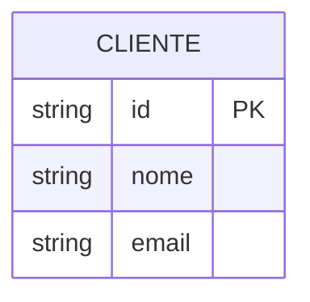
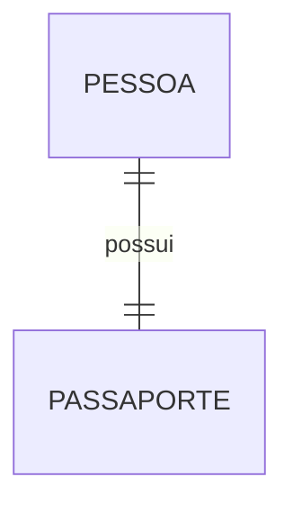
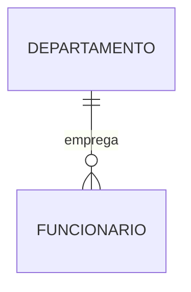
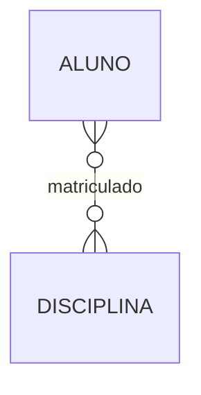
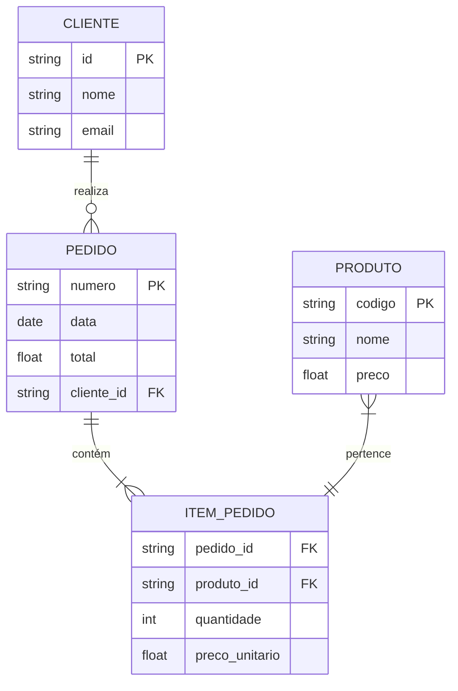
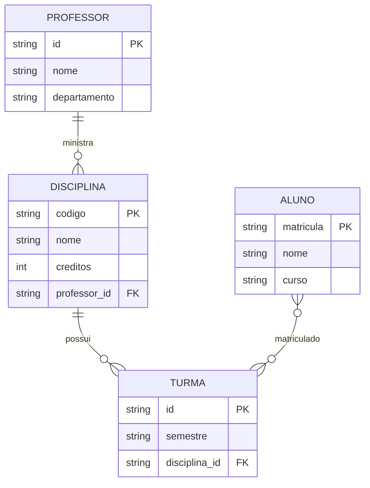

# Notação Pé de Galinha (Crow's Foot)

A notação Pé de Galinha, também conhecida como Crow's Foot, é uma das notações mais populares para modelagem de dados, especialmente em ferramentas CASE e ambientes profissionais.

## Elementos Básicos

### 1. Entidades

- Representadas por retângulos
- Nome em MAIÚSCULAS
- Atributos listados internamente
- Chaves indicadas (PK/FK)

### 2. Relacionamentos

- Representados por linhas
- Cardinalidade nas extremidades
- Verbos conectando entidades
- Direção de leitura indicada

### 3. Símbolos de Cardinalidade

| Símbolo | Significado |
|---------|-------------|
| \|\| | Exatamente um |
| \|o | Zero ou um |
| \|\{ | Um ou mais |
| o{ | Zero ou mais |

## Exemplos de Cardinalidade

### 1. Um-para-Um (1:1)

### 2. Um-para-Muitos (1:N)

### 3. Muitos-para-Muitos (N:M)

## Modelos Complexos

### 1. Sistema de Vendas

### 2. Sistema Acadêmico

## Vantagens

1. **Compacta**
   - Economia de espaço
   - Diagramas limpos
   - Fácil visualização
   - Escalável

2. **Profissional**
   - Amplamente adotada
   - Suporte em ferramentas
   - Padrão de mercado
   - Fácil integração

3. **Prática**
   - Rápida de desenhar
   - Fácil de modificar
   - Clara de entender
   - Simples de manter

## Boas Práticas

### 1. Layout
- Minimize cruzamentos de linhas
- Alinhe entidades relacionadas
- Mantenha espaçamento consistente
- Organize por grupos lógicos

### 2. Nomenclatura
- Use nomes significativos
- Mantenha padrão consistente
- Evite abreviações
- Use termos do domínio

### 3. Relacionamentos
- Indique direção de leitura
- Use verbos significativos
- Evite redundância
- Mantenha simplicidade

## Ferramentas Populares

### 1. Modelagem
- MySQL Workbench
- ERwin
- Visio
- Draw.io
- Lucidchart

### 2. Recursos
- Templates prontos
- Validação automática
- Geração de código
- Documentação integrada

## Comparação com Outras Notações

### 1. Vantagens sobre Chen
- Mais compacta
- Mais moderna
- Mais utilizada
- Melhor suporte

### 2. Vantagens sobre UML
- Foco em dados
- Mais simples
- Mais específica
- Melhor para BD

## Casos de Uso

### 1. Modelagem de Dados
- Bancos relacionais
- Data warehouses
- Sistemas OLTP
- Sistemas OLAP

### 2. Documentação
- Especificações
- Manuais técnicos
- Documentação API
- Modelos conceituais

## Dicas Práticas

### 1. Início do Projeto
- Identifique entidades principais
- Estabeleça relacionamentos básicos
- Defina cardinalidades
- Valide com stakeholders

### 2. Manutenção
- Mantenha documentação atualizada
- Revise periodicamente
- Refatore quando necessário
- Versione alterações

## Conclusão

A notação Pé de Galinha é:
- Eficiente
- Profissional
- Bem suportada
- Amplamente adotada

Recomendada para:
- Projetos profissionais
- Documentação técnica
- Modelagem de dados
- Comunicação entre equipes