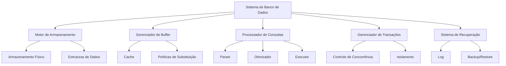
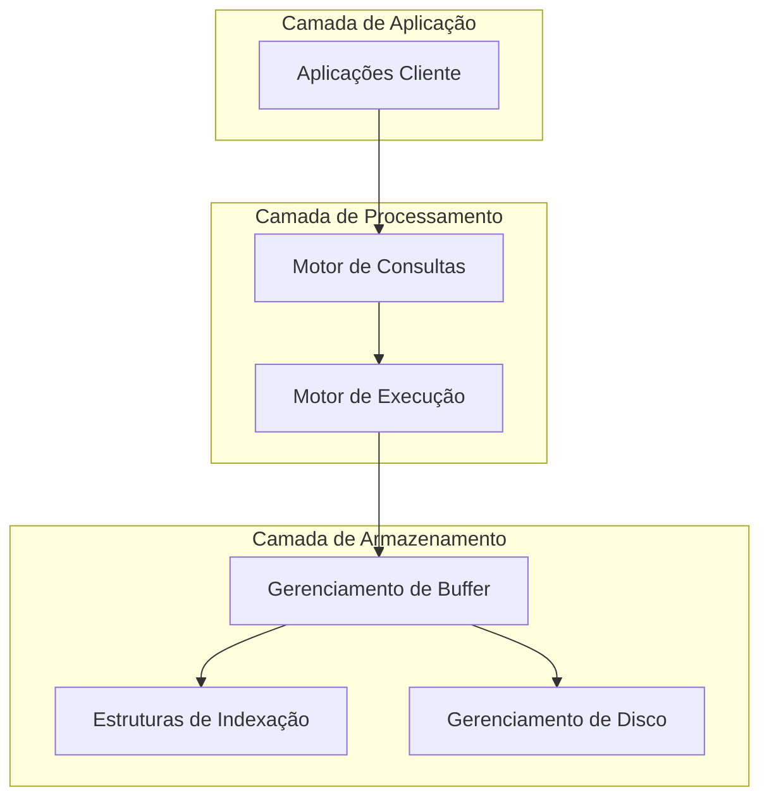
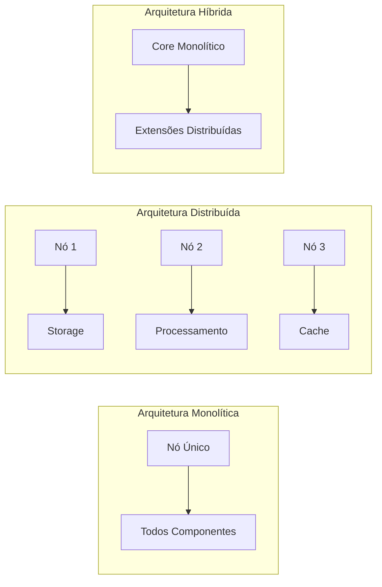
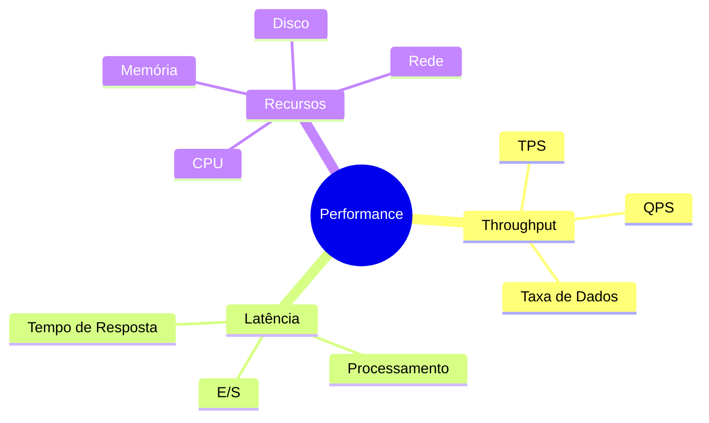
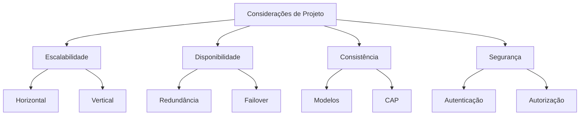

# Arquitetura de Sistemas de Dados

A arquitetura de sistemas de dados é a estrutura fundamental que define como os dados são armazenados, processados e gerenciados em um sistema de banco de dados. Este capítulo explora os componentes essenciais, padrões arquiteturais e considerações de projeto que formam a base dos sistemas de dados modernos.

## Componentes Fundamentais

### 1. Motor de Armazenamento
- Gerenciamento de armazenamento físico
- Implementação de estruturas de dados
- Organização de páginas e registros
- Estratégias de compressão e codificação

### 2. Gerenciador de Buffer
- Gerenciamento de memória cache
- Políticas de substituição de páginas
- Otimização de E/S
- Estratégias de pré-carregamento e gravação posterior

### 3. Processador de Consultas
- Analisador e validador de consultas
- Otimizador de consultas
- Executor de planos
- Cache de resultados

### 4. Gerenciador de Transações
- Controle de concorrência
- Isolamento de transações
- Gerenciamento de bloqueios
- Detecção de impasses

### 5. Sistema de Recuperação
- Registro antecipado de alterações
- Gerenciamento de pontos de verificação
- Recuperação após falhas
- Backup e restauração

## Camadas Arquiteturais

### Camada de Armazenamento
1. **Gerenciamento de Disco**
   - Alocação de espaço
   - Gerenciamento de blocos
   - Escalonamento de E/S
   - Configurações RAID

2. **Estruturas de Indexação**
   - Árvores B e variantes
   - Índices hash
   - Índices bitmap
   - Índices especializados

3. **Gerenciamento de Buffer**
   - Políticas LRU/MRU
   - Rastreamento de páginas sujas
   - Substituição de páginas
   - Mapeamento de memória

### Camada de Processamento
1. **Motor de Consultas**
   - Análise sintática
   - Análise semântica
   - Reescrita de consultas
   - Otimização baseada em custos

2. **Motor de Execução**
   - Processamento em pipeline
   - Execução paralela
   - Gerenciamento de recursos
   - Otimização em tempo de execução

## Padrões Arquiteturais

### 1. Arquitetura Monolítica
- **Características**
  - Implantação em nó único
  - Arquitetura compartilhada
  - Forte consistência
  - Simplicidade operacional

- **Considerações**
  - Limites de escalabilidade vertical
  - Ponto único de falha
  - Manutenção simplificada
  - Menor complexidade operacional

### 2. Arquitetura Distribuída
- **Características**
  - Implantação multi-nó
  - Arquitetura sem compartilhamento
  - Escalabilidade horizontal
  - Alta disponibilidade

- **Componentes Específicos**
  - Processador de consultas distribuído
  - Protocolos de consenso
  - Gerenciador de replicação
  - Gerenciador de particionamento

### 3. Arquitetura Híbrida
- **Características**
  - Combinação de abordagens
  - Flexibilidade de implantação
  - Compromissos personalizáveis
  - Adaptabilidade contextual

## Considerações de Desempenho

### Métricas Fundamentais
1. **Taxa de Transferência**
   - Transações por segundo (TPS)
   - Consultas por segundo (QPS)
   - Taxa de transferência de dados

2. **Latência**
   - Tempo de resposta
   - Tempo de processamento
   - Tempo de espera E/S

3. **Utilização de Recursos**
   - Uso de CPU
   - Consumo de memória
   - Largura de banda de E/S
   - Utilização de rede

### Otimização
1. **Otimização de Consultas**
   - Otimização de plano de execução
   - Utilização de índices
   - Estratégias de junção
   - Visões materializadas

2. **Gerenciamento de Recursos**
   - Pool de conexões
   - Gerenciamento de threads
   - Alocação de memória
   - Escalonamento de E/S

## Considerações de Projeto

### 1. Escalabilidade
- Escalabilidade horizontal vs. vertical
- Particionamento de dados
- Replicação
- Balanceamento de carga

### 2. Disponibilidade
- Redundância
- Mecanismos de failover
- Recuperação de desastres
- Estratégias de backup

### 3. Consistência
- Modelos de consistência
- Compromissos CAP
- Níveis de isolamento
- Gerenciamento de atraso de replicação

### 4. Segurança
- Autenticação
- Autorização
- Criptografia
- Registro de auditoria

## Conclusão

A arquitetura de sistemas de dados é um campo complexo que requer um equilíbrio cuidadoso entre diversos requisitos e restrições. O sucesso de uma implementação depende da compreensão profunda destes componentes e suas interações, além da capacidade de fazer escolhas informadas baseadas em requisitos específicos do sistema.