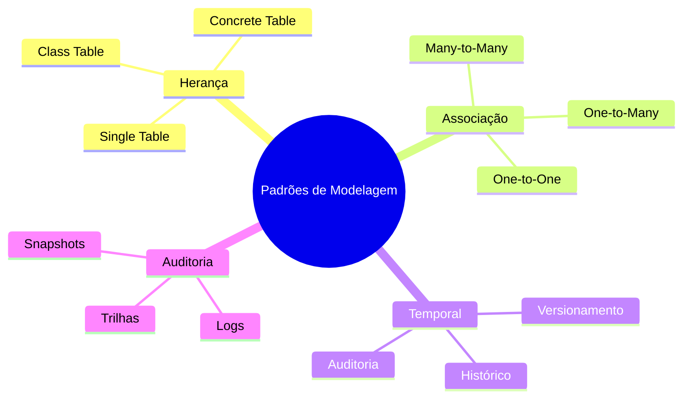

# Padrões de Modelagem de Dados

## Visão Geral

## Categorias de Padrões

### 1. Padrões de Herança
- Mapeamento de hierarquias
- Polimorfismo em dados
- Reutilização de estruturas

### 2. Padrões de Associação
- Relacionamentos complexos
- Cardinalidades
- Agregações

### 3. Padrões Temporais
- Histórico de mudanças
- Versionamento
- Dados temporais

### 4. Padrões de Auditoria
- Rastreamento
- Segurança
- Conformidade

## Seleção de Padrões

### Critérios
1. **Requisitos Funcionais**
   - Funcionalidades necessárias
   - Regras de negócio
   - Casos de uso

2. **Requisitos Não-Funcionais**
   - Performance
   - Manutenibilidade
   - Escalabilidade

3. **Contexto**
   - Tecnologia
   - Equipe
   - Restrições