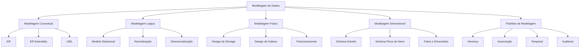
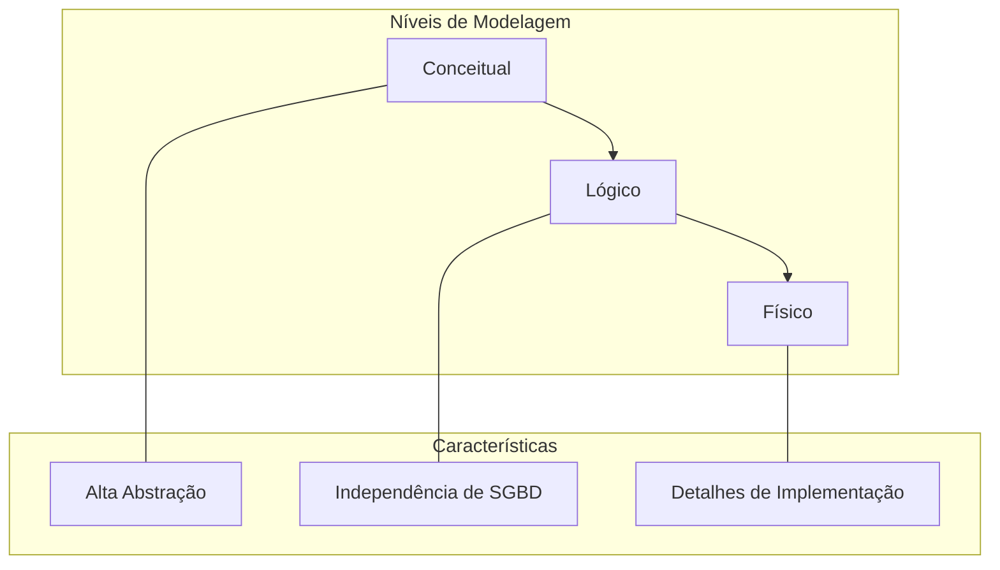
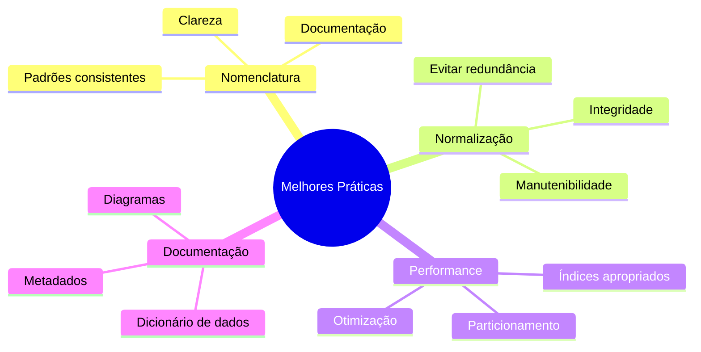

# Modelagem de Dados

## Visão Geral

## Introdução à Modelagem de Dados

A modelagem de dados é um processo fundamental no desenvolvimento de sistemas de banco de dados, servindo como ponte entre os requisitos do negócio e a implementação técnica. Este processo envolve a criação de modelos que representam a estrutura, relacionamentos e restrições dos dados em diferentes níveis de abstração.

### Objetivos da Modelagem

1. **Representação da Realidade**
   - Capturar requisitos do negócio
   - Mapear entidades e relacionamentos
   - Definir regras e restrições

2. **Qualidade dos Dados**
   - Garantir integridade
   - Evitar redundância
   - Manter consistência

3. **Eficiência Operacional**
   - Otimizar consultas
   - Facilitar manutenção
   - Permitir escalabilidade

## Níveis de Abstração

### 1. Nível Conceitual
- Foco no domínio do negócio
- Independente de tecnologia
- Diagrama Entidade-Relacionamento
- Visão de alto nível

### 2. Nível Lógico
- Estruturas de dados normalizadas
- Independente do SGBD
- Modelo Relacional
- Definição de chaves e relacionamentos

### 3. Nível Físico
- Específico para o SGBD
- Otimizações de performance
- Estruturas de armazenamento
- Índices e partições

## Processo de Modelagem

### Etapas do Processo

1. **Levantamento de Requisitos**
   - Entrevistas com stakeholders
   - Análise de documentação
   - Identificação de regras de negócio

2. **Análise de Dados**
   - Identificação de entidades
   - Mapeamento de relacionamentos
   - Definição de atributos

3. **Desenvolvimento dos Modelos**
   - Criação do modelo conceitual
   - Transformação para modelo lógico
   - Refinamento do modelo físico

4. **Validação e Refinamento**
   - Revisão com stakeholders
   - Testes de consistência
   - Ajustes de performance

## Considerações de Design

### 1. Flexibilidade
- Adaptabilidade a mudanças
- Extensibilidade do modelo
- Reutilização de estruturas

### 2. Performance
- Otimização de consultas
- Estratégias de indexação
- Particionamento de dados

### 3. Integridade
- Consistência dos dados
- Regras de negócio
- Restrições de integridade

### 4. Segurança
- Controle de acesso
- Auditoria
- Proteção de dados

## Melhores Práticas

### 1. Padronização
- Convenções de nomenclatura
- Documentação consistente
- Processos padronizados

### 2. Modularização
- Decomposição adequada
- Reutilização de estruturas
- Manutenibilidade

### 3. Validação
- Testes de integridade
- Verificação de requisitos
- Revisão por pares

## Ferramentas e Tecnologias

### 1. Ferramentas CASE
- Modelagem visual
- Geração de código
- Documentação automática

### 2. Sistemas de Versionamento
- Controle de versão
- Colaboração em equipe
- Rastreabilidade

### 3. Frameworks de Modelagem
- Metodologias estabelecidas
- Padrões de indústria
- Melhores práticas

## Conclusão

A modelagem de dados é uma disciplina fundamental que requer um equilíbrio entre teoria e prática. O sucesso de um projeto de banco de dados depende diretamente da qualidade de sua modelagem, que deve ser:

- Precisa na representação do negócio
- Eficiente em termos de performance
- Flexível para acomodar mudanças
- Manutenível a longo prazo

A combinação de boas práticas, ferramentas adequadas e uma metodologia sólida é essencial para criar modelos de dados que atendam às necessidades do presente e sejam adaptáveis às demandas futuras.