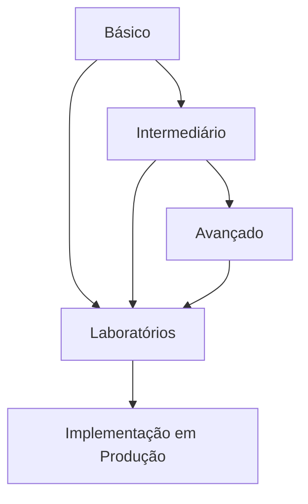

# Exercícios de DCL (Data Control Language)

## Visão Geral

Este módulo contém uma série progressiva de exercícios para praticar comandos DCL em SQL. Os exercícios estão organizados em três níveis de dificuldade:

### Nível Básico
- Criação e gerenciamento de usuários
- Concessão de privilégios simples
- Revogação de privilégios
- Operações fundamentais de DCL

### Nível Intermediário
- Gerenciamento de roles
- Hierarquias de privilégios
- Privilégios em nível de coluna
- Técnicas de segurança intermediárias

### Nível Avançado
- Implementação de políticas de segurança
- Auditoria de privilégios
- Cenários empresariais de controle de acesso
- Migração de permissões

## Estrutura dos Exercícios

Cada exercício segue o formato:
1. Descrição do problema
2. Requisitos específicos
3. Dicas de implementação
4. Solução de referência
5. Critérios de avaliação

## Ambiente de Prática

```sql
-- Database de teste
CREATE DATABASE seguranca_db;

-- Schema para isolamento
CREATE SCHEMA aplicacao;
CREATE SCHEMA relatorios;
CREATE SCHEMA administracao;

-- Tabelas de exemplo
CREATE TABLE aplicacao.clientes (
    id SERIAL PRIMARY KEY,
    nome VARCHAR(100) NOT NULL,
    email VARCHAR(100) UNIQUE,
    cpf VARCHAR(14) UNIQUE,
    limite_credito DECIMAL(10,2),
    data_cadastro DATE DEFAULT CURRENT_DATE
);

CREATE TABLE aplicacao.produtos (
    id SERIAL PRIMARY KEY,
    nome VARCHAR(100) NOT NULL,
    descricao TEXT,
    preco DECIMAL(10,2) CHECK (preco > 0),
    estoque INTEGER DEFAULT 0
);

CREATE TABLE aplicacao.pedidos (
    id SERIAL PRIMARY KEY,
    cliente_id INTEGER REFERENCES aplicacao.clientes(id),
    data_pedido TIMESTAMP DEFAULT CURRENT_TIMESTAMP,
    valor_total DECIMAL(10,2),
    status VARCHAR(20) DEFAULT 'Pendente'
);

CREATE TABLE relatorios.vendas_mensais (
    mes DATE PRIMARY KEY,
    total_vendas DECIMAL(12,2),
    total_pedidos INTEGER,
    ticket_medio DECIMAL(10,2)
);

CREATE TABLE administracao.usuarios (
    username VARCHAR(50) PRIMARY KEY,
    departamento VARCHAR(50),
    cargo VARCHAR(50),
    data_criacao TIMESTAMP DEFAULT CURRENT_TIMESTAMP
);

CREATE TABLE administracao.log_acessos (
    id SERIAL PRIMARY KEY,
    username VARCHAR(50),
    tabela_acessada VARCHAR(100),
    tipo_operacao VARCHAR(20),
    data_acesso TIMESTAMP DEFAULT CURRENT_TIMESTAMP
);
```

## Fluxo de Estudo Recomendado



## Preparação do Ambiente

Para obter o máximo proveito destes exercícios, recomendamos:

1. **Configurar um ambiente de banco de dados**
   - PostgreSQL 12+ ou MySQL 8+
   - Cliente SQL (DBeaver, pgAdmin, MySQL Workbench)
   - Scripts de inicialização fornecidos

2. **Usuários de teste**
   ```sql
   -- Criar usuários para testes
   CREATE USER app_user WITH PASSWORD 'app123';
   CREATE USER relatorio_user WITH PASSWORD 'rel123';
   CREATE USER admin_user WITH PASSWORD 'adm123';
   CREATE USER dev_user WITH PASSWORD 'dev123';
   ```

3. **Ferramentas recomendadas**
   - Editor de SQL com highlight de sintaxe
   - Ferramenta para visualização de privilégios
   - Ambiente para documentar suas soluções

## Navegação do Conteúdo

- [Exercícios Básicos](basic-dcl-exercises.md)
- [Exercícios Intermediários](intermediate-dcl-exercises.md)
- [Exercícios Avançados](advanced-dcl-exercises.md)

## Dicas de Estudo

```ascii
╔════════════════════════════════════════════╗
║  BOAS PRÁTICAS DE SEGURANÇA:              ║
║  ✓ Privilégio mínimo necessário           ║
║  ✓ Usar roles para agrupar permissões     ║
║  ✓ Revisar permissões regularmente        ║
║  ✓ Documentar políticas de acesso         ║
║  ✓ Implementar auditoria de acessos       ║
╚════════════════════════════════════════════╝
```

## Suporte e Recursos

- Fórum de discussão
- Documentação oficial do SGBD
- Exemplos práticos adicionais
- Soluções comentadas

## Próximos Passos

Após completar os exercícios de DCL, recomendamos:

1. **Laboratórios práticos**
   - Aplicação em cenários realistas
   - Integração com outros conceitos

2. **Projetos integrados**
   - Implementação de políticas de segurança
   - Auditoria e conformidade

3. **Tópicos relacionados**
   - Segurança de banco de dados
   - Criptografia de dados
   - Conformidade com regulamentações (LGPD, GDPR)

## Feedback e Avaliação

Para cada conjunto de exercícios, você pode:
- Verificar suas soluções contra as referências
- Compartilhar abordagens alternativas
- Discutir implicações de segurança
- Solicitar revisão por pares