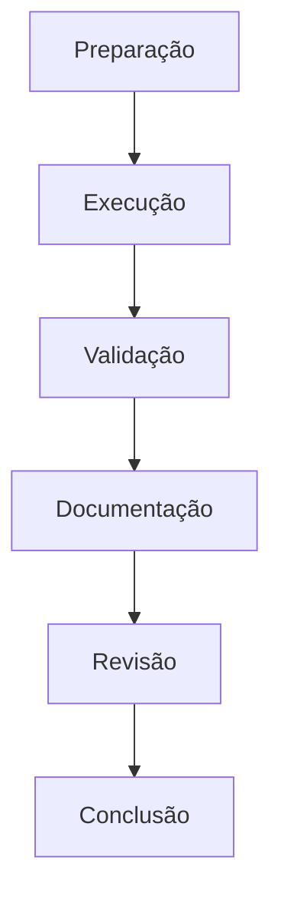

# Laboratórios de DCL

## Visão Geral

Os laboratórios práticos de DCL (Data Control Language) são projetados para fornecer experiência hands-on com operações de controle de acesso em ambientes PostgreSQL. Cada laboratório apresenta cenários reais e desafios práticos comumente encontrados em ambientes de produção.

## Estrutura dos Laboratórios

Cada laboratório segue uma estrutura consistente:

1. **Preparação do Ambiente**
   - Configuração inicial
   - Pré-requisitos
   - Scripts de setup

2. **Objetivos de Aprendizado**
   - Conceitos principais
   - Habilidades técnicas
   - Resultados esperados

3. **Roteiro Prático**
   - Instruções passo a passo
   - Comandos e scripts
   - Pontos de verificação

4. **Avaliação**
   - Critérios de conclusão
   - Testes de validação
   - Métricas de sucesso

## Ambiente de Laboratório

```sql
-- Criar database dedicado para laboratórios
CREATE DATABASE lab_dcl;

-- Schema para isolamento de exercícios
CREATE SCHEMA lab_workspace;

-- Tabelas para os laboratórios
CREATE TABLE lab_workspace.clientes (
    id SERIAL PRIMARY KEY,
    nome VARCHAR(100) NOT NULL,
    email VARCHAR(100) UNIQUE,
    data_cadastro DATE DEFAULT CURRENT_DATE,
    status VARCHAR(20) DEFAULT 'Ativo',
    segmento VARCHAR(50),
    limite_credito DECIMAL(10,2) DEFAULT 1000.00,
    dados_sensíveis TEXT
);

CREATE TABLE lab_workspace.produtos (
    id SERIAL PRIMARY KEY,
    codigo VARCHAR(20) UNIQUE,
    nome VARCHAR(100) NOT NULL,
    descricao TEXT,
    preco DECIMAL(10,2) NOT NULL CHECK (preco > 0),
    estoque INTEGER DEFAULT 0,
    categoria VARCHAR(50),
    data_cadastro DATE DEFAULT CURRENT_DATE,
    status VARCHAR(20) DEFAULT 'Ativo'
);

CREATE TABLE lab_workspace.pedidos (
    id SERIAL PRIMARY KEY,
    cliente_id INTEGER REFERENCES lab_workspace.clientes(id),
    data_pedido TIMESTAMP DEFAULT CURRENT_TIMESTAMP,
    valor_total DECIMAL(10,2) DEFAULT 0,
    status VARCHAR(20) DEFAULT 'Pendente',
    observacoes TEXT
);

CREATE TABLE lab_workspace.itens_pedido (
    id SERIAL PRIMARY KEY,
    pedido_id INTEGER REFERENCES lab_workspace.pedidos(id),
    produto_id INTEGER REFERENCES lab_workspace.produtos(id),
    quantidade INTEGER NOT NULL CHECK (quantidade > 0),
    preco_unitario DECIMAL(10,2) NOT NULL,
    desconto DECIMAL(5,2) DEFAULT 0
);

CREATE TABLE lab_workspace.usuarios (
    id SERIAL PRIMARY KEY,
    username VARCHAR(50) UNIQUE NOT NULL,
    nome_completo VARCHAR(100) NOT NULL,
    departamento VARCHAR(50),
    cargo VARCHAR(50),
    data_criacao TIMESTAMP DEFAULT CURRENT_TIMESTAMP,
    ultimo_acesso TIMESTAMP,
    status VARCHAR(20) DEFAULT 'Ativo'
);

CREATE TABLE lab_workspace.log_acessos (
    id SERIAL PRIMARY KEY,
    usuario_id INTEGER REFERENCES lab_workspace.usuarios(id),
    data_hora TIMESTAMP DEFAULT CURRENT_TIMESTAMP,
    operacao VARCHAR(20),
    tabela_acessada VARCHAR(50),
    detalhes TEXT
);

-- Tabela de controle de progresso
CREATE TABLE lab_workspace.lab_progress (
    lab_id SERIAL PRIMARY KEY,
    lab_name VARCHAR(100),
    start_time TIMESTAMP DEFAULT CURRENT_TIMESTAMP,
    completion_time TIMESTAMP,
    status VARCHAR(20) DEFAULT 'IN_PROGRESS',
    notes TEXT
);
```

## Laboratórios Disponíveis

### 1. Gerenciamento de Usuários
- Criação e configuração de usuários
- Atribuição de permissões básicas
- Gerenciamento de senhas e políticas
- Monitoramento de atividades

### 2. Hierarquia de Roles
- Implementação de estrutura de roles
- Herança de permissões
- Separação de responsabilidades
- Melhores práticas de design

### 3. Auditoria de Segurança
- Configuração de logs de auditoria
- Monitoramento de atividades suspeitas
- Análise de padrões de acesso
- Relatórios de conformidade

### 4. Migração de Permissões
- Exportação de permissões existentes
- Planejamento de migração
- Implementação de novas políticas
- Validação e testes de acesso

## Fluxo de Trabalho Recomendado



## Boas Práticas

```ascii
╔════════════════════════════════════════════╗
║  DIRETRIZES DE SEGURANÇA:                 ║
║  ✓ Privilégio mínimo necessário           ║
║  ✓ Separação de responsabilidades         ║
║  ✓ Auditoria regular                      ║
║  ✓ Documentação de políticas              ║
║  ✓ Testes de penetração                   ║
╚════════════════════════════════════════════╝
```

## Ferramentas Necessárias

1. **PostgreSQL Client**
   - psql
   - pgAdmin 4
   - DBeaver

2. **Utilitários de Segurança**
   - pg_dump (para backup de permissões)
   - pgAudit (para auditoria avançada)
   - Ferramentas de análise de logs

3. **Scripts de Suporte**
   ```sql
   -- Script de verificação de ambiente
   CREATE OR REPLACE FUNCTION lab_workspace.check_security_environment()
   RETURNS TABLE (
       check_item VARCHAR,
       status VARCHAR,
       details TEXT
   ) AS $$
   BEGIN
       RETURN QUERY
       SELECT 'Database Version'::VARCHAR,
              version()::VARCHAR,
              'Verificação da versão do PostgreSQL'::TEXT
       UNION ALL
       SELECT 'Authentication Method',
              current_setting('password_encryption'),
              'Método de criptografia de senhas'
       UNION ALL
       SELECT 'SSL Status',
              CASE WHEN current_setting('ssl') = 'on' THEN 'Enabled' ELSE 'Disabled' END,
              'Status da conexão SSL';
   END;
   $$ LANGUAGE plpgsql;
   ```

## Navegação dos Laboratórios

- [Laboratório de Gerenciamento de Usuários](lab-user-management.md)
- [Laboratório de Hierarquia de Roles](lab-role-hierarchy.md)
- [Laboratório de Auditoria de Segurança](lab-security-audit.md)
- [Laboratório de Migração de Permissões](lab-permission-migration.md)

## Suporte e Recursos

### Documentação
- [PostgreSQL Official Documentation](https://www.postgresql.org/docs/)
- [DCL Reference Guide](https://www.postgresql.org/docs/current/ddl-priv.html)
- [Security Best Practices](https://www.postgresql.org/docs/current/user-manag.html)

### Comunidade
- Fórum PostgreSQL
- Stack Overflow
- GitHub Discussions

## Conclusão

Os laboratórios DCL fornecem uma base prática essencial para o desenvolvimento de habilidades em segurança de banco de dados. A prática regular destes exercícios contribuirá significativamente para sua expertise em controle de acesso e segurança em ambientes PostgreSQL.

## Próximos Passos

1. **Preparação**
   - Configure seu ambiente local
   - Revise os pré-requisitos
   - Familiarize-se com as ferramentas

2. **Execução**
   - Siga os laboratórios em ordem
   - Complete todos os exercícios
   - Documente seus resultados

3. **Avançado**
   - Explore variações dos exercícios
   - Crie seus próprios cenários
   - Compartilhe experiências

---

> **Nota**: Certifique-se de manter backups e usar ambientes de teste apropriados durante a execução dos laboratórios. Nunca pratique operações de segurança em ambientes de produção sem a devida autorização e planejamento.