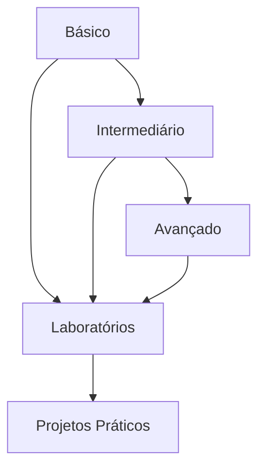

# Exercícios de DDL (Data Definition Language)

## Visão Geral

Este módulo contém uma série progressiva de exercícios para praticar comandos DDL em SQL. Os exercícios estão organizados em três níveis de dificuldade:

### Nível Básico
- Criação de tabelas simples
- Alterações básicas de estrutura
- Operações fundamentais de DDL

### Nível Intermediário
- Relacionamentos entre tabelas
- Constraints complexas
- Modificações de schema

### Nível Avançado
- Otimização de estruturas
- Migrations complexas
- Cenários empresariais

## Estrutura dos Exercícios

Cada exercício segue o formato:
1. Descrição do problema
2. Requisitos específicos
3. Dicas de implementação
4. Solução de referência
5. Critérios de avaliação

## Ambiente de Prática

```sql
-- Database de teste
CREATE DATABASE exercicios_ddl;

-- Schema para isolamento
CREATE SCHEMA pratica;

-- Tabela de controle
CREATE TABLE controle_exercicios (
    id SERIAL PRIMARY KEY,
    exercicio VARCHAR(50),
    completado BOOLEAN DEFAULT FALSE,
    data_conclusao TIMESTAMP
);
```

## Fluxo de Estudo Recomendado



## Avaliação de Progresso

| Nível | Pontos por Exercício | Total de Exercícios | Pontuação Máxima |
|-------|---------------------|---------------------|------------------|
| Básico | 10 | 10 | 100 |
| Intermediário | 20 | 10 | 200 |
| Avançado | 30 | 10 | 300 |

## Recursos Necessários

1. **Ambiente de Desenvolvimento**
   - PostgreSQL 12+
   - Cliente SQL
   - Editor de texto

2. **Conhecimentos Prévios**
   - Conceitos básicos de SQL
   - Modelagem de dados
   - Comandos DDL fundamentais

## Navegação do Conteúdo

- [Exercícios Básicos](basic-ddl-exercises.md)
- [Exercícios Intermediários](intermediate-ddl-exercises.md)
- [Exercícios Avançados](advanced-ddl-exercises.md)

## Dicas de Estudo

```ascii
╔════════════════════════════════════════════╗
║  BOAS PRÁTICAS:                           ║
║  ✓ Teste cada comando individualmente      ║
║  ✓ Mantenha scripts de rollback           ║
║  ✓ Documente suas soluções                ║
║  ✓ Pratique regularmente                  ║
║  ✓ Revise conceitos quando necessário     ║
╚════════════════════════════════════════════╝
```

## Suporte e Recursos

- Fórum de discussão
- Documentação oficial
- Exemplos práticos
- Soluções comentadas

## Próximos Passos

1. Comece pelos exercícios básicos
2. Avance gradualmente
3. Pratique em laboratórios
4. Desenvolva projetos reais

## Certificação

Complete todos os exercícios para receber:
- Certificado de conclusão
- Badge de proficiência
- Pontuação para ranking

## Feedback

Sua opinião é importante:
- Avalie os exercícios
- Sugira melhorias
- Reporte problemas
- Compartilhe experiências