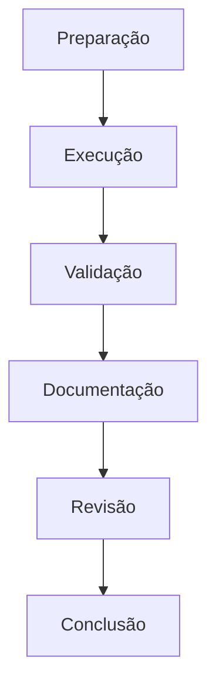

# Laboratórios de DDL

## Visão Geral

Os laboratórios práticos de DDL (Data Definition Language) são projetados para fornecer experiência hands-on com operações de definição de dados em ambientes PostgreSQL. Cada laboratório apresenta cenários reais e desafios práticos comumente encontrados em ambientes de produção.

## Estrutura dos Laboratórios

Cada laboratório segue uma estrutura consistente:

1. **Preparação do Ambiente**
   - Configuração inicial
   - Pré-requisitos
   - Scripts de setup

2. **Objetivos de Aprendizado**
   - Conceitos principais
   - Habilidades técnicas
   - Resultados esperados

3. **Roteiro Prático**
   - Instruções passo a passo
   - Comandos e scripts
   - Pontos de verificação

4. **Avaliação**
   - Critérios de conclusão
   - Testes de validação
   - Métricas de sucesso

## Ambiente de Laboratório

```sql
-- Criar database dedicado para laboratórios
CREATE DATABASE lab_ddl;

-- Schema para isolamento de exercícios
CREATE SCHEMA lab_workspace;

-- Tabela de controle de progresso
CREATE TABLE lab_workspace.lab_progress (
    lab_id SERIAL PRIMARY KEY,
    lab_name VARCHAR(100),
    start_time TIMESTAMP DEFAULT CURRENT_TIMESTAMP,
    completion_time TIMESTAMP,
    status VARCHAR(20) DEFAULT 'IN_PROGRESS',
    notes TEXT
);
```

## Laboratórios Disponíveis

### 1. Criação de Database
- Estruturação inicial de databases
- Configurações básicas
- Boas práticas de nomenclatura

### 2. Evolução de Schema
- Alterações estruturais
- Migrações seguras
- Versionamento de schema

### 3. Gerenciamento de Constraints
- Implementação de regras de negócio
- Integridade referencial
- Validações customizadas

### 4. Manutenção de Tabelas
- Operações de manutenção
- Otimização de estruturas
- Gerenciamento de espaço

## Fluxo de Trabalho Recomendado



## Boas Práticas

```ascii
╔════════════════════════════════════════════╗
║  DIRETRIZES DE LABORATÓRIO:               ║
║  ✓ Sempre fazer backup antes das práticas ║
║  ✓ Documentar todas as alterações         ║
║  ✓ Testar em ambiente isolado             ║
║  ✓ Validar resultados                     ║
║  ✓ Manter scripts de rollback             ║
╚════════════════════════════════════════════╝
```

## Ferramentas Necessárias

1. **PostgreSQL Client**
   - psql
   - pgAdmin 4
   - DBeaver

2. **Utilitários**
   - pg_dump
   - pg_restore
   - pg_bench

3. **Scripts de Suporte**
   ```sql
   -- Script de verificação de ambiente
   CREATE OR REPLACE FUNCTION lab_workspace.check_environment()
   RETURNS TABLE (
       check_item VARCHAR,
       status VARCHAR,
       details TEXT
   ) AS $$
   BEGIN
       RETURN QUERY
       SELECT 'Database Version'::VARCHAR,
              version()::VARCHAR,
              'Verificação da versão do PostgreSQL'::TEXT
       UNION ALL
       SELECT 'Available Space',
              pg_size_pretty(pg_database_size(current_database())),
              'Espaço utilizado pelo database atual';
   END;
   $$ LANGUAGE plpgsql;
   ```

## Navegação dos Laboratórios

- [Laboratório de Criação de Database](lab-database-creation.md)
- [Laboratório de Evolução de Schema](lab-schema-evolution.md)
- [Laboratório de Gerenciamento de Constraints](lab-constraint-management.md)
- [Laboratório de Manutenção de Tabelas](lab-table-maintenance.md)

## Suporte e Recursos

### Documentação
- [PostgreSQL Official Documentation](https://www.postgresql.org/docs/)
- [DDL Reference Guide](https://www.postgresql.org/docs/current/ddl.html)
- [Schema Management Best Practices](https://www.postgresql.org/docs/current/ddl-schemas.html)

### Comunidade
- Fórum PostgreSQL
- Stack Overflow
- GitHub Discussions

## Conclusão

Os laboratórios DDL fornecem uma base prática essencial para o desenvolvimento de habilidades em gerenciamento de estruturas de dados. A prática regular destes exercícios contribuirá significativamente para sua expertise em administração de bancos de dados PostgreSQL.

## Próximos Passos

1. **Preparação**
   - Configure seu ambiente local
   - Revise os pré-requisitos
   - Familiarize-se com as ferramentas

2. **Execução**
   - Siga os laboratórios em ordem
   - Complete todos os exercícios
   - Documente seus resultados

3. **Avançado**
   - Explore variações dos exercícios
   - Crie seus próprios cenários
   - Compartilhe experiências

---

> **Nota**: Certifique-se de manter backups e usar ambientes de teste apropriados durante a execução dos laboratórios.