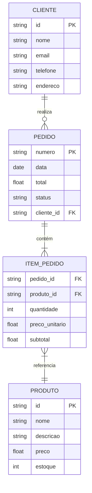
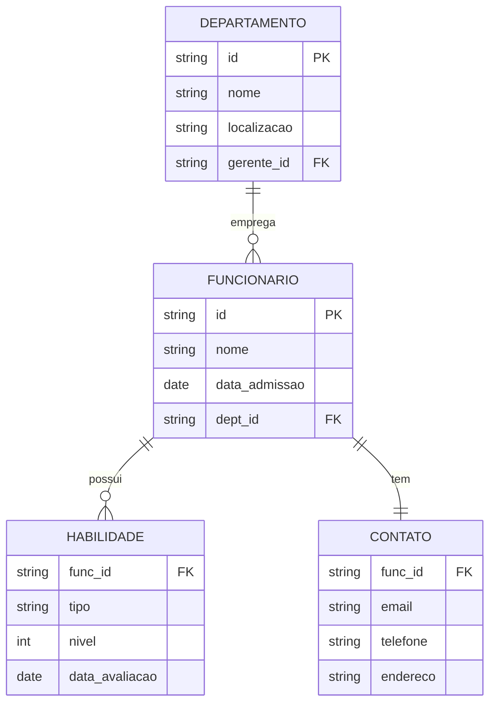
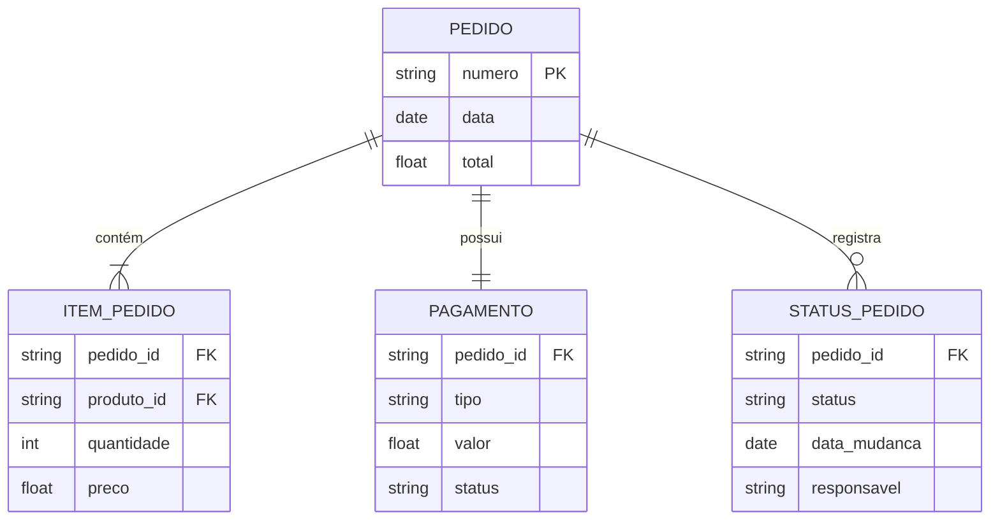

# Princípios de Design ER

Os princípios de design ER são diretrizes fundamentais que orientam a criação de modelos de dados eficientes, manuteníveis e escaláveis.

## Princípios Fundamentais

### 1. Abstração Adequada
- **Nível correto de detalhamento**
    - Identificação das informações essenciais
    - Eliminação de detalhes supérfluos
    - Equilíbrio entre simplicidade e completude
    - Foco nas necessidades do negócio

- **Representação clara do domínio**
    - Alinhamento com conceitos do negócio
    - Vocabulário consistente com stakeholders
    - Mapeamento direto de processos
    - Facilidade de compreensão

- **Balanceamento de complexidade**
    - Decomposição de estruturas complexas
    - Agrupamento lógico de elementos
    - Gerenciamento de dependências
    - Simplicidade sem perda de funcionalidade

- **Foco nos aspectos relevantes**
    - Priorização de requisitos críticos
    - Identificação de casos de uso principais
    - Suporte a objetivos do negócio
    - Flexibilidade para evolução

### 2. Normalização Apropriada
- **Eliminação de redundância**
    - Identificação de dados duplicados
    - Consolidação de informações
    - Estruturas normalizadas
    - Exceções justificadas

- **Integridade dos dados**
    - Consistência das informações
    - Regras de validação
    - Restrições de integridade
    - Garantias de qualidade

- **Eficiência de armazenamento**
    - Otimização de estruturas
    - Uso adequado de tipos de dados
    - Estratégias de compressão
    - Gerenciamento de espaço

- **Facilidade de manutenção**
    - Simplicidade de atualizações
    - Minimização de impactos
    - Clareza nas modificações
    - Rastreabilidade de mudanças

### 3. Modularidade
- **Decomposição lógica**
    - Separação de conceitos
    - Agrupamento funcional
    - Interfaces bem definidas
    - Limites claros

- **Coesão entre elementos**
    - Relacionamentos significativos
    - Dependências justificadas
    - Agrupamentos naturais
    - Minimização de fragmentação

- **Acoplamento controlado**
    - Interfaces bem definidas
    - Dependências minimizadas
    - Isolamento de mudanças
    - Flexibilidade de evolução

- **Reusabilidade**
    - Componentes genéricos
    - Padrões reutilizáveis
    - Estruturas flexíveis
    - Adaptabilidade

### 4. Consistência
- **Nomenclatura padronizada**
    - Convenções de nomes
    - Termos do domínio
    - Abreviações consistentes
    - Clareza semântica

- **Convenções de modelagem**
    - Padrões de design
    - Práticas estabelecidas
    - Diretrizes documentadas
    - Conformidade com standards

- **Documentação uniforme**
    - Descrições claras
    - Metadados completos
    - Histórico de decisões
    - Justificativas de design

- **Regras consistentes**
    - Políticas uniformes
    - Restrições padronizadas
    - Validações coerentes
    - Tratamento de exceções

## Exemplos Práticos

### 1. Abstração Adequada

### 2. Normalização

### 3. Modularidade

## Aplicação dos Princípios

### 1. Na Modelagem Inicial
- **Identificar entidades principais**
    - Análise do domínio
    - Levantamento de requisitos
    - Definição de escopo
    - Validação com stakeholders

- **Estabelecer relacionamentos básicos**
    - Conexões naturais
    - Cardinalidades
    - Dependências
    - Restrições

- **Definir atributos essenciais**
    - Dados fundamentais
    - Tipos apropriados
    - Restrições básicas
    - Documentação inicial

- **Validar normalização**
    - Análise de dependências
    - Eliminação de redundância
    - Verificação de integridade
    - Ajustes necessários

### 2. No Refinamento
- **Otimizar estruturas**
    - Análise de performance
    - Ajustes de design
    - Melhorias de eficiência
    - Validação de mudanças

- **Ajustar cardinalidades**
    - Revisão de relacionamentos
    - Verificação de restrições
    - Correção de anomalias
    - Documentação de mudanças

- **Refinar atributos**
    - Revisão de tipos
    - Ajuste de restrições
    - Adição de metadados
    - Validação de regras

- **Validar consistência**
    - Verificação de padrões
    - Teste de integridade
    - Análise de impacto
    - Documentação atualizada

## Checklist de Validação

### 1. Abstração
- [ ] Nível adequado de detalhamento
    - [ ] Informações essenciais identificadas
    - [ ] Detalhes supérfluos eliminados
    - [ ] Complexidade gerenciável
    - [ ] Alinhamento com necessidades

- [ ] Representação clara do domínio
    - [ ] Conceitos bem definidos
    - [ ] Vocabulário consistente
    - [ ] Processos mapeados
    - [ ] Entendimento facilitado

- [ ] Complexidade gerenciável
    - [ ] Estruturas decompostas
    - [ ] Agrupamentos lógicos
    - [ ] Dependências claras
    - [ ] Simplicidade mantida

- [ ] Foco nos aspectos relevantes
    - [ ] Requisitos críticos atendidos
    - [ ] Casos de uso suportados
    - [ ] Objetivos alcançados
    - [ ] Flexibilidade preservada

### 2. Normalização
- [ ] Eliminação de redundância
    - [ ] Dados consolidados
    - [ ] Duplicações removidas
    - [ ] Estruturas otimizadas
    - [ ] Exceções documentadas

- [ ] Dependências funcionais corretas
    - [ ] Relacionamentos válidos
    - [ ] Integridade mantida
    - [ ] Anomalias eliminadas
    - [ ] Consistência garantida

- [ ] Integridade referencial
    - [ ] Chaves apropriadas
    - [ ] Relacionamentos válidos
    - [ ] Restrições definidas
    - [ ] Cascatas configuradas

- [ ] Eficiência de armazenamento
    - [ ] Tipos otimizados
    - [ ] Espaço gerenciado
    - [ ] Performance adequada
    - [ ] Recursos otimizados

## Conclusão

Os princípios de design ER são fundamentais para:
- Qualidade do modelo de dados
- Eficiência do sistema
- Manutenibilidade do código
- Escalabilidade da solução

Sua aplicação consistente resulta em:
- Modelos mais robustos
- Sistemas mais confiáveis
- Manutenção simplificada
- Melhor documentação
- Maior satisfação dos usuários
- Menor custo total de propriedade
