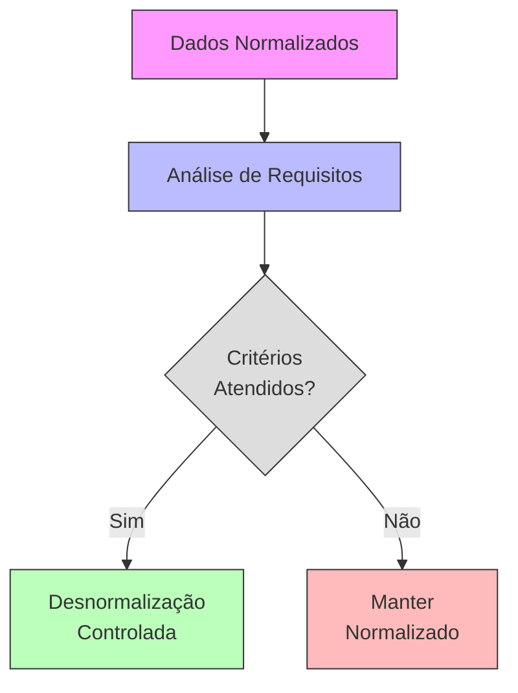

# Intro Desnormalização

A desnormalização é uma estratégia de design de banco de dados que introduz redundância controlada para melhorar a performance em casos específicos.

## Conceito



## Quando Desnormalizar

### 1. Performance Crítica
- Consultas complexas frequentes
- Joins custosos
- Requisitos de tempo real
- Alta carga de leitura

### 2. Dados Estáticos
- Baixa frequência de atualizações
- Dados históricos
- Dados de referência
- Informações catalográficas

### 3. Requisitos Específicos
- Análises estatísticas
- Relatórios complexos
- Agregações frequentes
- Cache de dados

## Técnicas de Desnormalização

### 1. Duplicação de Dados
```sql
-- Normalizado
Cliente(id, nome)
Pedido(id, cliente_id, data)

-- Desnormalizado
Pedido(id, cliente_id, cliente_nome, data)
```

### 2. Tabelas Agregadas
```sql
-- Normalizado
Venda(id, produto_id, quantidade, valor)

-- Desnormalizado
Venda_Diaria(data, total_vendas, total_valor)
```

### 3. Campos Calculados
```sql
-- Normalizado
Produto(id, preco)
Item_Pedido(pedido_id, produto_id, quantidade)

-- Desnormalizado
Item_Pedido(pedido_id, produto_id, quantidade, valor_total)
```

## Riscos e Desafios

### 1. Integridade de Dados
- Inconsistências potenciais
- Complexidade de atualizações
- Sincronização de dados
- Validação adicional

### 2. Manutenção
- Código mais complexo
- Maior espaço em disco
- Processos de atualização
- Documentação necessária

### 3. Performance
- Overhead em escritas
- Custos de storage
- Backup e recuperação
- Índices adicionais

## Estratégias de Implementação

### 1. Análise Prévia
- Perfil de carga
- Padrões de acesso
- Requisitos de consistência
- Custos vs. benefícios

### 2. Implementação Controlada
- Mudanças incrementais
- Testes de performance
- Monitoramento
- Rollback plan

### 3. Manutenção
- Processos de sincronização
- Verificações periódicas
- Ajustes de performance
- Documentação atualizada

## Melhores Práticas

### 1. Documentação
- Justificativas
- Impactos
- Dependências
- Procedimentos

### 2. Monitoramento
- Performance metrics
- Uso de storage
- Consistência de dados
- Logs de atualização

### 3. Revisão Periódica
- Validação de benefícios
- Ajustes necessários
- Evolução do sistema
- Reavaliação de decisões

## Exemplos Práticos

### 1. E-Commerce
```sql
-- Antes
Produto(id, nome, preco)
Categoria(id, nome)
Produto_Categoria(produto_id, categoria_id)

-- Depois
Produto(id, nome, preco, categoria_nome)
```

### 2. Sistema de Relatórios
```sql
-- Antes
Venda(id, data, valor)

-- Depois
Venda(id, data, valor)
Venda_Mensal(ano, mes, total_vendas, valor_total)
```

### 3. Gestão de Conteúdo
```sql
-- Antes
Artigo(id, titulo, conteudo)
Tag(id, nome)
Artigo_Tag(artigo_id, tag_id)

-- Depois
Artigo(id, titulo, conteudo, tags_concatenadas)
```