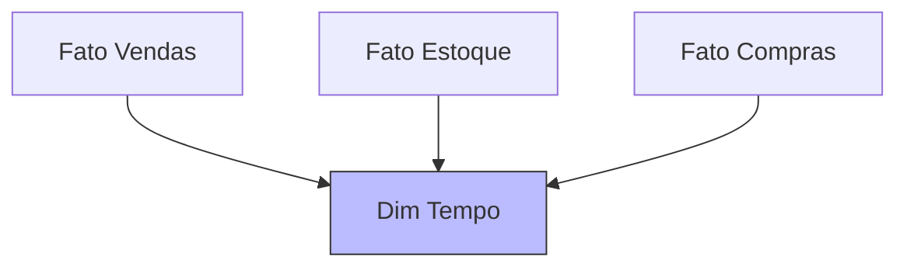

# Tabelas Dimensão

## Estrutura Básica

### 1. Dimensão Produto
```sql
CREATE TABLE dim_produto (
    sk_produto INT PRIMARY KEY,
    cod_produto VARCHAR(20),
    nome VARCHAR(100),
    marca VARCHAR(50),
    categoria VARCHAR(50),
    subcategoria VARCHAR(50),
    preco_base DECIMAL(10,2),
    data_inicio DATE,
    data_fim DATE,
    flag_atual CHAR(1)
);
```

## Tipos de Dimensões

### 1. Dimensões Conformadas


### 2. Role-Playing Dimensions
```sql
-- Exemplo de views para role-playing
CREATE VIEW dim_data_pedido AS
SELECT * FROM dim_tempo;

CREATE VIEW dim_data_entrega AS
SELECT * FROM dim_tempo;
```

### 3. Junk Dimensions
```sql
CREATE TABLE dim_status (
    sk_status INT PRIMARY KEY,
    status_pedido VARCHAR(20),
    status_pagamento VARCHAR(20),
    tipo_entrega VARCHAR(20),
    prioridade VARCHAR(10)
);
```

## Slowly Changing Dimensions (SCD)

### 1. Tipo 1 (Sobrescrita)
```sql
UPDATE dim_produto
SET preco_base = 29.99
WHERE sk_produto = 1001;
```

### 2. Tipo 2 (Histórico)
```sql
-- Fechando registro atual
UPDATE dim_produto
SET data_fim = CURRENT_DATE,
    flag_atual = 'N'
WHERE sk_produto = 1001
AND flag_atual = 'S';

-- Inserindo novo registro
INSERT INTO dim_produto (
    sk_produto,
    cod_produto,
    nome,
    preco_base,
    data_inicio,
    flag_atual
) VALUES (
    NEXT_SK(),
    'PROD1001',
    'Produto A',
    29.99,
    CURRENT_DATE,
    'S'
);
```

### 3. Tipo 3 (Versão Anterior)
```sql
ALTER TABLE dim_produto
ADD preco_anterior DECIMAL(10,2),
ADD data_alteracao_preco DATE;
```

## Hierarquias

### 1. Definição
```sql
CREATE TABLE dim_localizacao (
    sk_localizacao INT PRIMARY KEY,
    cidade VARCHAR(50),
    estado VARCHAR(50),
    regiao VARCHAR(50),
    pais VARCHAR(50),
    continente VARCHAR(30)
);
```

### 2. Navegação
```sql
-- Exemplo de drill-down
SELECT 
    l.continente,
    l.pais,
    l.regiao,
    SUM(f.valor_venda) as total_vendas
FROM fato_vendas f
JOIN dim_localizacao l ON f.sk_localizacao = l.sk_localizacao
GROUP BY ROLLUP(l.continente, l.pais, l.regiao);
```