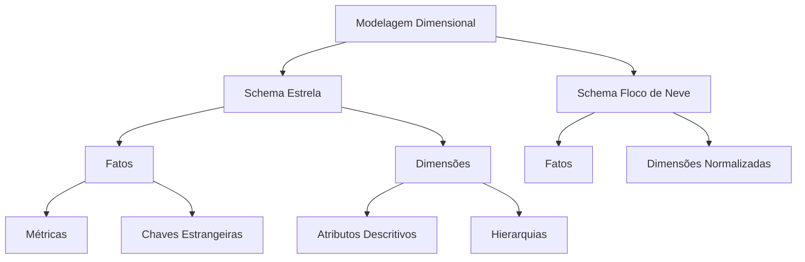

# Modelagem Dimensional

A modelagem dimensional é uma técnica específica para modelagem de data warehouses e data marts, otimizada para consultas analíticas e processamento OLAP.

## Visão Geral

## Componentes Principais

### 1. Tabelas Fato
- Métricas de negócio
- Granularidade
- Chaves estrangeiras
- Tipos de fatos

### 2. Tabelas Dimensão
- Atributos descritivos
- Hierarquias
- Dimensões conformadas
- SCD (Slowly Changing Dimensions)

## Tipos de Schema

### 1. Schema Estrela
- Desnormalizado
- Performance otimizada
- Simplicidade
- Manutenção facilitada

### 2. Schema Floco de Neve
- Normalizado
- Economia de espaço
- Complexidade maior
- Mais joins necessários

## Melhores Práticas

1. **Design de Fatos**
   - Definir granularidade
   - Identificar métricas
   - Estabelecer dimensões
   - Garantir integridade

2. **Design de Dimensões**
   - Definir hierarquias
   - Planejar mudanças
   - Padronizar atributos
   - Manter conformidade