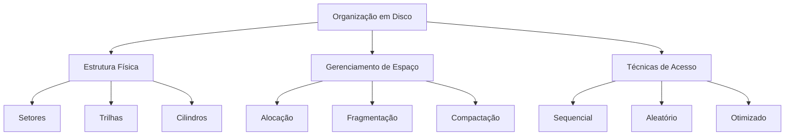
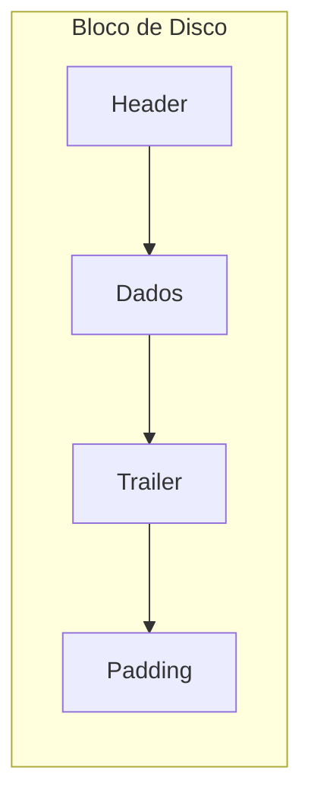
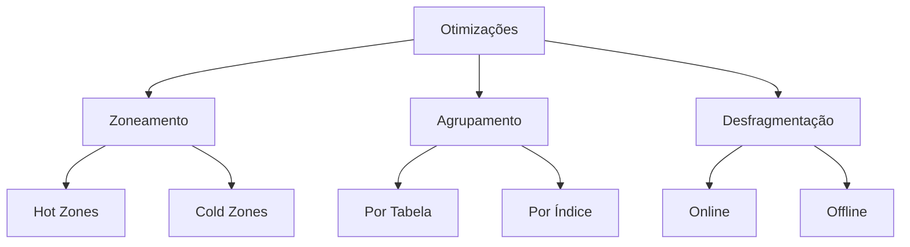
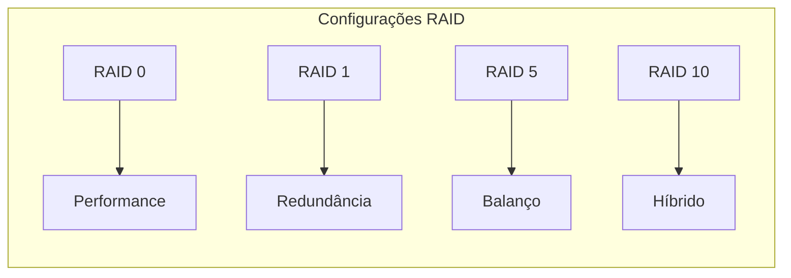
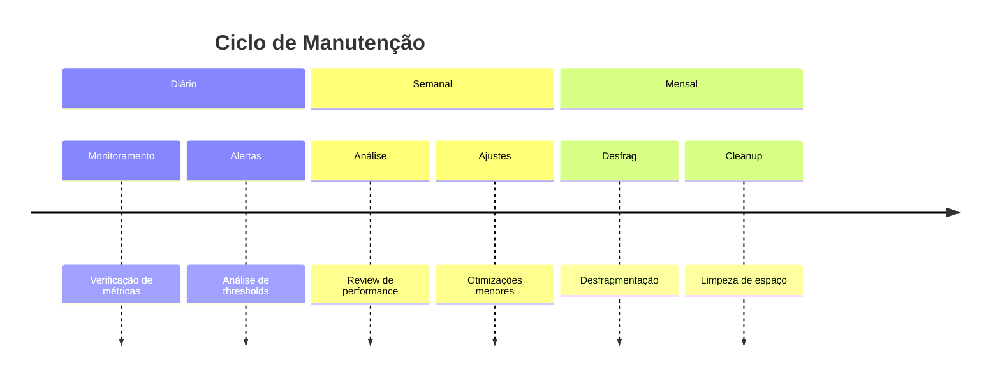

# Organização em Disco

A organização em disco é um aspecto fundamental dos sistemas de banco de dados que impacta diretamente o desempenho e a eficiência do sistema.



## Anatomia do Disco

### 1. Componentes Físicos
- Pratos (Platters)
- Cabeças de leitura/escrita
- Setores e trilhas
- Cilindros


### 2. Características Operacionais
- Tempo de seek
- Latência rotacional
- Taxa de transferência
- Tempo de acesso médio

## Organização de Dados

### 1. Blocos de Disco
- Tamanho do bloco
- Alinhamento
- Fragmentação
- Overhead



### 2. Estratégias de Alocação
- Contígua
- Linked
- Indexed
- Extents

## Otimizações de Acesso

### 1. Técnicas de Posicionamento
- Zoneamento
- Agrupamento
- Desfragmentação
- Balanceamento



### 2. Padrões de Acesso
- Sequencial
- Random
- Mixed
- Batch

## Considerações de Performance

### 1. Métricas Importantes
- IOPS (I/O por segundo)
- Throughput
- Latência
- Queue depth

### 2. Gargalos Comuns
- Seek time
- Rotational delay
- Transfer bottlenecks
- Queue congestion

```mermaid
xychart-beta
    title "Impacto das Otimizações"
    x-axis [Sem Otimização, Com Zoneamento, Com Agrupamento, Totalmente Otimizado]
    y-axis "Performance (IOPS)" 0 --> 100
    bar [30, 50, 70, 90]
```

## Técnicas Avançadas

### 1. RAID
- RAID 0 (Striping)
- RAID 1 (Mirroring)
- RAID 5 (Striping with parity)
- RAID 10 (Striping and mirroring)



### 2. Técnicas Modernas
- SSD optimization
- NVMe considerations
- Hybrid storage
- Tiered storage

## Monitoramento e Manutenção

### 1. Ferramentas de Diagnóstico
- I/O stats
- Disk usage
- Performance counters
- Queue metrics

### 2. Manutenção Preventiva
- Desfragmentação regular
- Space monitoring
- Performance tracking
- Health checks



## Boas Práticas

1. Dimensionamento adequado
2. Monitoramento contínuo
3. Manutenção preventiva
4. Otimização regular
5. Documentação atualizada

## Conclusão

A organização eficiente em disco é crucial para o desempenho do banco de dados. O entendimento profundo dos conceitos apresentados permite implementar e manter sistemas de alto desempenho.

## Referências

1. "Database System Concepts" - Silberschatz, Korth e Sudarshan
2. "Storage Systems: Organization, Performance, Coding, Reliability" - Bruce Jacob
3. "Hard Drive Performance Characteristics" - StorageReview
4. Documentação técnica de fabricantes de discos