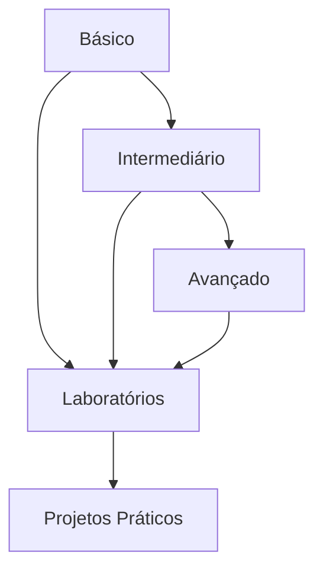

# Exercícios de DML (Data Manipulation Language)

## Visão Geral

Este módulo contém uma série progressiva de exercícios para praticar comandos DML em SQL. Os exercícios estão organizados em três níveis de dificuldade:

### Nível Básico
- Consultas simples com SELECT
- Inserções básicas de dados
- Atualizações e exclusões simples
- Operações fundamentais de DML

### Nível Intermediário
- Consultas com múltiplas tabelas
- Subconsultas e expressões
- Operações em lote
- Técnicas de manipulação avançadas

### Nível Avançado
- Operações complexas de sincronização
- Manipulação de dados em grande escala
- Otimização de performance
- Cenários empresariais realistas

## Estrutura dos Exercícios

Cada exercício segue o formato:
1. Descrição do problema
2. Requisitos específicos
3. Dicas de implementação
4. Solução de referência
5. Critérios de avaliação

## Ambiente de Prática

```sql
-- Database de teste
CREATE DATABASE exercicios_dml;

-- Schema para isolamento
CREATE SCHEMA pratica;

-- Tabelas de exemplo
CREATE TABLE pratica.clientes (
    id SERIAL PRIMARY KEY,
    nome VARCHAR(100) NOT NULL,
    email VARCHAR(100) UNIQUE,
    data_cadastro DATE DEFAULT CURRENT_DATE
);

CREATE TABLE pratica.produtos (
    id SERIAL PRIMARY KEY,
    nome VARCHAR(100) NOT NULL,
    preco DECIMAL(10,2) CHECK (preco > 0),
    estoque INTEGER DEFAULT 0
);

CREATE TABLE pratica.pedidos (
    id SERIAL PRIMARY KEY,
    cliente_id INTEGER REFERENCES pratica.clientes(id),
    data_pedido TIMESTAMP DEFAULT CURRENT_TIMESTAMP,
    status VARCHAR(20) DEFAULT 'Pendente'
);

CREATE TABLE pratica.itens_pedido (
    pedido_id INTEGER REFERENCES pratica.pedidos(id),
    produto_id INTEGER REFERENCES pratica.produtos(id),
    quantidade INTEGER CHECK (quantidade > 0),
    preco_unitario DECIMAL(10,2),
    PRIMARY KEY (pedido_id, produto_id)
);

-- Tabela de controle
CREATE TABLE pratica.controle_exercicios (
    id SERIAL PRIMARY KEY,
    exercicio VARCHAR(50),
    completado BOOLEAN DEFAULT FALSE,
    data_conclusao TIMESTAMP
);
```

## Fluxo de Estudo Recomendado



## Preparação do Ambiente

Para obter o máximo proveito destes exercícios, recomendamos:

1. **Configurar um ambiente de banco de dados**
   - PostgreSQL 12+ ou MySQL 8+
   - Cliente SQL (DBeaver, pgAdmin, MySQL Workbench)
   - Scripts de inicialização fornecidos

2. **Dados de teste**
   ```sql
   -- Inserir dados de exemplo
   INSERT INTO pratica.clientes (nome, email)
   VALUES 
       ('Ana Silva', 'ana@email.com'),
       ('Bruno Costa', 'bruno@email.com'),
       ('Carla Mendes', 'carla@email.com');
       
   INSERT INTO pratica.produtos (nome, preco, estoque)
   VALUES
       ('Smartphone', 1299.99, 50),
       ('Notebook', 3499.99, 20),
       ('Fones de Ouvido', 199.99, 100);
   ```

3. **Ferramentas recomendadas**
   - Editor de SQL com highlight de sintaxe
   - Ferramenta de visualização de planos de execução
   - Ambiente para documentar suas soluções

## Navegação do Conteúdo

- [Exercícios Básicos](basic-dml-exercises.md)
- [Exercícios Intermediários](intermediate-dml-exercises.md)
- [Exercícios Avançados](advanced-dml-exercises.md)

## Dicas de Estudo

```ascii
╔════════════════════════════════════════════╗
║  BOAS PRÁTICAS:                           ║
║  ✓ Teste cada comando individualmente      ║
║  ✓ Analise planos de execução              ║
║  ✓ Documente suas soluções                ║
║  ✓ Pratique regularmente                  ║
║  ✓ Revise conceitos quando necessário     ║
╚════════════════════════════════════════════╝
```

## Suporte e Recursos

- Fórum de discussão
- Documentação oficial do SGBD
- Exemplos práticos adicionais
- Soluções comentadas

## Próximos Passos

Após completar os exercícios de DML, recomendamos:

1. **Laboratórios práticos**
   - Aplicação em cenários realistas
   - Integração com outros conceitos

2. **Projetos integrados**
   - Desenvolvimento de aplicações completas
   - Implementação de sistemas de banco de dados

3. **Tópicos avançados**
   - Otimização de consultas
   - Tuning de performance
   - Padrões de design SQL

## Feedback e Avaliação

Para cada conjunto de exercícios, você pode:
- Verificar suas soluções contra as referências
- Compartilhar abordagens alternativas
- Discutir otimizações possíveis
- Solicitar revisão por pares

---

> **Nota**: Estes exercícios são projetados para serem progressivos. Recomendamos completar os exercícios básicos antes de avançar para os níveis mais complexos.