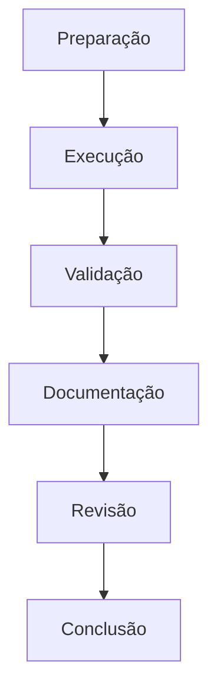

# Laboratórios de DML

## Visão Geral

Os laboratórios práticos de DML (Data Manipulation Language) são projetados para fornecer experiência hands-on com operações de manipulação de dados em ambientes PostgreSQL. Cada laboratório apresenta cenários reais e desafios práticos comumente encontrados em ambientes de produção.

## Estrutura dos Laboratórios

Cada laboratório segue uma estrutura consistente:

1. **Preparação do Ambiente**
   - Configuração inicial
   - Pré-requisitos
   - Scripts de setup

2. **Objetivos de Aprendizado**
   - Conceitos principais
   - Habilidades técnicas
   - Resultados esperados

3. **Roteiro Prático**
   - Instruções passo a passo
   - Comandos e scripts
   - Pontos de verificação

4. **Avaliação**
   - Critérios de conclusão
   - Testes de validação
   - Métricas de sucesso

## Ambiente de Laboratório

```sql
-- Criar database dedicado para laboratórios
CREATE DATABASE lab_dml;

-- Schema para isolamento de exercícios
CREATE SCHEMA lab_workspace;

-- Tabelas para os laboratórios
CREATE TABLE lab_workspace.clientes (
    id SERIAL PRIMARY KEY,
    nome VARCHAR(100) NOT NULL,
    email VARCHAR(100) UNIQUE,
    data_cadastro DATE DEFAULT CURRENT_DATE,
    status VARCHAR(20) DEFAULT 'Ativo',
    segmento VARCHAR(50),
    limite_credito DECIMAL(10,2) DEFAULT 1000.00
);

CREATE TABLE lab_workspace.produtos (
    id SERIAL PRIMARY KEY,
    codigo VARCHAR(20) UNIQUE,
    nome VARCHAR(100) NOT NULL,
    descricao TEXT,
    preco DECIMAL(10,2) NOT NULL CHECK (preco > 0),
    estoque INTEGER DEFAULT 0,
    categoria VARCHAR(50),
    data_cadastro DATE DEFAULT CURRENT_DATE,
    status VARCHAR(20) DEFAULT 'Ativo'
);

CREATE TABLE lab_workspace.pedidos (
    id SERIAL PRIMARY KEY,
    cliente_id INTEGER REFERENCES lab_workspace.clientes(id),
    data_pedido TIMESTAMP DEFAULT CURRENT_TIMESTAMP,
    valor_total DECIMAL(10,2) DEFAULT 0,
    status VARCHAR(20) DEFAULT 'Pendente',
    observacoes TEXT
);

CREATE TABLE lab_workspace.itens_pedido (
    pedido_id INTEGER REFERENCES lab_workspace.pedidos(id),
    produto_id INTEGER REFERENCES lab_workspace.produtos(id),
    quantidade INTEGER CHECK (quantidade > 0),
    preco_unitario DECIMAL(10,2) NOT NULL,
    desconto DECIMAL(10,2) DEFAULT 0,
    PRIMARY KEY (pedido_id, produto_id)
);

-- Tabela de controle de progresso
CREATE TABLE lab_workspace.lab_progress (
    lab_id SERIAL PRIMARY KEY,
    lab_name VARCHAR(100),
    start_time TIMESTAMP DEFAULT CURRENT_TIMESTAMP,
    completion_time TIMESTAMP,
    status VARCHAR(20) DEFAULT 'IN_PROGRESS',
    notes TEXT
);
```

## Laboratórios Disponíveis

### 1. Manipulação de Dados
- Operações CRUD básicas
- Transações e consistência
- Manipulação em lote
- Validação de dados

### 2. Análise de Dados
- Consultas analíticas
- Agregações e agrupamentos
- Funções de janela
- Relatórios dinâmicos

### 3. Transformação de Dados
- Conversão de formatos
- Limpeza de dados
- Normalização e desnormalização
- Enriquecimento de dados

### 4. Integração de Dados
- Importação e exportação
- Sincronização entre tabelas
- Migração de dados
- Validação de integridade

## Fluxo de Trabalho Recomendado



## Boas Práticas

```ascii
╔════════════════════════════════════════════╗
║  DIRETRIZES DE LABORATÓRIO:               ║
║  ✓ Sempre trabalhar em transações         ║
║  ✓ Verificar resultados após cada etapa   ║
║  ✓ Documentar todas as operações          ║
║  ✓ Testar com diferentes conjuntos        ║
║  ✓ Manter scripts de rollback             ║
╚════════════════════════════════════════════╝
```

## Ferramentas Necessárias

1. **PostgreSQL Client**
   - psql
   - pgAdmin 4
   - DBeaver

2. **Utilitários**
   - pg_dump (para backup)
   - COPY (para importação/exportação)
   - Ferramentas de análise de plano de execução

3. **Scripts de Suporte**
   ```sql
   -- Script de verificação de ambiente
   CREATE OR REPLACE FUNCTION lab_workspace.check_environment()
   RETURNS TABLE (
       check_item VARCHAR,
       status VARCHAR,
       details TEXT
   ) AS $$
   BEGIN
       RETURN QUERY
       SELECT 'Database Version'::VARCHAR,
              version()::VARCHAR,
              'Verificação da versão do PostgreSQL'::TEXT
       UNION ALL
       SELECT 'Available Tables',
              (SELECT string_agg(table_name, ', ') FROM information_schema.tables 
               WHERE table_schema = 'lab_workspace'),
              'Tabelas disponíveis no schema lab_workspace';
   END;
   $$ LANGUAGE plpgsql;
   ```

## Navegação dos Laboratórios

- [Laboratório de Manipulação de Dados](lab-data-manipulation.md)
- [Laboratório de Análise de Dados](lab-data-analysis.md)
- [Laboratório de Transformação de Dados](lab-data-transformation.md)
- [Laboratório de Integração de Dados](lab-data-integration.md)

## Suporte e Recursos

### Documentação
- [PostgreSQL Official Documentation](https://www.postgresql.org/docs/)
- [DML Reference Guide](https://www.postgresql.org/docs/current/dml.html)
- [Data Manipulation Best Practices](https://www.postgresql.org/docs/current/sql-commands.html)

### Comunidade
- Fórum PostgreSQL
- Stack Overflow
- GitHub Discussions

## Conclusão

Os laboratórios DML fornecem uma base prática essencial para o desenvolvimento de habilidades em manipulação de dados. A prática regular destes exercícios contribuirá significativamente para sua expertise em operações de banco de dados PostgreSQL.

## Próximos Passos

1. **Preparação**
   - Configure seu ambiente local
   - Revise os pré-requisitos
   - Familiarize-se com as ferramentas

2. **Execução**
   - Siga os laboratórios em ordem
   - Complete todos os exercícios
   - Documente seus resultados

3. **Avançado**
   - Explore variações dos exercícios
   - Crie seus próprios cenários
   - Compartilhe experiências

---

> **Nota**: Certifique-se de manter backups e usar ambientes de teste apropriados durante a execução dos laboratórios. As operações DML podem modificar dados permanentemente.