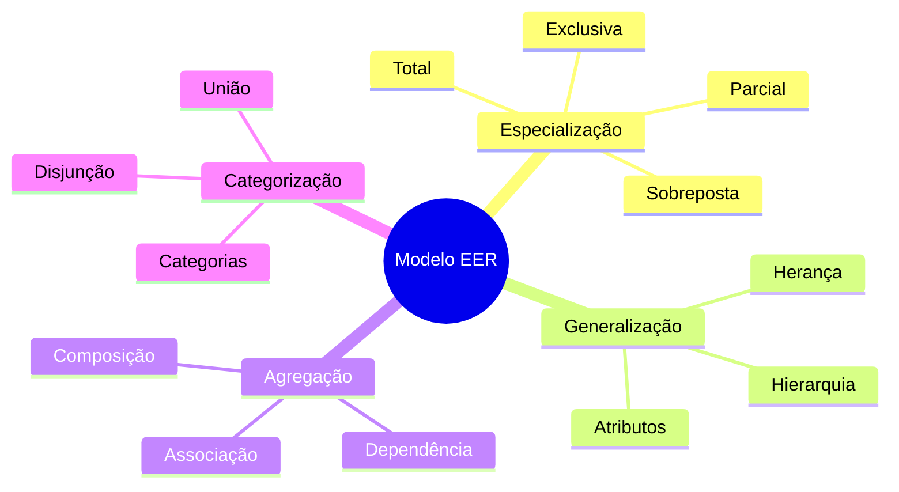
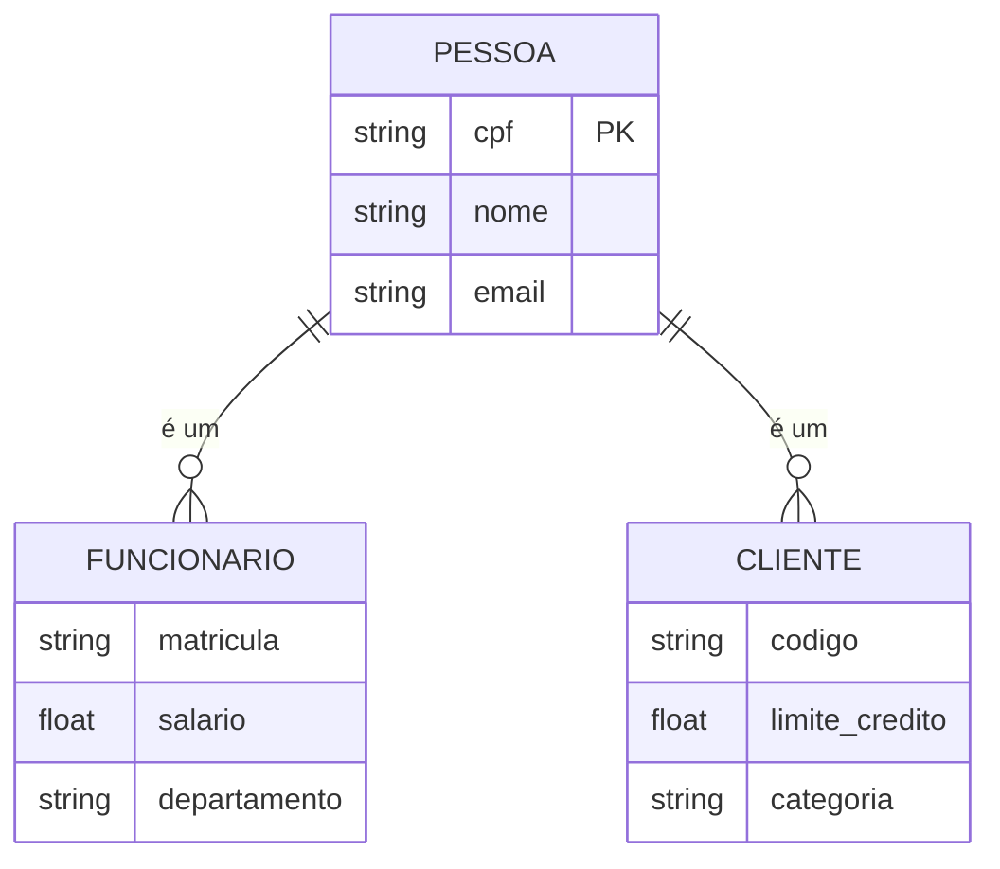
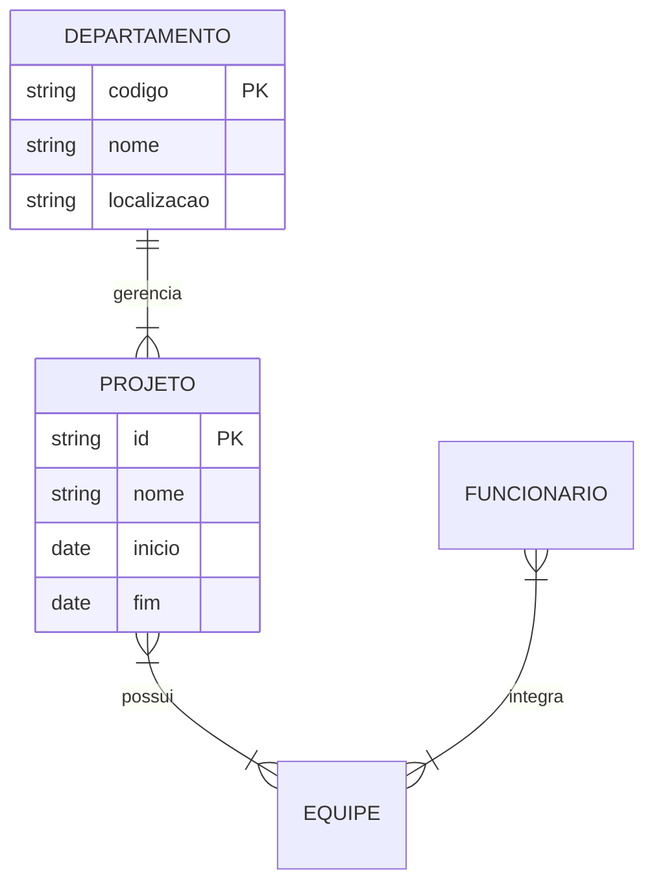

# Modelo ER Estendido (EER)

O Modelo ER Estendido adiciona conceitos avançados ao modelo ER tradicional, permitindo uma modelagem mais rica e precisa.

## Conceitos Principais

## Elementos Avançados

### 1. Especialização/Generalização

### 2. Agregação e Composição

## Aplicações Práticas

### 1. Modelagem de Herança
- Hierarquias naturais
- Compartilhamento de atributos
- Especialização de comportamentos
- Restrições de integridade

### 2. Modelagem de Composição
- Relacionamentos todo-parte
- Dependências existenciais
- Propagação de operações
- Integridade referencial

### 3. Modelagem de Categorização
- Tipos dinâmicos
- União de entidades
- Restrições de participação
- Regras de negócio

## Vantagens e Limitações

### Vantagens
- Maior expressividade
- Melhor semântica
- Reutilização
- Organização

### Limitações
- Complexidade adicional
- Mapeamento mais difícil
- Implementação complexa
- Overhead de design

## Melhores Práticas

1. **Design**
   - Use quando necessário
   - Mantenha simplicidade
   - Documente decisões
   - Valide com stakeholders

2. **Implementação**
   - Planeje mapeamento
   - Considere performance
   - Teste integridade
   - Monitore complexidade