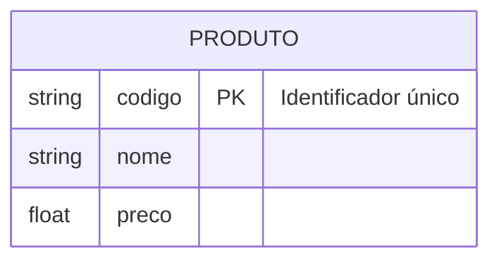
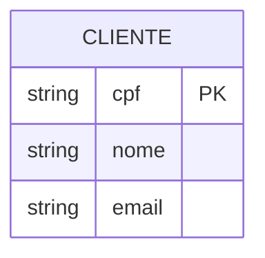
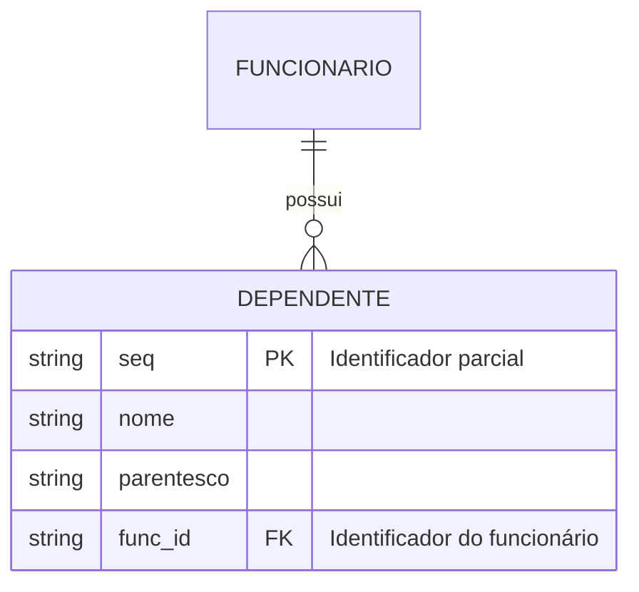
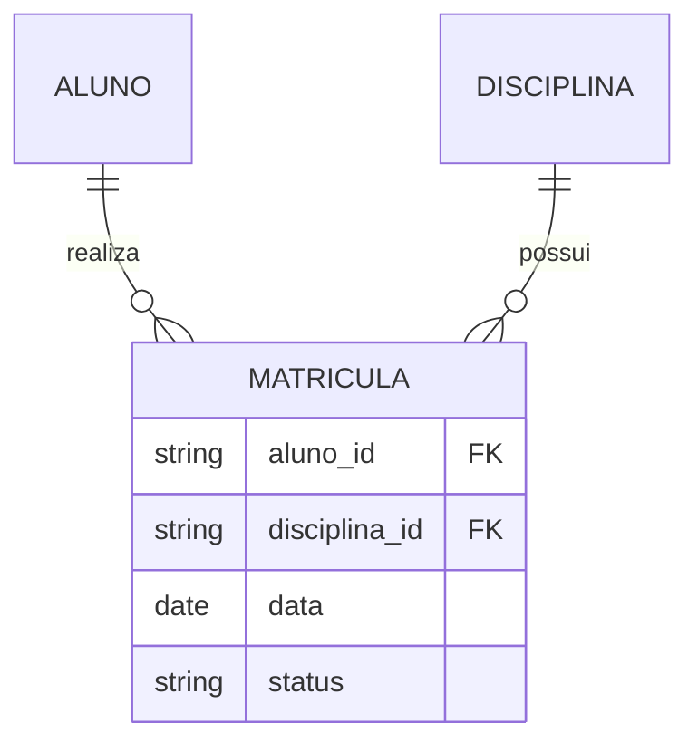
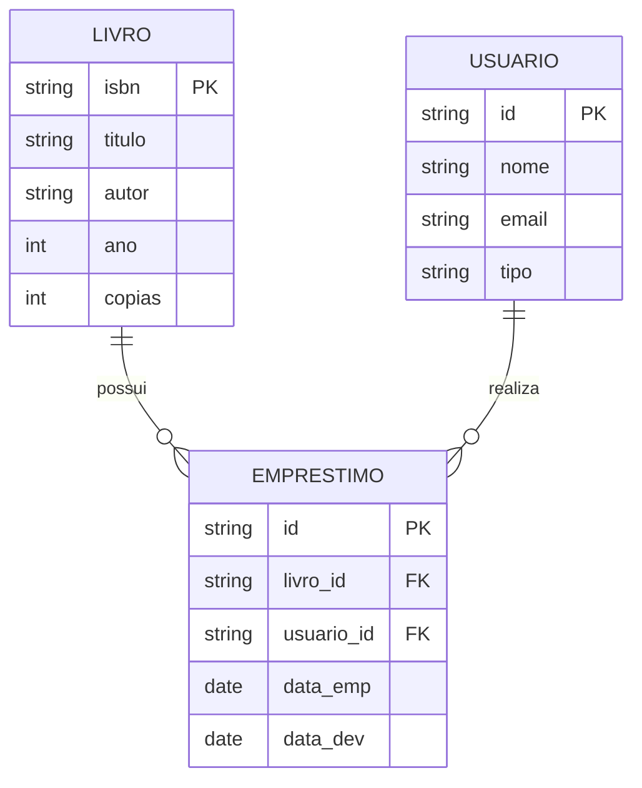
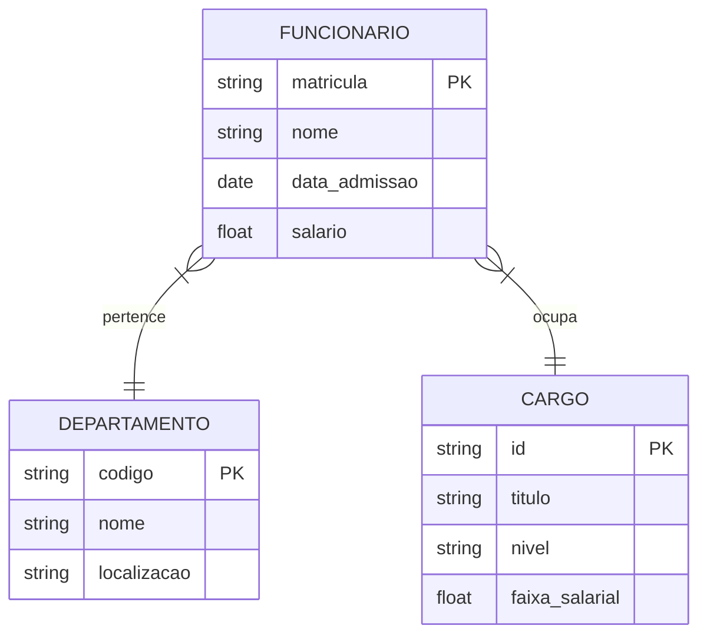

# Entidades

Uma entidade é um objeto ou conceito do mundo real que pode ser identificado de forma única e sobre o qual desejamos armazenar informações.

## Características das Entidades

### 1. Identificação Única
Cada entidade deve possuir um identificador único (chave primária) que a distingue das demais.

### 2. Tipos de Entidades

#### Entidades Fortes
- Existem independentemente de outras entidades
- Possuem identificador próprio
- Exemplo: `CLIENTE`, `PRODUTO`

#### Entidades Fracas
- Dependem de outras entidades para existir
- Identificador parcial
- Exemplo: `DEPENDENTE`, `ITEM_PEDIDO`

#### Entidades Associativas
- Resultam do relacionamento entre outras entidades
- Também conhecidas como entidades de junção
- Exemplo: `MATRICULA`, `INSCRICAO`

### 3. Ocorrências (Instâncias)

Uma ocorrência é uma instância específica de uma entidade.

Exemplo para entidade `PRODUTO`:
- `{codigo: "001", nome: "Laptop", preco: 3500.00}`
- `{codigo: "002", nome: "Mouse", preco: 89.90}`

## Boas Práticas

### 1. Nomenclatura
- Use substantivos no singular
- Evite abreviações
- Use maiúsculas para nomes de entidades
- Seja consistente com o padrão adotado

### 2. Identificação
- Escolha identificadores estáveis
- Prefira chaves naturais quando possível
- Use chaves surrogate quando necessário

### 3. Granularidade
- Defina o nível adequado de abstração
- Evite entidades muito genéricas
- Evite entidades muito específicas

## Exemplos Práticos

### Sistema de Biblioteca

### Sistema de RH

## Considerações Importantes

### 1. Integridade
- Garanta que cada entidade tenha identificador único
- Mantenha a consistência dos dados
- Defina regras de validação

### 2. Relacionamentos
- Identifique corretamente as dependências
- Estabeleça cardinalidades apropriadas
- Considere o ciclo de vida das entidades

### 3. Evolução
- Planeje para mudanças futuras
- Documente decisões de design
- Mantenha o modelo atualizado

## Conclusão

Entidades são fundamentais para:
- Organização dos dados
- Representação do domínio
- Base para implementação
- Comunicação entre stakeholders

A modelagem correta de entidades é crucial para:
- Integridade dos dados
- Eficiência do sistema
- Manutenibilidade
- Escalabilidade