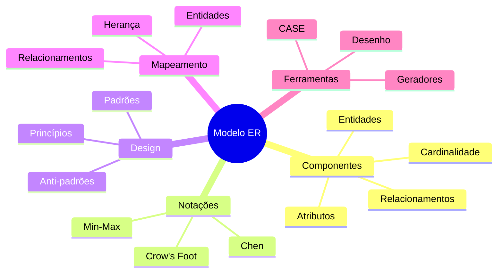
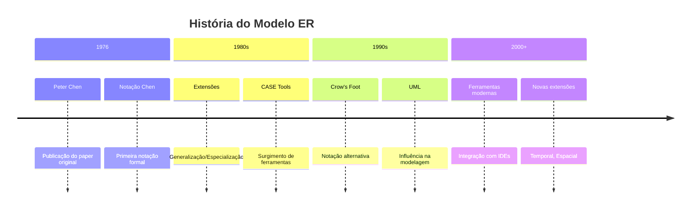
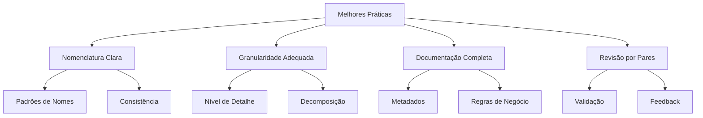

# Diagramas Entidade-Relacionamento (ER)

O modelo Entidade-Relacionamento (ER) é uma ferramenta fundamental para modelagem conceitual de dados, permitindo representar a estrutura lógica de um banco de dados de forma visual e intuitiva.

## Visão Geral

## Importância na Modelagem de Dados

O modelo ER serve como ponte entre os requisitos do negócio e a implementação técnica, oferecendo:

1. **Comunicação Efetiva**
   - Facilita o diálogo entre stakeholders
   - Representa visualmente conceitos complexos
   - Documenta decisões de design

2. **Abstração de Dados**
   - Foco na estrutura conceitual
   - Independência de implementação
   - Visão de alto nível do sistema

3. **Base para Implementação**
   - Guia para modelo relacional
   - Fundamento para design físico
   - Referência para validação

## Evolução Histórica

## Princípios Fundamentais

### 1. Abstração
- Foco nos aspectos essenciais
- Omissão de detalhes técnicos
- Representação clara do domínio

### 2. Modularidade
- Decomposição em componentes
- Relacionamentos bem definidos
- Reutilização de padrões

### 3. Formalismo
- Regras claras de construção
- Semântica bem definida
- Consistência na representação

## Benefícios e Limitações

### Benefícios
1. **Clareza Conceitual**
   - Fácil compreensão
   - Representação intuitiva
   - Documentação efetiva

2. **Flexibilidade**
   - Adaptável a diferentes domínios
   - Suporte a múltiplas notações
   - Extensível para novos conceitos

3. **Padronização**
   - Linguagem comum
   - Práticas estabelecidas
   - Ferramentas maduras

### Limitações
1. **Complexidade**
   - Diagramas podem ficar sobrecarregados
   - Necessidade de decomposição
   - Curva de aprendizado inicial

2. **Abstração vs. Detalhe**
   - Equilíbrio entre níveis
   - Decisões de granularidade
   - Compromissos de design

## Melhores Práticas

1. **Nomenclatura**
   - Use nomes significativos
   - Mantenha consistência
   - Siga convenções estabelecidas

2. **Granularidade**
   - Defina nível apropriado de detalhe
   - Decomponha modelos complexos
   - Mantenha equilíbrio na abstração

3. **Documentação**
   - Inclua metadados relevantes
   - Documente regras de negócio
   - Mantenha histórico de decisões

## Próximos Passos

Para aprofundar seu conhecimento em modelagem ER, explore:

1. **Conceitos Básicos**
   - Entidades e seus tipos
   - Relacionamentos e cardinalidade
   - Atributos e suas características

2. **Restrições e Regras**
   - Chaves e identificadores
   - Restrições de participação
   - Regras de integridade

3. **Notações e Ferramentas**
   - Diferentes estilos de notação
   - Ferramentas de modelagem
   - Técnicas de documentação

4. **Design e Implementação**
   - Padrões de modelagem
   - Mapeamento para modelo relacional
   - Otimizações e refinamentos

## Conclusão

O modelo ER continua sendo uma ferramenta essencial para modelagem de dados, oferecendo:
- Base sólida para design de banco de dados
- Comunicação efetiva entre stakeholders
- Documentação clara e manutenível
- Fundamento para implementação técnica

A compreensão profunda dos conceitos ER e suas aplicações é fundamental para qualquer profissional de banco de dados.