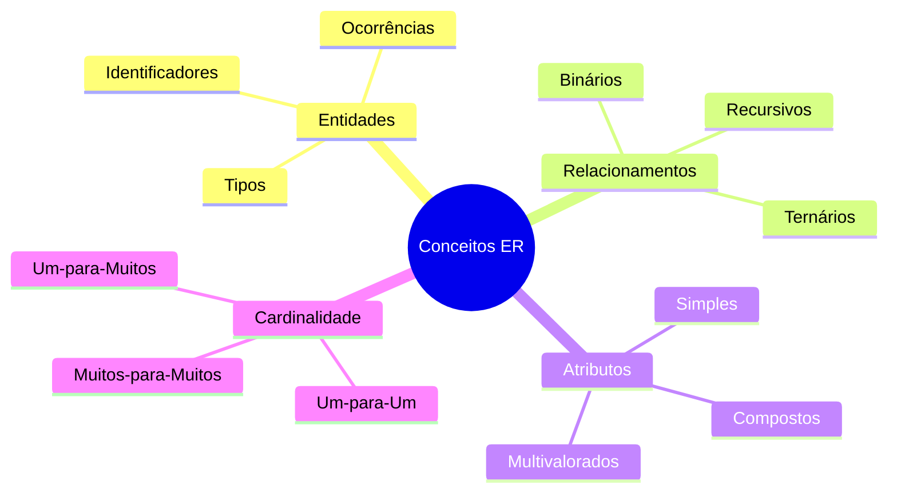
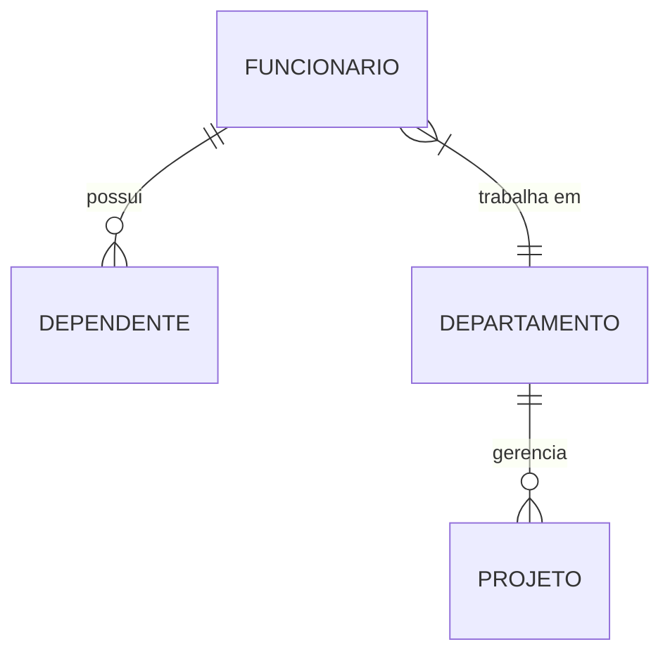
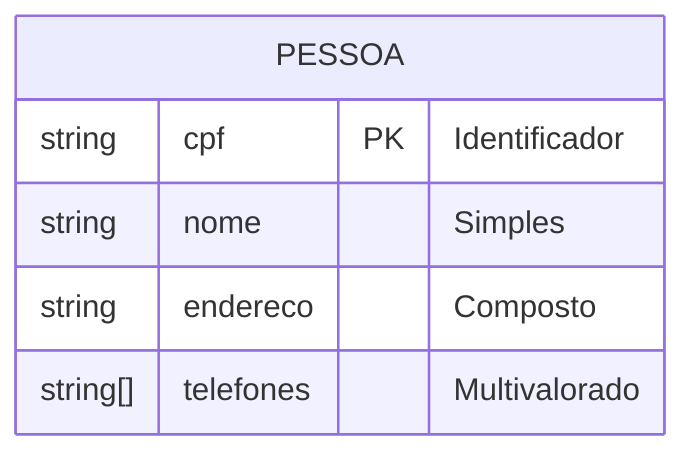
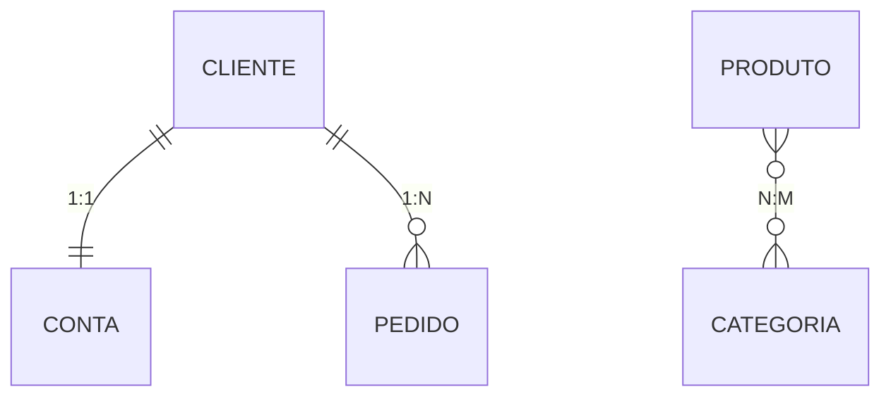
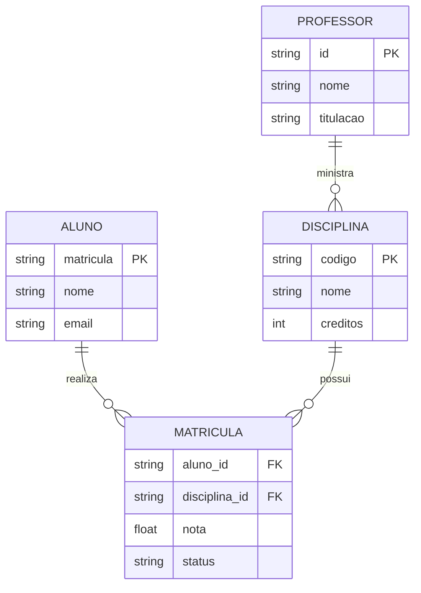
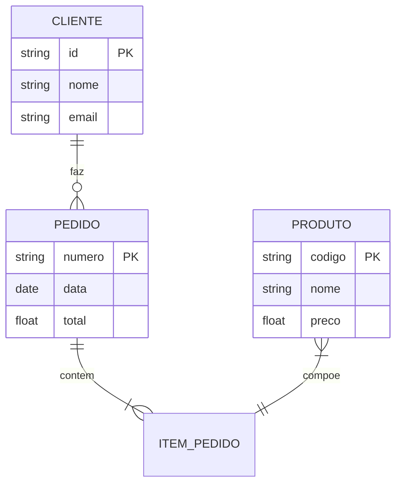

# Conceitos Fundamentais do Modelo ER

Os conceitos fundamentais do Modelo Entidade-Relacionamento (ER) formam a base para a modelagem conceitual de dados. Este capítulo explora os elementos essenciais que compõem um diagrama ER.

## Visão Geral dos Conceitos

## Elementos Básicos

### 1. Entidades

Uma entidade representa um objeto ou conceito do mundo real que pode ser distintamente identificado.

#### Tipos de Entidades
- **Entidades Fortes**: Existem independentemente de outras entidades
- **Entidades Fracas**: Dependem de outras entidades para existir
- **Entidades Associativas**: Resultam da associação entre outras entidades

- **Exemplo**:
  - EMPLOYEE (entidade forte)
  - DEPENDENT (entidade fraca)
  - DEPARTAMENT (entidade associativa)

### 2. Relacionamentos

Representam associações entre entidades, descrevendo como elas interagem entre si.

> Nunca crie relacionamentos entre atributos
>
> Sempre crie relacionamentos entre entidades! 
> {style="warning"}

#### Características dos Relacionamentos
- **Grau**: Número de entidades participantes
- **Papel**: Função de cada entidade no relacionamento

### 3. Atributos

Descrevem propriedades ou características das entidades e relacionamentos.

#### Classificação dos Atributos

1. **Quanto à Estrutura**
   - Simples (atômicos)
   - Compostos
   - Multivalorados

2. **Quanto à Função**
   - Descritivos
   - Identificadores (chaves)
   - Referenciais

### 4. Cardinalidade

Define o número de instâncias de uma entidade que podem estar relacionadas com instâncias de outra entidade.

#### Tipos de Cardinalidade

- **Um-para-Um (1:1)**
  - Cada instância se relaciona com no máximo uma instância
  - Exemplo: Pessoa ↔ CPF

- **Um-para-Muitos (1:N)**
  - Uma instância se relaciona com várias instâncias
  - Exemplo: Departamento ↔ Funcionários

- **Muitos-para-Muitos (N:M)**
  - Várias instâncias se relacionam com várias instâncias
  - Exemplo: Alunos ↔ Disciplinas

## Regras e Restrições

### 1. Integridade Referencial
- Garante consistência entre relacionamentos
- Previne referências inválidas
- Mantém a coerência dos dados

### 2. Participação
- **Total**: Todas as instâncias participam do relacionamento
- **Parcial**: Algumas instâncias podem não participar

### 3. Exclusividade
- Define se uma instância pode participar em múltiplos relacionamentos
- Estabelece restrições de unicidade

## Exemplos Práticos

### Sistema Acadêmico

### Sistema de E-commerce

## Considerações de Design

1. **Normalização vs. Desnormalização**
   - Equilíbrio entre integridade e desempenho
   - Decisões baseadas em requisitos

2. **Granularidade**
   - Nível adequado de detalhamento
   - Decomposição de entidades complexas

3. **Manutenibilidade**
   - Facilidade de evolução
   - Clareza na representação

## Conclusão

Os conceitos fundamentais do Modelo ER são essenciais para:
- Compreensão da estrutura de dados
- Comunicação entre stakeholders
- Base para implementação física
- Documentação do sistema

A aplicação correta destes conceitos resulta em modelos:
- Claros e compreensíveis
- Precisos e consistentes
- Flexíveis e extensíveis
- Implementáveis e manuteníveis