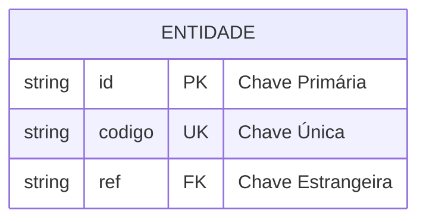
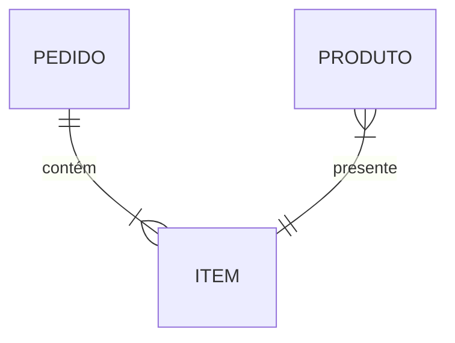
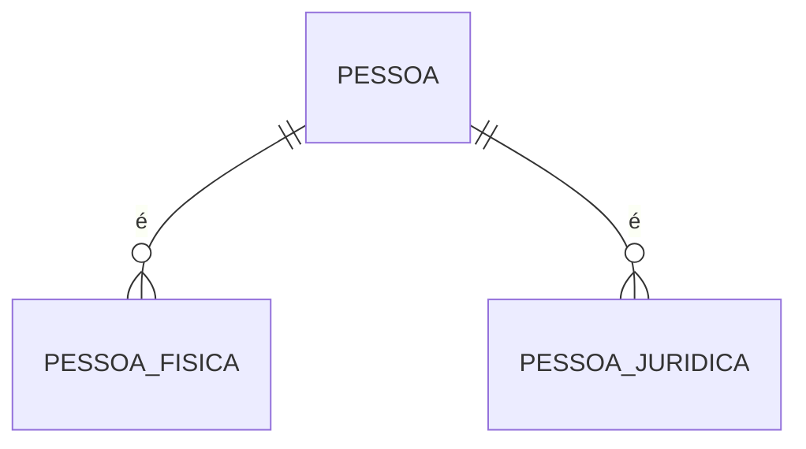
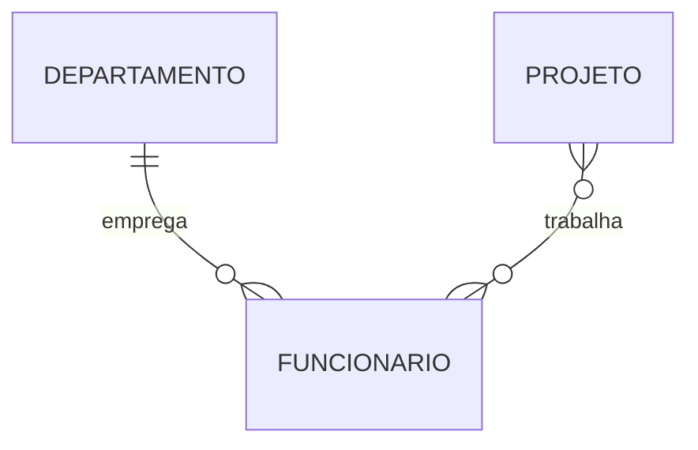
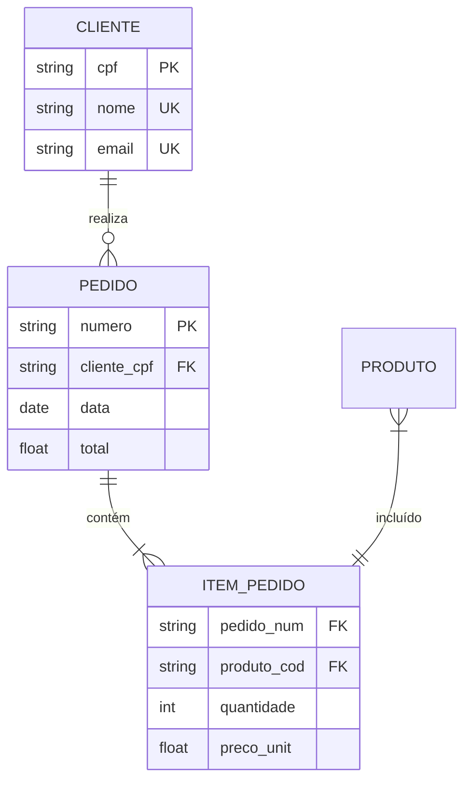
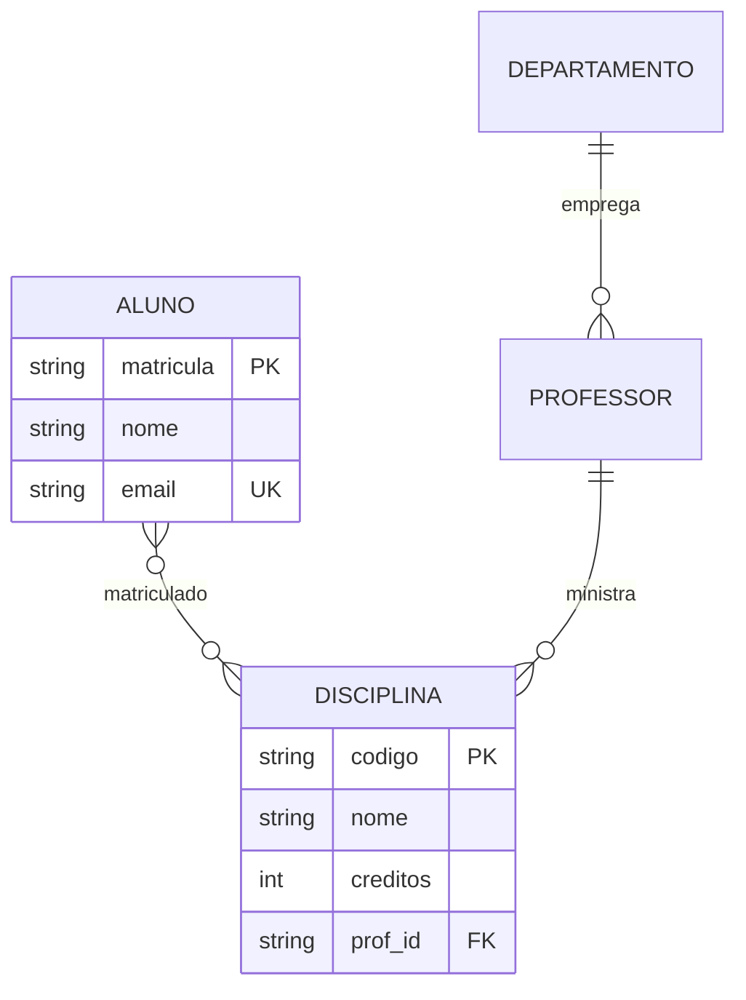
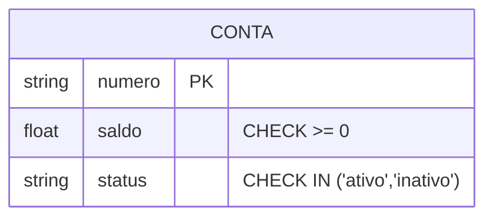
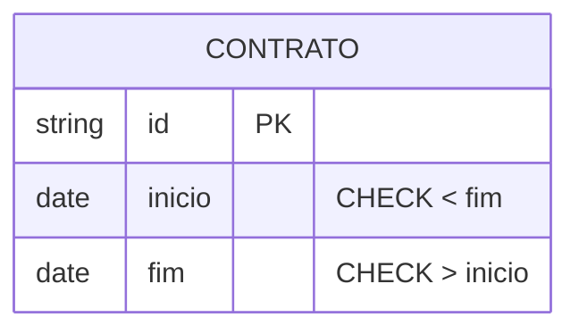

# Restrições no Modelo ER

As restrições no modelo ER são regras que garantem a integridade e consistência dos dados. Elas definem limites e condições que os dados devem satisfazer.

## Tipos de Restrições

### 1. Restrições de Chave



#### Chave Primária (PK)
- Identifica unicamente cada instância
- Não pode ser nula
- Não pode ser duplicada

#### Chave Estrangeira (FK)
- Referencia chave primária de outra entidade
- Mantém integridade referencial
- Pode ser nula (dependendo da participação)

#### Chave Única (UK)
- Garante valores únicos
- Pode ser nula (diferente da PK)
- Permite múltiplas por entidade

### 2. Restrições de Participação



#### Participação Total
- Todas as instâncias devem participar
- Representada por linha dupla
- Exemplo: Todo item deve ter um produto

#### Participação Parcial
- Participação opcional
- Representada por linha simples
- Exemplo: Cliente pode não ter pedidos

### 3. Restrições de Sobreposição



#### Disjunção (XOR)
- Entidade participa em apenas um relacionamento
- Mutuamente exclusivo
- Exemplo: Pessoa Física XOR Jurídica

#### Sobreposição
- Entidade pode participar em múltiplos relacionamentos
- Não exclusivo
- Exemplo: Funcionário pode ser Cliente

### 4. Restrições de Cardinalidade



#### Cardinalidade Mínima
- Número mínimo de participações
- Exemplo: Zero (opcional) ou Um (obrigatório)

#### Cardinalidade Máxima
- Número máximo de participações
- Exemplo: Um ou Muitos (N)

## Implementação de Restrições

### 1. Nível de Banco de Dados

```sql
CREATE TABLE Produto (
    codigo VARCHAR(10) PRIMARY KEY,
    nome VARCHAR(100) NOT NULL,
    preco DECIMAL(10,2) CHECK (preco > 0)
);
```

### 2. Nível de Aplicação

```java
public class Produto {
    @Id
    private String codigo;
    
    @NotNull
    private String nome;
    
    @Positive
    private BigDecimal preco;
}
```

## Exemplos Práticos

### Sistema de Vendas



### Sistema Acadêmico



## Boas Práticas

### 1. Definição de Restrições
- Identifique regras de negócio
- Documente claramente
- Valide com stakeholders

### 2. Implementação
- Use mecanismos apropriados
- Mantenha consistência
- Considere performance

### 3. Manutenção
- Monitore violações
- Atualize quando necessário
- Mantenha documentação

## Considerações Importantes

### 1. Performance
- Impacto das restrições
- Otimização de verificações
- Estratégias de indexação

### 2. Integridade
- Consistência dos dados
- Validações necessárias
- Tratamento de exceções

### 3. Flexibilidade
- Evolução do modelo
- Mudanças de requisitos
- Manutenibilidade

## Padrões Comuns

### 1. Restrições de Negócio



### 2. Restrições Temporais



## Conclusão

Restrições são essenciais para:
- Integridade dos dados
- Regras de negócio
- Consistência do modelo
- Qualidade da informação

Uma modelagem adequada de restrições:
- Previne inconsistências
- Facilita manutenção
- Melhora confiabilidade
- Garante qualidade