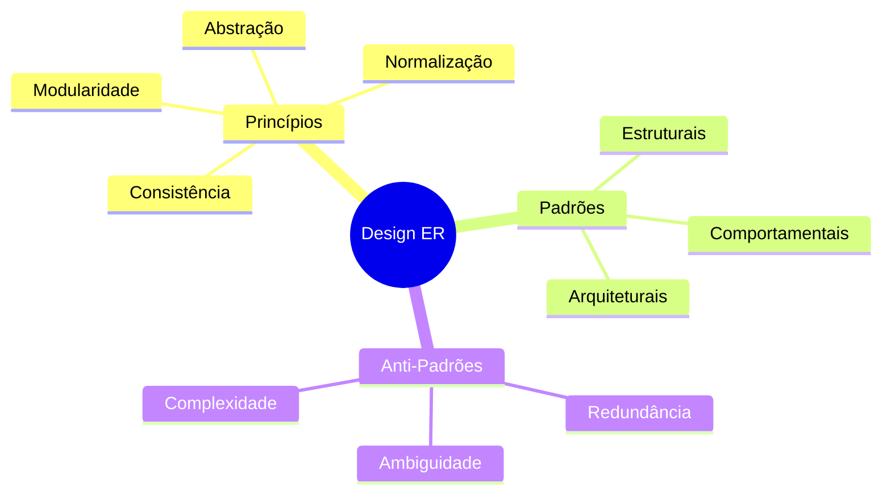

# Design de Modelos Entidade-Relacionamento

O design de modelos Entidade-Relacionamento (ER) é uma habilidade crítica que combina princípios teóricos com experiência prática para criar modelos de dados eficientes e sustentáveis.

## Visão Geral do Design ER

## Processo de Design

### 1. Análise de Requisitos
- Identificação de entidades
- Definição de relacionamentos
- Levantamento de restrições
- Validação com stakeholders

### 2. Modelagem Conceitual
- Criação do modelo inicial
- Refinamento iterativo
- Validação de conceitos
- Documentação de decisões

### 3. Otimização
- Análise de desempenho
- Refinamento de estruturas
- Validação de padrões
- Eliminação de anti-padrões

## Aspectos Críticos

### 1. Escalabilidade
- Crescimento de dados
- Evolução do schema
- Performance sustentável
- Manutenibilidade

### 2. Integridade
- Consistência dos dados
- Regras de negócio
- Restrições de domínio
- Validações

### 3. Usabilidade
- Clareza do modelo
- Facilidade de consulta
- Simplicidade de manutenção
- Documentação efetiva

## Ferramentas e Técnicas

### 1. Modelagem
- Diagramas ER
- Ferramentas CASE
- Validadores de modelo
- Geradores de documentação

### 2. Validação
- Revisões por pares
- Testes de conceito
- Prototipação
- Benchmarking

## Conclusão

O design ER efetivo requer:
- Conhecimento sólido dos princípios
- Compreensão dos padrões comuns
- Reconhecimento de anti-padrões
- Prática constante e iteração

Para aprofundamento, consulte:
- [Design Principles](design-principles.md)
- [Common Patterns](common-patterns.md)
- [Anti-Patterns](anti-patterns.md)