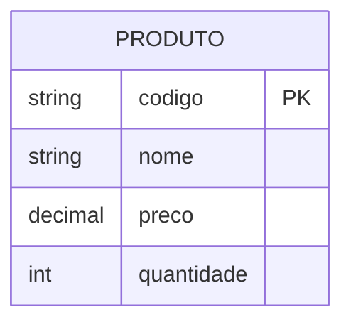
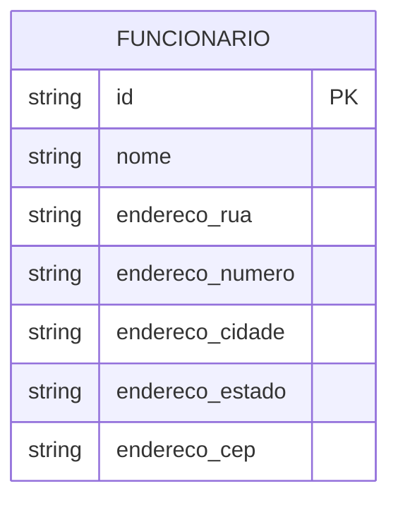
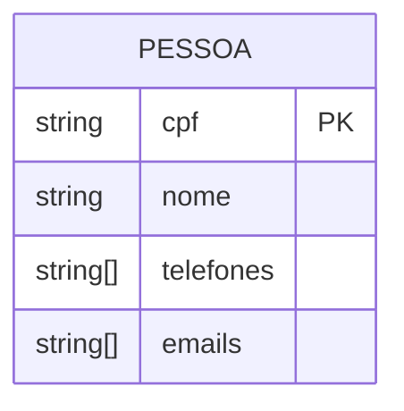
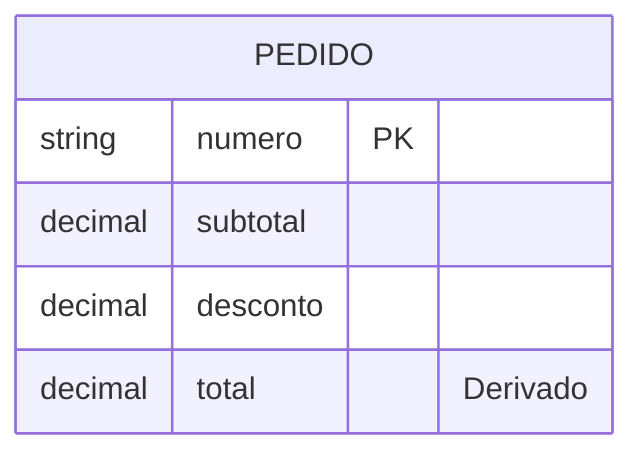

# Mapeamento de Atributos ER para Relacional

## Tipos de Atributos

### 1. Atributos Simples



#### Implementação
```sql
CREATE TABLE Produto (
    codigo VARCHAR(20) PRIMARY KEY,
    nome VARCHAR(100) NOT NULL,
    preco DECIMAL(10,2) NOT NULL,
    quantidade INTEGER DEFAULT 0
);
```

### 2. Atributos Compostos



#### Método 1: Decomposição
```sql
CREATE TABLE Funcionario (
    id VARCHAR(20) PRIMARY KEY,
    nome VARCHAR(100) NOT NULL,
    endereco_rua VARCHAR(100),
    endereco_numero VARCHAR(10),
    endereco_cidade VARCHAR(50),
    endereco_estado CHAR(2),
    endereco_cep VARCHAR(8)
);
```

#### Método 2: Nova Entidade
```sql
CREATE TABLE Funcionario (
    id VARCHAR(20) PRIMARY KEY,
    nome VARCHAR(100) NOT NULL
);

CREATE TABLE Endereco (
    funcionario_id VARCHAR(20) PRIMARY KEY,
    rua VARCHAR(100),
    numero VARCHAR(10),
    cidade VARCHAR(50),
    estado CHAR(2),
    cep VARCHAR(8),
    FOREIGN KEY (funcionario_id) REFERENCES Funcionario(id)
);
```

### 3. Atributos Multivalorados



#### Implementação
```sql
CREATE TABLE Pessoa (
    cpf VARCHAR(11) PRIMARY KEY,
    nome VARCHAR(100) NOT NULL
);

CREATE TABLE Telefone_Pessoa (
    pessoa_cpf VARCHAR(11),
    telefone VARCHAR(20),
    tipo VARCHAR(20),
    PRIMARY KEY (pessoa_cpf, telefone),
    FOREIGN KEY (pessoa_cpf) REFERENCES Pessoa(cpf)
);

CREATE TABLE Email_Pessoa (
    pessoa_cpf VARCHAR(11),
    email VARCHAR(100),
    principal BOOLEAN DEFAULT false,
    PRIMARY KEY (pessoa_cpf, email),
    FOREIGN KEY (pessoa_cpf) REFERENCES Pessoa(cpf)
);
```

### 4. Atributos Derivados



#### Implementação
```sql
CREATE TABLE Pedido (
    numero VARCHAR(20) PRIMARY KEY,
    subtotal DECIMAL(10,2) NOT NULL,
    desconto DECIMAL(10,2) DEFAULT 0,
    -- total é calculado: subtotal - desconto
    CHECK (desconto >= 0 AND desconto <= subtotal)
);

CREATE VIEW Pedido_Com_Total AS
SELECT 
    numero,
    subtotal,
    desconto,
    (subtotal - desconto) as total
FROM Pedido;
```

## Restrições e Validações

### 1. Domínios Personalizados
```sql
CREATE DOMAIN Email AS VARCHAR(100)
    CHECK (VALUE ~ '^[A-Za-z0-9._%+-]+@[A-Za-z0-9.-]+\.[A-Za-z]{2,}$');

CREATE DOMAIN CPF AS VARCHAR(11)
    CHECK (VALUE ~ '^\d{11}$');

CREATE TABLE Cliente (
    cpf CPF PRIMARY KEY,
    email Email,
    nome VARCHAR(100) NOT NULL
);
```

### 2. Restrições de Valor
```sql
CREATE TABLE Produto (
    codigo VARCHAR(20) PRIMARY KEY,
    nome VARCHAR(100) NOT NULL,
    preco DECIMAL(10,2),
    estoque INTEGER,
    CONSTRAINT check_preco_positivo CHECK (preco > 0),
    CONSTRAINT check_estoque_nao_negativo CHECK (estoque >= 0)
);
```

### 3. Valores Default
```sql
CREATE TABLE Usuario (
    id SERIAL PRIMARY KEY,
    nome VARCHAR(100) NOT NULL,
    ativo BOOLEAN DEFAULT true,
    data_cadastro TIMESTAMP DEFAULT CURRENT_TIMESTAMP,
    tentativas_login INTEGER DEFAULT 0
);
```

## Padrões de Implementação

### 1. Atributos de Auditoria
```sql
CREATE TABLE Entidade (
    id VARCHAR(20) PRIMARY KEY,
    -- outros atributos
    criado_em TIMESTAMP DEFAULT CURRENT_TIMESTAMP,
    criado_por VARCHAR(50),
    alterado_em TIMESTAMP,
    alterado_por VARCHAR(50)
);

CREATE TRIGGER atualiza_auditoria
    BEFORE UPDATE ON Entidade
    FOR EACH ROW
    EXECUTE FUNCTION fn_atualiza_auditoria();
```

### 2. Atributos Sensíveis
```sql
CREATE TABLE Usuario (
    id SERIAL PRIMARY KEY,
    nome VARCHAR(100) NOT NULL,
    email VARCHAR(100) UNIQUE NOT NULL,
    senha_hash VARCHAR(64) NOT NULL,
    dados_sensiveis JSONB ENCRYPTED
);
```

### 3. Atributos JSON
```sql
CREATE TABLE Configuracao (
    id SERIAL PRIMARY KEY,
    chave VARCHAR(50) UNIQUE NOT NULL,
    valor JSONB,
    metadata JSONB DEFAULT '{}'::jsonb
);
```

## Otimizações

### 1. Índices
```sql
-- Índice para busca por texto
CREATE INDEX idx_produto_nome ON Produto USING GIN (to_tsvector('portuguese', nome));

-- Índice para JSON
CREATE INDEX idx_config_valor ON Configuracao USING GIN (valor jsonb_path_ops);

-- Índice parcial
CREATE INDEX idx_usuario_ativo ON Usuario(email) WHERE ativo = true;
```

### 2. Compressão
```sql
CREATE TABLE Historico (
    id BIGSERIAL PRIMARY KEY,
    dados TEXT COMPRESSION lz4
)
TABLESPACE historico_tablespace;
```

## Exemplos Práticos

### Sistema de Vendas
```sql
CREATE TABLE Produto (
    codigo VARCHAR(20) PRIMARY KEY,
    nome VARCHAR(100) NOT NULL,
    descricao TEXT,
    preco_custo DECIMAL(10,2),
    preco_venda DECIMAL(10,2),
    margem_lucro DECIMAL(5,2) GENERATED ALWAYS AS (
        ((preco_venda - preco_custo) / preco_custo) * 100
    ) STORED,
    especificacoes JSONB,
    CONSTRAINT check_precos CHECK (preco_venda > preco_custo)
);

CREATE TABLE Categoria (
    id SERIAL PRIMARY KEY,
    nome VARCHAR(50) UNIQUE NOT NULL,
    atributos_especificos JSONB DEFAULT '{}'::jsonb
);

CREATE TABLE Produto_Categoria (
    produto_codigo VARCHAR(20),
    categoria_id INTEGER,
    ordem INTEGER DEFAULT 1,
    PRIMARY KEY (produto_codigo, categoria_id),
    FOREIGN KEY (produto_codigo) REFERENCES Produto(codigo),
    FOREIGN KEY (categoria_id) REFERENCES Categoria(id)
);
```

## Considerações Importantes

### 1. Performance
- Escolha tipos de dados apropriados
- Defina índices estrategicamente
- Monitore o uso de atributos

### 2. Manutenibilidade
- Documente decisões de design
- Use nomes descritivos
- Mantenha consistência

### 3. Segurança
- Proteja dados sensíveis
- Implemente auditoria
- Valide entradas

## Conclusão

O mapeamento eficiente de atributos é crucial para:
- Integridade dos dados
- Performance do sistema
- Facilidade de manutenção
- Segurança da informação