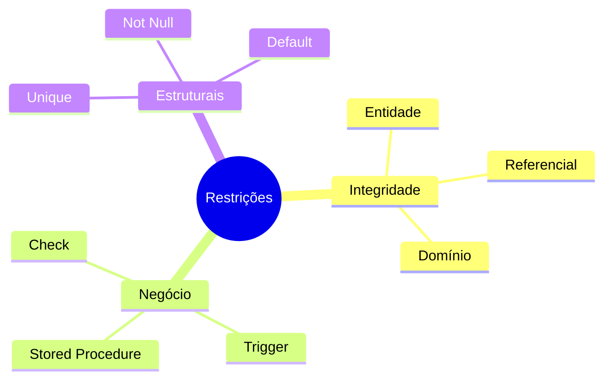
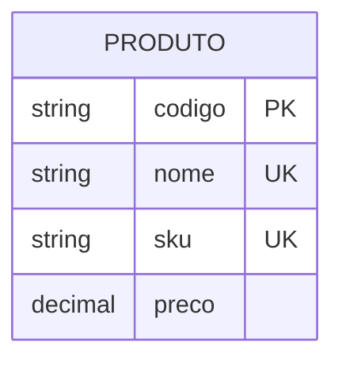
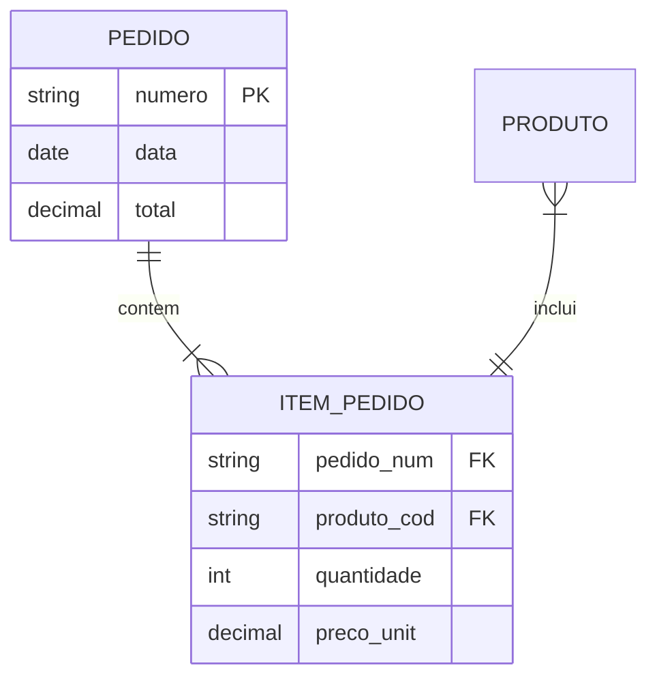
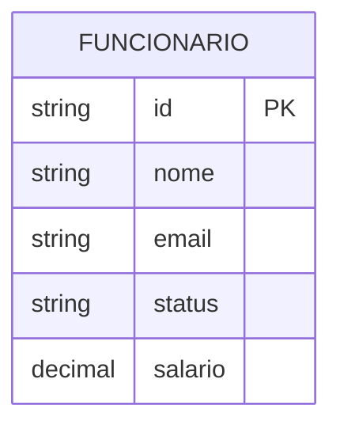
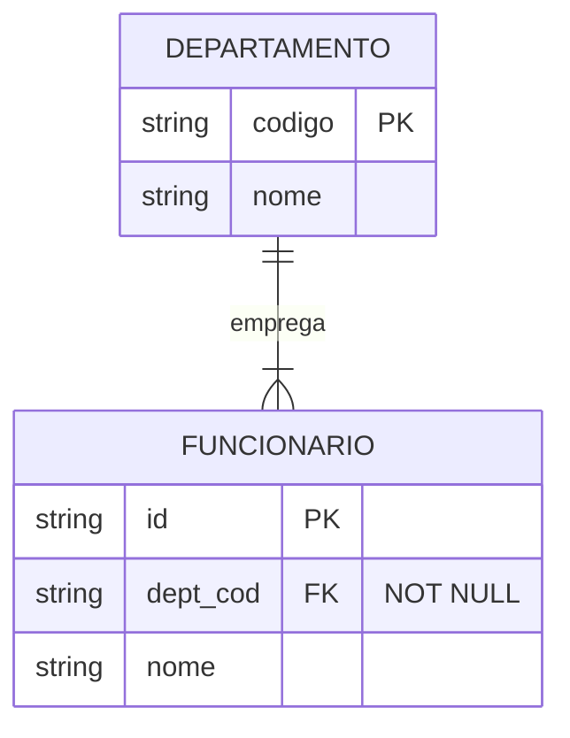
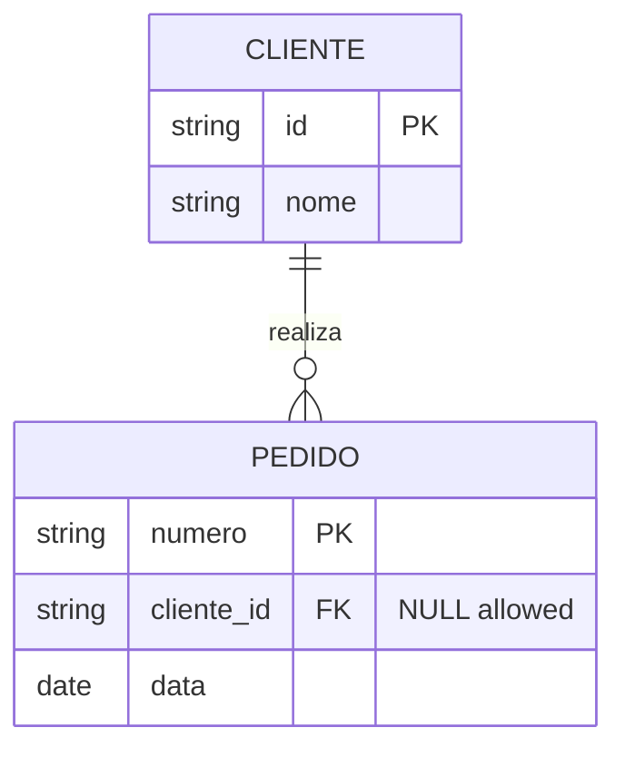

# Mapeamento de Restrições ER para Relacional

## Visão Geral



## Tipos de Restrições

### 1. Restrições de Chave



#### Implementação
```sql
CREATE TABLE Produto (
    codigo VARCHAR(20) PRIMARY KEY,
    nome VARCHAR(100) NOT NULL UNIQUE,
    sku VARCHAR(50) UNIQUE,
    preco DECIMAL(10,2),
    CONSTRAINT check_preco CHECK (preco > 0)
);
```

### 2. Restrições de Integridade Referencial



#### Implementação
```sql
CREATE TABLE Pedido (
    numero VARCHAR(20) PRIMARY KEY,
    data DATE NOT NULL,
    total DECIMAL(10,2)
);

CREATE TABLE Item_Pedido (
    pedido_num VARCHAR(20),
    produto_cod VARCHAR(20),
    quantidade INTEGER NOT NULL,
    preco_unit DECIMAL(10,2) NOT NULL,
    PRIMARY KEY (pedido_num, produto_cod),
    FOREIGN KEY (pedido_num) 
        REFERENCES Pedido(numero)
        ON DELETE CASCADE
        ON UPDATE CASCADE,
    FOREIGN KEY (produto_cod) 
        REFERENCES Produto(codigo)
        ON DELETE RESTRICT
        ON UPDATE CASCADE
);
```

### 3. Restrições de Domínio



#### Implementação
```sql
CREATE TABLE Funcionario (
    id VARCHAR(20) PRIMARY KEY,
    nome VARCHAR(100) NOT NULL,
    email VARCHAR(100) CHECK (email LIKE '%@%'),
    status VARCHAR(20) CHECK (status IN ('ATIVO', 'INATIVO', 'FERIAS')),
    salario DECIMAL(10,2) CHECK (salario >= 0)
);
```

## Restrições de Negócio

### 1. Validações Complexas

```sql
-- Trigger para validar datas
CREATE TRIGGER check_datas
BEFORE INSERT OR UPDATE ON Pedido
FOR EACH ROW
BEGIN
    IF NEW.data_entrega <= NEW.data_pedido THEN
        RAISE EXCEPTION 'Data de entrega deve ser posterior à data do pedido';
    END IF;
END;

-- Stored Procedure para validação de estoque
CREATE PROCEDURE validar_estoque(
    p_produto_id VARCHAR,
    p_quantidade INTEGER
) AS $$
BEGIN
    IF NOT EXISTS (
        SELECT 1 FROM Estoque 
        WHERE produto_id = p_produto_id 
        AND quantidade_disponivel >= p_quantidade
    ) THEN
        RAISE EXCEPTION 'Estoque insuficiente';
    END IF;
END;
$$ LANGUAGE plpgsql;
```

### 2. Restrições Temporais

```sql
CREATE TABLE Contrato (
    id VARCHAR(20) PRIMARY KEY,
    data_inicio DATE NOT NULL,
    data_fim DATE,
    valor DECIMAL(10,2),
    CONSTRAINT check_datas 
        CHECK (data_fim IS NULL OR data_fim > data_inicio),
    CONSTRAINT check_vigencia 
        CHECK (data_fim IS NULL OR data_fim > CURRENT_DATE)
);
```

## Mapeamento de Participação

### 1. Participação Total



#### Implementação
```sql
CREATE TABLE Funcionario (
    id VARCHAR(20) PRIMARY KEY,
    dept_cod VARCHAR(20) NOT NULL,
    nome VARCHAR(100) NOT NULL,
    FOREIGN KEY (dept_cod) 
        REFERENCES Departamento(codigo)
        ON DELETE RESTRICT
);
```

### 2. Participação Parcial



#### Implementação
```sql
CREATE TABLE Pedido (
    numero VARCHAR(20) PRIMARY KEY,
    cliente_id VARCHAR(20),
    data DATE NOT NULL,
    FOREIGN KEY (cliente_id) 
        REFERENCES Cliente(id)
        ON DELETE SET NULL
);
```

## Otimizações

### 1. Índices para Restrições
```sql
-- Índices para chaves estrangeiras
CREATE INDEX idx_item_pedido_num ON Item_Pedido(pedido_num);
CREATE INDEX idx_item_produto_cod ON Item_Pedido(produto_cod);

-- Índices para validações frequentes
CREATE INDEX idx_funcionario_status ON Funcionario(status);
CREATE INDEX idx_contrato_datas ON Contrato(data_inicio, data_fim);
```

### 2. Particionamento
```sql
-- Particionamento por status
CREATE TABLE Pedido (
    numero VARCHAR(20),
    status VARCHAR(20),
    data DATE,
    total DECIMAL(10,2)
) PARTITION BY LIST (status);

CREATE TABLE pedido_pendente 
    PARTITION OF Pedido FOR VALUES IN ('PENDENTE');
CREATE TABLE pedido_aprovado 
    PARTITION OF Pedido FOR VALUES IN ('APROVADO');
CREATE TABLE pedido_cancelado 
    PARTITION OF Pedido FOR VALUES IN ('CANCELADO');
```

## Boas Práticas

### 1. Nomenclatura
- Prefixos consistentes para constraints
- Nomes descritivos para regras de negócio
- Padrão para índices e triggers

### 2. Documentação
```sql
COMMENT ON TABLE Produto IS 'Cadastro de produtos comercializados';
COMMENT ON COLUMN Produto.codigo IS 'Código único do produto';
COMMENT ON CONSTRAINT check_preco ON Produto 
    IS 'Garante que o preço seja sempre positivo';
```

### 3. Manutenção
- Monitoramento de violações
- Logs de alterações
- Revisão periódica

## Considerações de Performance

### 1. Análise de Impacto
- Custo de verificações
- Frequência de validações
- Complexidade das regras

### 2. Estratégias de Otimização
- Uso adequado de índices
- Particionamento eficiente
- Cache de validações

## Conclusão

O mapeamento eficiente de restrições:
- Garante integridade dos dados
- Implementa regras de negócio
- Otimiza performance
- Facilita manutenção