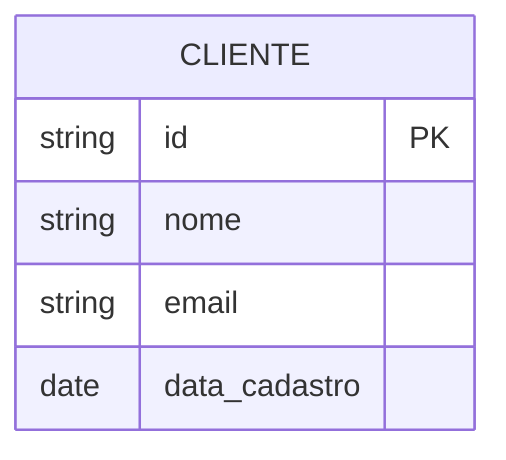
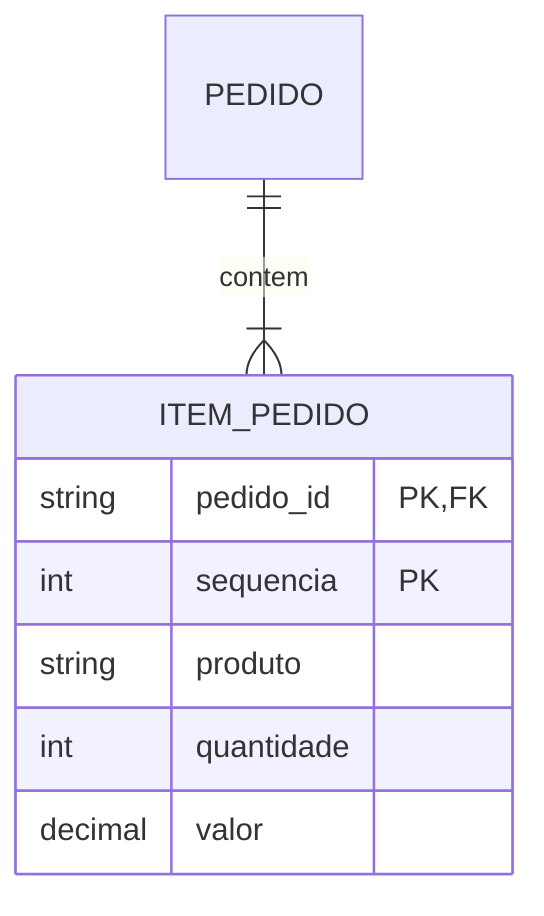
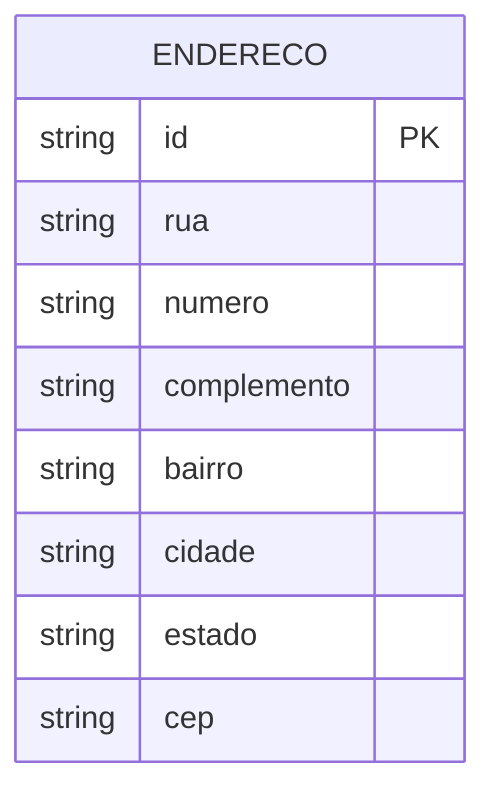

# Mapeamento de Entidades ER para Relacional

## Regras Fundamentais

### 1. Entidades Fortes



↓ Transformação ↓

```sql
CREATE TABLE Cliente (
    id VARCHAR(50) PRIMARY KEY,
    nome VARCHAR(100) NOT NULL,
    email VARCHAR(100) UNIQUE,
    data_cadastro DATE NOT NULL
);
```

### 2. Entidades Fracas



↓ Transformação ↓

```sql
CREATE TABLE Item_Pedido (
    pedido_id VARCHAR(50),
    sequencia INTEGER,
    produto VARCHAR(100) NOT NULL,
    quantidade INTEGER NOT NULL,
    valor DECIMAL(10,2) NOT NULL,
    PRIMARY KEY (pedido_id, sequencia),
    FOREIGN KEY (pedido_id) REFERENCES Pedido(id)
);
```

## Mapeamento de Atributos

### 1. Atributos Simples
- Mapeamento direto para colunas
- Tipo de dados apropriado
- Restrições básicas (NOT NULL, etc.)

### 2. Atributos Compostos



#### Opção 1: Decomposição
```sql
CREATE TABLE Endereco (
    id VARCHAR(50) PRIMARY KEY,
    rua VARCHAR(100),
    numero VARCHAR(10),
    complemento VARCHAR(50),
    bairro VARCHAR(50),
    cidade VARCHAR(50),
    estado CHAR(2),
    cep VARCHAR(8)
);
```

#### Opção 2: Agregação
```sql
CREATE TABLE Endereco (
    id VARCHAR(50) PRIMARY KEY,
    endereco_completo VARCHAR(300)
);
```

### 3. Atributos Multivalorados


```sql
CREATE TABLE Telefone (
    func_id VARCHAR(50),
    numero VARCHAR(20),
    tipo VARCHAR(20),
    PRIMARY KEY (func_id, numero),
    FOREIGN KEY (func_id) REFERENCES Funcionario(id)
);
```

## Estratégias de Identificação

### 1. Chaves Naturais
```sql
CREATE TABLE Produto (
    codigo_barras VARCHAR(13) PRIMARY KEY,
    descricao VARCHAR(200),
    preco DECIMAL(10,2)
);
```

### 2. Chaves Surrogate
```sql
CREATE TABLE Produto (
    id SERIAL PRIMARY KEY,
    codigo_barras VARCHAR(13) UNIQUE,
    descricao VARCHAR(200),
    preco DECIMAL(10,2)
);
```

## Restrições e Integridade

### 1. Domínios
```sql
CREATE DOMAIN Email AS VARCHAR(100)
    CHECK (VALUE ~ '^[A-Za-z0-9._%+-]+@[A-Za-z0-9.-]+\.[A-Za-z]{2,}$');

CREATE TABLE Usuario (
    id SERIAL PRIMARY KEY,
    email Email NOT NULL UNIQUE
);
```

### 2. Checks
```sql
CREATE TABLE Produto (
    id SERIAL PRIMARY KEY,
    nome VARCHAR(100),
    preco DECIMAL(10,2),
    estoque INTEGER,
    CONSTRAINT check_preco_positivo CHECK (preco > 0),
    CONSTRAINT check_estoque_positivo CHECK (estoque >= 0)
);
```

## Padrões de Implementação

### 1. Auditoria
```sql
CREATE TABLE Cliente (
    id SERIAL PRIMARY KEY,
    nome VARCHAR(100),
    criado_em TIMESTAMP DEFAULT CURRENT_TIMESTAMP,
    atualizado_em TIMESTAMP,
    criado_por VARCHAR(50),
    atualizado_por VARCHAR(50)
);
```

### 2. Soft Delete
```sql
CREATE TABLE Produto (
    id SERIAL PRIMARY KEY,
    nome VARCHAR(100),
    ativo BOOLEAN DEFAULT true,
    deletado_em TIMESTAMP,
    deletado_por VARCHAR(50)
);
```

## Considerações de Performance

### 1. Índices
```sql
CREATE TABLE Pedido (
    id SERIAL PRIMARY KEY,
    cliente_id INTEGER,
    data DATE,
    status VARCHAR(20)
);

CREATE INDEX idx_pedido_cliente ON Pedido(cliente_id);
CREATE INDEX idx_pedido_data ON Pedido(data);
CREATE INDEX idx_pedido_status ON Pedido(status);
```

### 2. Particionamento
```sql
CREATE TABLE Vendas (
    id SERIAL,
    data DATE,
    valor DECIMAL(10,2)
) PARTITION BY RANGE (data);

CREATE TABLE vendas_2023 PARTITION OF Vendas
    FOR VALUES FROM ('2023-01-01') TO ('2024-01-01');
```

## Exemplos Práticos

### 1. Sistema de E-commerce
```sql
CREATE TABLE Produto (
    id SERIAL PRIMARY KEY,
    sku VARCHAR(50) UNIQUE,
    nome VARCHAR(100),
    descricao TEXT,
    preco DECIMAL(10,2),
    estoque INTEGER,
    categoria_id INTEGER REFERENCES Categoria(id)
);

CREATE TABLE Pedido (
    id SERIAL PRIMARY KEY,
    cliente_id INTEGER REFERENCES Cliente(id),
    data TIMESTAMP DEFAULT CURRENT_TIMESTAMP,
    status VARCHAR(20),
    valor_total DECIMAL(10,2)
);

CREATE TABLE Item_Pedido (
    pedido_id INTEGER,
    produto_id INTEGER,
    quantidade INTEGER,
    preco_unitario DECIMAL(10,2),
    PRIMARY KEY (pedido_id, produto_id),
    FOREIGN KEY (pedido_id) REFERENCES Pedido(id),
    FOREIGN KEY (produto_id) REFERENCES Produto(id)
);
```

### 2. Sistema Acadêmico
```sql
CREATE TABLE Aluno (
    matricula VARCHAR(20) PRIMARY KEY,
    nome VARCHAR(100),
    data_nascimento DATE,
    curso_id INTEGER REFERENCES Curso(id)
);

CREATE TABLE Disciplina (
    codigo VARCHAR(10) PRIMARY KEY,
    nome VARCHAR(100),
    carga_horaria INTEGER,
    departamento_id INTEGER REFERENCES Departamento(id)
);

CREATE TABLE Matricula (
    aluno_id VARCHAR(20),
    disciplina_id VARCHAR(10),
    semestre VARCHAR(6),
    nota DECIMAL(4,2),
    frequencia INTEGER,
    PRIMARY KEY (aluno_id, disciplina_id, semestre),
    FOREIGN KEY (aluno_id) REFERENCES Aluno(matricula),
    FOREIGN KEY (disciplina_id) REFERENCES Disciplina(codigo)
);
```