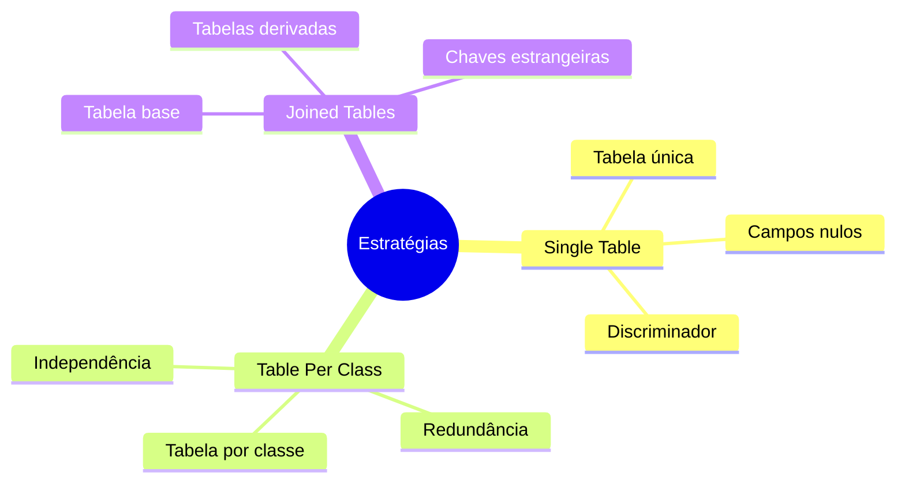
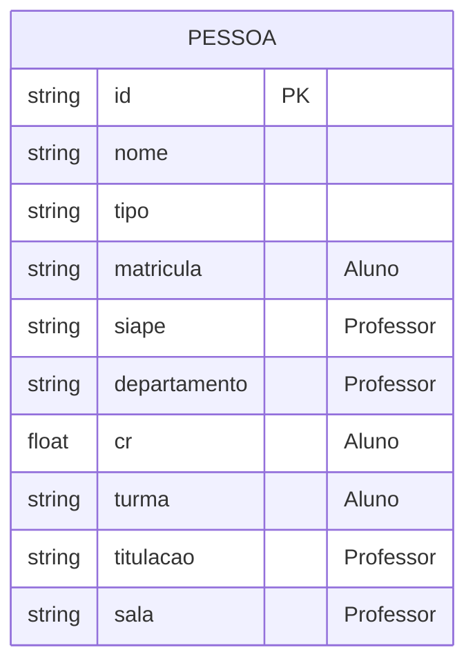
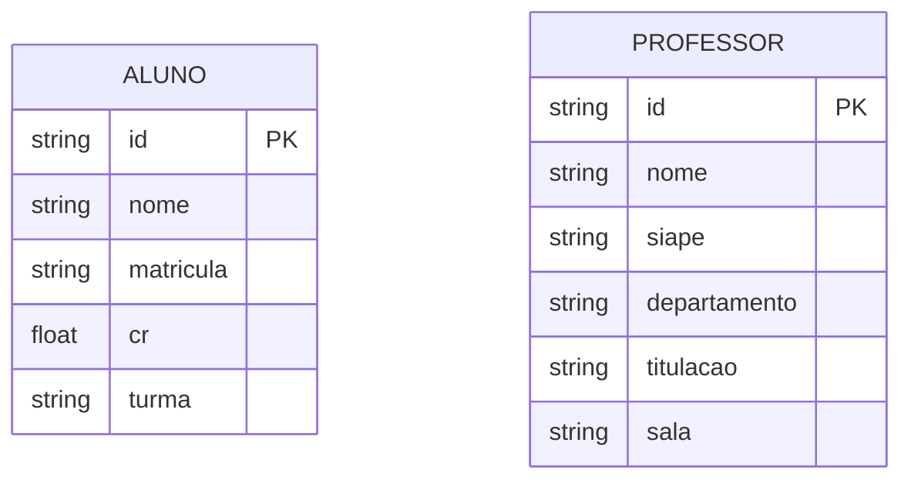
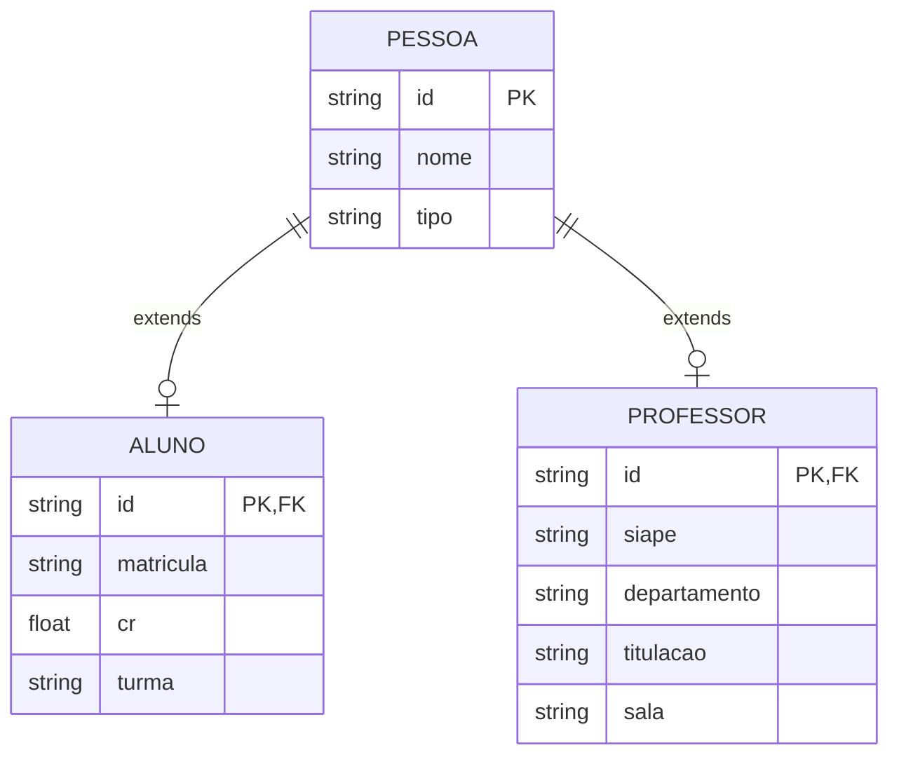
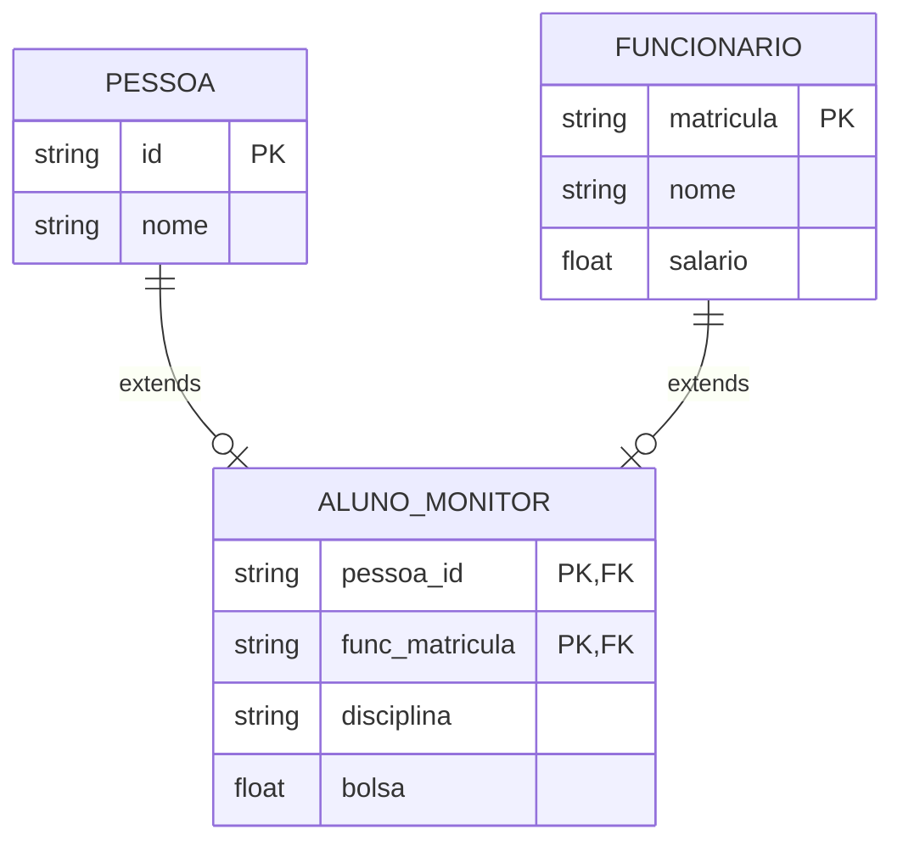
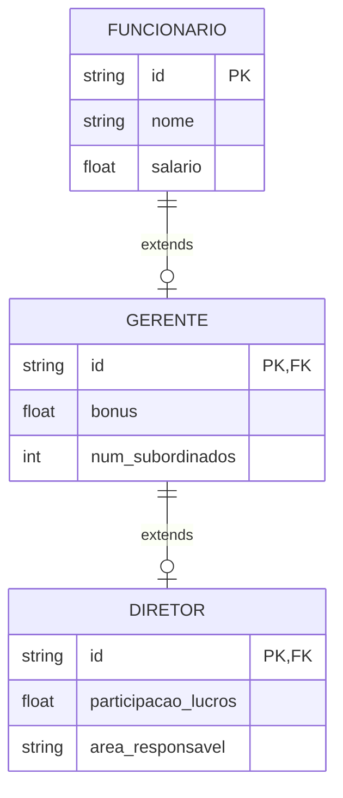
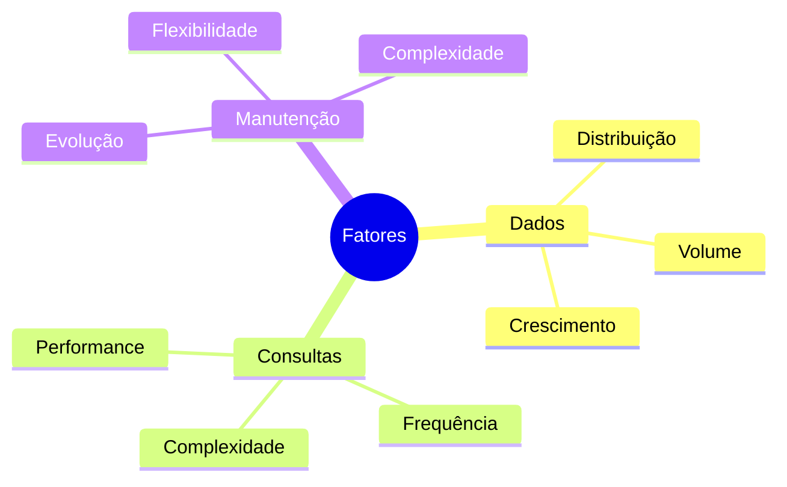

# Mapeamento de Herança ER para Relacional

## Visão Geral das Estratégias



## Estratégias de Mapeamento

### 1. Single Table (Tabela Única)



#### Implementação
```sql
CREATE TABLE Pessoa (
    id VARCHAR(20) PRIMARY KEY,
    nome VARCHAR(100) NOT NULL,
    tipo VARCHAR(20) NOT NULL,
    -- Atributos de Aluno
    matricula VARCHAR(20),
    cr FLOAT,
    turma VARCHAR(20),
    -- Atributos de Professor
    siape VARCHAR(20),
    departamento VARCHAR(50),
    titulacao VARCHAR(30),
    sala VARCHAR(10),
    -- Restrições
    CONSTRAINT check_tipo CHECK (tipo IN ('ALUNO', 'PROFESSOR')),
    CONSTRAINT check_aluno CHECK (
        (tipo = 'ALUNO' AND matricula IS NOT NULL) OR
        (tipo = 'PROFESSOR' AND matricula IS NULL)
    ),
    CONSTRAINT check_professor CHECK (
        (tipo = 'PROFESSOR' AND siape IS NOT NULL) OR
        (tipo = 'ALUNO' AND siape IS NULL)
    )
);
```

#### Vantagens
- Consultas simples
- Sem necessidade de junções
- Fácil manutenção

#### Desvantagens
- Desperdício de espaço
- Muitos campos nulos
- Menor integridade de dados

### 2. Table Per Class (Tabela por Classe)



#### Implementação
```sql
CREATE TABLE Aluno (
    id VARCHAR(20) PRIMARY KEY,
    nome VARCHAR(100) NOT NULL,
    matricula VARCHAR(20) UNIQUE NOT NULL,
    cr FLOAT,
    turma VARCHAR(20)
);

CREATE TABLE Professor (
    id VARCHAR(20) PRIMARY KEY,
    nome VARCHAR(100) NOT NULL,
    siape VARCHAR(20) UNIQUE NOT NULL,
    departamento VARCHAR(50),
    titulacao VARCHAR(30),
    sala VARCHAR(10)
);
```

#### Vantagens
- Modelo mais flexível
- Melhor integridade de dados
- Consultas específicas eficientes

#### Desvantagens
- Redundância de dados
- Consultas polimórficas complexas
- Maior espaço de armazenamento

### 3. Joined Tables (Tabelas Unidas)



#### Implementação
```sql
CREATE TABLE Pessoa (
    id VARCHAR(20) PRIMARY KEY,
    nome VARCHAR(100) NOT NULL,
    tipo VARCHAR(20) NOT NULL,
    CONSTRAINT check_tipo CHECK (tipo IN ('ALUNO', 'PROFESSOR'))
);

CREATE TABLE Aluno (
    id VARCHAR(20) PRIMARY KEY,
    matricula VARCHAR(20) UNIQUE NOT NULL,
    cr FLOAT,
    turma VARCHAR(20),
    FOREIGN KEY (id) REFERENCES Pessoa(id)
);

CREATE TABLE Professor (
    id VARCHAR(20) PRIMARY KEY,
    siape VARCHAR(20) UNIQUE NOT NULL,
    departamento VARCHAR(50),
    titulacao VARCHAR(30),
    sala VARCHAR(10),
    FOREIGN KEY (id) REFERENCES Pessoa(id)
);
```

#### Vantagens
- Normalização completa
- Sem campos nulos
- Integridade referencial

#### Desvantagens
- Necessidade de junções
- Performance reduzida
- Complexidade de manutenção

## Casos Especiais

### 1. Herança Múltipla



#### Implementação
```sql
CREATE TABLE Pessoa (
    id VARCHAR(20) PRIMARY KEY,
    nome VARCHAR(100) NOT NULL
);

CREATE TABLE Funcionario (
    matricula VARCHAR(20) PRIMARY KEY,
    nome VARCHAR(100) NOT NULL,
    salario DECIMAL(10,2)
);

CREATE TABLE Aluno_Monitor (
    pessoa_id VARCHAR(20),
    func_matricula VARCHAR(20),
    disciplina VARCHAR(50) NOT NULL,
    bolsa DECIMAL(10,2),
    PRIMARY KEY (pessoa_id, func_matricula),
    FOREIGN KEY (pessoa_id) REFERENCES Pessoa(id),
    FOREIGN KEY (func_matricula) REFERENCES Funcionario(matricula)
);
```

### 2. Herança Hierárquica



#### Implementação
```sql
CREATE TABLE Funcionario (
    id VARCHAR(20) PRIMARY KEY,
    nome VARCHAR(100) NOT NULL,
    salario DECIMAL(10,2),
    tipo VARCHAR(20) NOT NULL,
    CONSTRAINT check_tipo CHECK (tipo IN ('FUNCIONARIO', 'GERENTE', 'DIRETOR'))
);

CREATE TABLE Gerente (
    id VARCHAR(20) PRIMARY KEY,
    bonus DECIMAL(10,2),
    num_subordinados INTEGER,
    FOREIGN KEY (id) REFERENCES Funcionario(id)
);

CREATE TABLE Diretor (
    id VARCHAR(20) PRIMARY KEY,
    participacao_lucros DECIMAL(10,2),
    area_responsavel VARCHAR(50),
    FOREIGN KEY (id) REFERENCES Gerente(id)
);
```

## Otimizações

### 1. Índices
```sql
-- Índices para junções eficientes
CREATE INDEX idx_pessoa_tipo ON Pessoa(tipo);
CREATE INDEX idx_aluno_matricula ON Aluno(matricula);
CREATE INDEX idx_professor_siape ON Professor(siape);

-- Índices para consultas frequentes
CREATE INDEX idx_funcionario_tipo ON Funcionario(tipo);
CREATE INDEX idx_gerente_subordinados ON Gerente(num_subordinados);
```

### 2. Views
```sql
-- View para consulta unificada de pessoas
CREATE VIEW vw_pessoas AS
    SELECT p.id, p.nome, p.tipo,
           a.matricula, a.cr, a.turma,
           pr.siape, pr.departamento, pr.titulacao
    FROM Pessoa p
    LEFT JOIN Aluno a ON p.id = a.id
    LEFT JOIN Professor pr ON p.id = pr.id;

-- View para hierarquia de funcionários
CREATE VIEW vw_funcionarios AS
    SELECT f.id, f.nome, f.salario, f.tipo,
           g.bonus, g.num_subordinados,
           d.participacao_lucros, d.area_responsavel
    FROM Funcionario f
    LEFT JOIN Gerente g ON f.id = g.id
    LEFT JOIN Diretor d ON g.id = d.id;
```

## Considerações de Design

### Escolha da Estratégia



#### Recomendações
1. **Single Table**
   - Hierarquias simples
   - Poucos atributos específicos
   - Consultas frequentes polimórficas

2. **Table Per Class**
   - Subclasses muito diferentes
   - Consultas específicas frequentes
   - Poucos dados compartilhados

3. **Joined Tables**
   - Alta normalização necessária
   - Dados compartilhados importantes
   - Evolução frequente do esquema

## Conclusão

A escolha da estratégia de mapeamento deve considerar:
- Requisitos funcionais
- Performance necessária
- Complexidade aceitável
- Flexibilidade para evolução