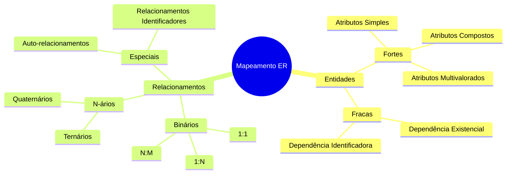
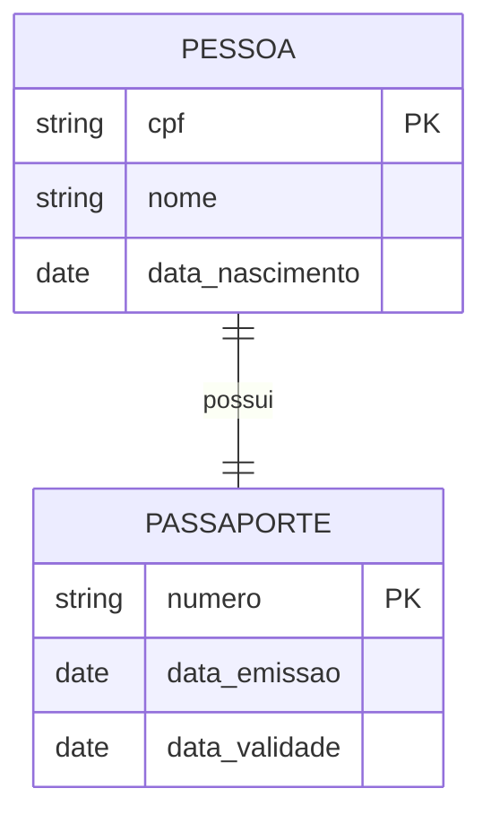
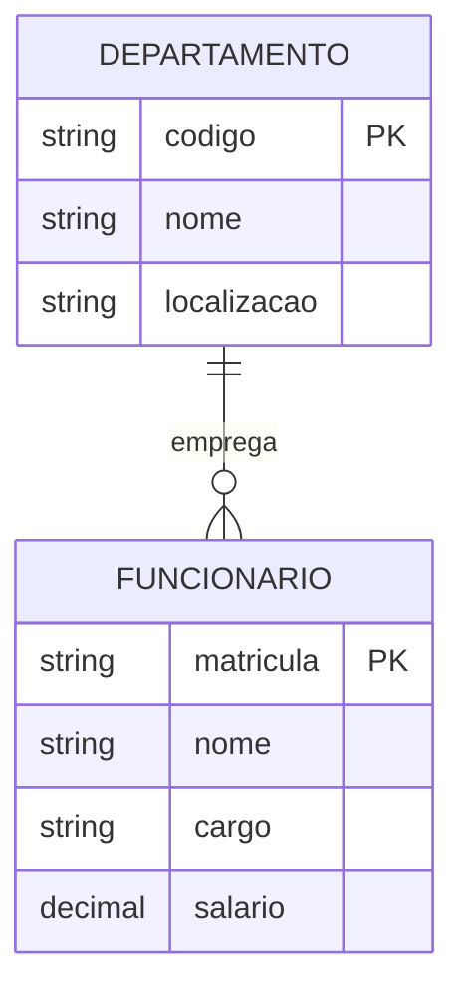
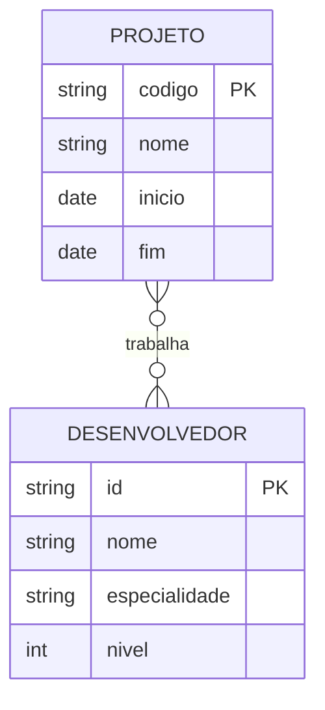
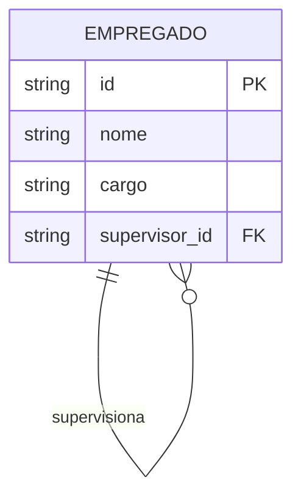
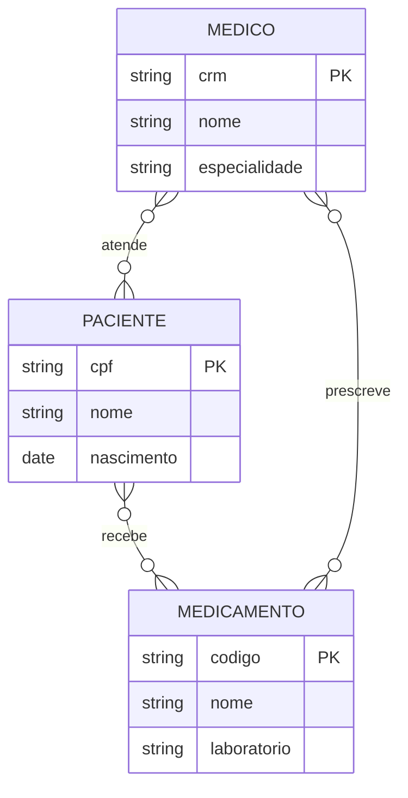

# Mapeamento de Relacionamentos ER para Relacional

## Fundamentos do Mapeamento

### Conceitos Básicos



## Mapeamento por Cardinalidade

### 1. Relacionamentos 1:1



#### Implementação
```sql
CREATE TABLE Pessoa (
    cpf VARCHAR(11) PRIMARY KEY,
    nome VARCHAR(100) NOT NULL,
    data_nascimento DATE,
    passaporte_numero VARCHAR(20) UNIQUE,
    FOREIGN KEY (passaporte_numero) REFERENCES Passaporte(numero)
);

CREATE TABLE Passaporte (
    numero VARCHAR(20) PRIMARY KEY,
    data_emissao DATE NOT NULL,
    data_validade DATE NOT NULL
);
```

### 2. Relacionamentos 1:N



#### Implementação
```sql
CREATE TABLE Departamento (
    codigo VARCHAR(10) PRIMARY KEY,
    nome VARCHAR(100) NOT NULL,
    localizacao VARCHAR(100)
);

CREATE TABLE Funcionario (
    matricula VARCHAR(20) PRIMARY KEY,
    nome VARCHAR(100) NOT NULL,
    cargo VARCHAR(50),
    salario DECIMAL(10,2),
    departamento_codigo VARCHAR(10) NOT NULL,
    FOREIGN KEY (departamento_codigo) REFERENCES Departamento(codigo)
);
```

### 3. Relacionamentos N:M



#### Implementação
```sql
CREATE TABLE Projeto (
    codigo VARCHAR(20) PRIMARY KEY,
    nome VARCHAR(100) NOT NULL,
    inicio DATE,
    fim DATE
);

CREATE TABLE Desenvolvedor (
    id VARCHAR(20) PRIMARY KEY,
    nome VARCHAR(100) NOT NULL,
    especialidade VARCHAR(50),
    nivel INTEGER
);

CREATE TABLE Projeto_Desenvolvedor (
    projeto_codigo VARCHAR(20),
    desenvolvedor_id VARCHAR(20),
    data_alocacao DATE NOT NULL,
    horas_semanais INTEGER,
    papel VARCHAR(50),
    PRIMARY KEY (projeto_codigo, desenvolvedor_id),
    FOREIGN KEY (projeto_codigo) REFERENCES Projeto(codigo),
    FOREIGN KEY (desenvolvedor_id) REFERENCES Desenvolvedor(id)
);
```

## Casos Especiais

### 1. Auto-relacionamentos



#### Implementação
```sql
CREATE TABLE Empregado (
    id VARCHAR(20) PRIMARY KEY,
    nome VARCHAR(100) NOT NULL,
    cargo VARCHAR(50),
    supervisor_id VARCHAR(20),
    FOREIGN KEY (supervisor_id) REFERENCES Empregado(id)
);
```

### 2. Relacionamentos Ternários



#### Implementação
```sql
CREATE TABLE Medico (
    crm VARCHAR(20) PRIMARY KEY,
    nome VARCHAR(100) NOT NULL,
    especialidade VARCHAR(50)
);

CREATE TABLE Paciente (
    cpf VARCHAR(11) PRIMARY KEY,
    nome VARCHAR(100) NOT NULL,
    nascimento DATE
);

CREATE TABLE Medicamento (
    codigo VARCHAR(20) PRIMARY KEY,
    nome VARCHAR(100) NOT NULL,
    laboratorio VARCHAR(100)
);

CREATE TABLE Prescricao (
    medico_crm VARCHAR(20),
    paciente_cpf VARCHAR(11),
    medicamento_codigo VARCHAR(20),
    data_prescricao DATE NOT NULL,
    dosagem VARCHAR(50),
    duracao_dias INTEGER,
    PRIMARY KEY (medico_crm, paciente_cpf, medicamento_codigo, data_prescricao),
    FOREIGN KEY (medico_crm) REFERENCES Medico(crm),
    FOREIGN KEY (paciente_cpf) REFERENCES Paciente(cpf),
    FOREIGN KEY (medicamento_codigo) REFERENCES Medicamento(codigo)
);
```

## Otimizações

### 1. Índices
```sql
-- Índices para relacionamentos 1:N
CREATE INDEX idx_funcionario_dept ON Funcionario(departamento_codigo);

-- Índices para relacionamentos N:M
CREATE INDEX idx_proj_dev_proj ON Projeto_Desenvolvedor(projeto_codigo);
CREATE INDEX idx_proj_dev_dev ON Projeto_Desenvolvedor(desenvolvedor_id);
```

### 2. Constraints
```sql
-- Restrições de integridade
ALTER TABLE Funcionario
ADD CONSTRAINT check_salario CHECK (salario > 0);

-- Restrições de exclusão
ALTER TABLE Funcionario
ADD CONSTRAINT fk_dept
FOREIGN KEY (departamento_codigo) 
REFERENCES Departamento(codigo)
ON DELETE RESTRICT
ON UPDATE CASCADE;
```

## Boas Práticas

### 1. Nomenclatura
- Nomes descritivos para tabelas de relacionamento
- Prefixos consistentes para chaves estrangeiras
- Sufixos padronizados para índices e constraints

### 2. Documentação
- Comentários explicativos nas tabelas
- Documentação das regras de negócio
- Diagramas de relacionamento

### 3. Performance
- Análise de cardinalidade
- Estratégia de indexação
- Monitoramento de consultas

## Exemplos Práticos

### Sistema de Biblioteca
```sql
CREATE TABLE Livro (
    isbn VARCHAR(13) PRIMARY KEY,
    titulo VARCHAR(200) NOT NULL,
    ano INTEGER,
    copias_disponiveis INTEGER
);

CREATE TABLE Usuario (
    id SERIAL PRIMARY KEY,
    nome VARCHAR(100) NOT NULL,
    email VARCHAR(100) UNIQUE
);

CREATE TABLE Emprestimo (
    livro_isbn VARCHAR(13),
    usuario_id INTEGER,
    data_emprestimo DATE NOT NULL,
    data_devolucao_prevista DATE NOT NULL,
    data_devolucao_real DATE,
    PRIMARY KEY (livro_isbn, usuario_id, data_emprestimo),
    FOREIGN KEY (livro_isbn) REFERENCES Livro(isbn),
    FOREIGN KEY (usuario_id) REFERENCES Usuario(id)
);
```

### Sistema de E-commerce
```sql
CREATE TABLE Pedido (
    numero VARCHAR(20) PRIMARY KEY,
    cliente_id INTEGER REFERENCES Cliente(id),
    data_pedido TIMESTAMP DEFAULT CURRENT_TIMESTAMP,
    status VARCHAR(20)
);

CREATE TABLE Produto (
    codigo VARCHAR(20) PRIMARY KEY,
    nome VARCHAR(100) NOT NULL,
    preco DECIMAL(10,2)
);

CREATE TABLE Item_Pedido (
    pedido_numero VARCHAR(20),
    produto_codigo VARCHAR(20),
    quantidade INTEGER NOT NULL,
    preco_unitario DECIMAL(10,2) NOT NULL,
    PRIMARY KEY (pedido_numero, produto_codigo),
    FOREIGN KEY (pedido_numero) REFERENCES Pedido(numero),
    FOREIGN KEY (produto_codigo) REFERENCES Produto(codigo)
);
```