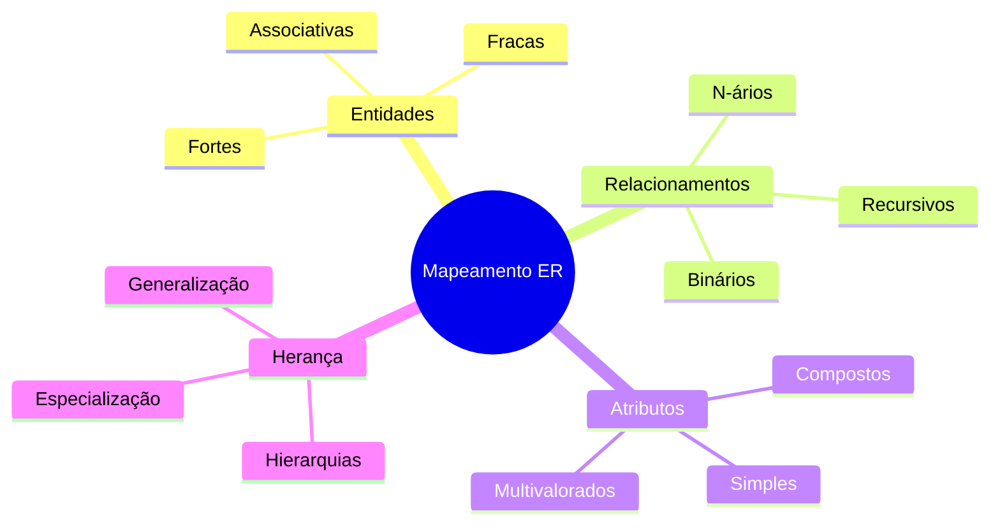
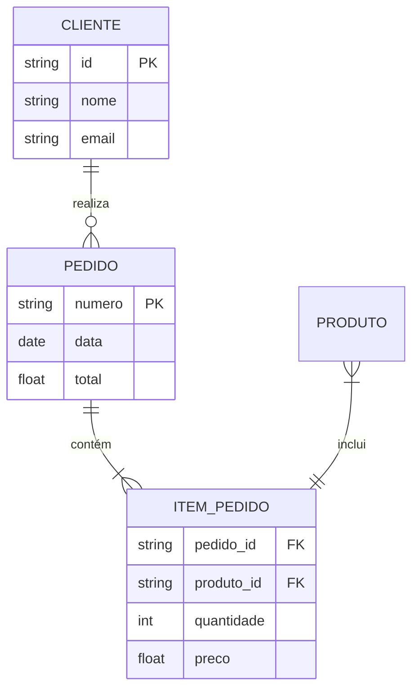
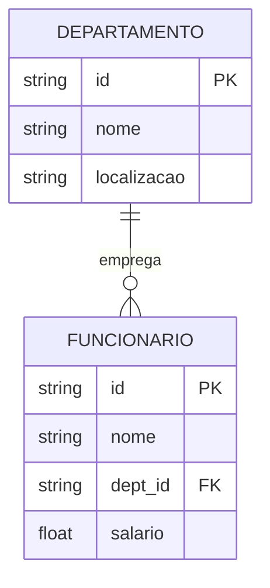
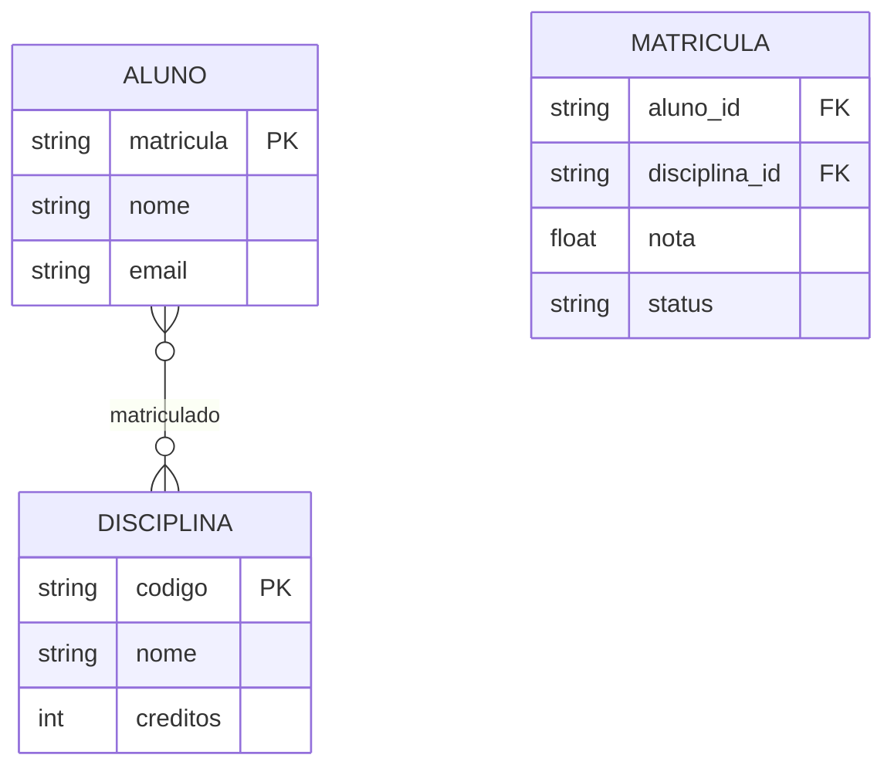

# Mapeamento do Modelo ER

O processo de mapeamento do Modelo Entidade-Relacionamento (ER) para um modelo lógico ou físico é uma etapa crucial no design de bancos de dados. Este capítulo aborda as estratégias e técnicas para realizar essa transformação de forma eficiente e consistente.

## Visão Geral do Mapeamento

## Princípios Fundamentais

### 1. Preservação Semântica
- Manter o significado dos dados
- Preservar regras de negócio
- Garantir integridade referencial
- Conservar restrições do modelo

### 2. Otimização Estrutural
- Minimizar redundância
- Otimizar acesso aos dados
- Balancear normalização
- Considerar performance

### 3. Consistência
- Seguir padrões de nomenclatura
- Manter convenções de design
- Documentar decisões
- Garantir rastreabilidade

## Processo de Mapeamento

### 1. Análise do Modelo ER

### 2. Identificação de Estruturas

#### Entidades Fortes
- Mapeamento direto para tabelas
- Definição de chaves primárias
- Atributos como colunas
- Restrições de integridade

#### Relacionamentos
- Análise de cardinalidade
- Chaves estrangeiras
- Tabelas de associação
- Restrições de referência

#### Atributos Especiais
- Tratamento de compostos
- Resolução de multivalorados
- Derivados e calculados
- Tipos de dados apropriados

## Exemplos de Transformação

### 1. Relacionamento 1:N

### 2. Relacionamento N:M

## Considerações Práticas

### 1. Performance
- Índices apropriados
- Tipos de dados eficientes
- Estratégias de particionamento
- Otimização de consultas

### 2. Manutenibilidade
- Documentação clara
- Nomenclatura consistente
- Modularidade
- Flexibilidade para mudanças

### 3. Escalabilidade
- Estruturas extensíveis
- Gerenciamento de crescimento
- Estratégias de distribuição
- Planejamento de capacidade

## Ferramentas e Tecnologias

### 1. Ferramentas CASE
- Modelagem visual
- Geração de código
- Documentação automática
- Validação de modelos

### 2. SGBDs
- Recursos específicos
- Limitações técnicas
- Otimizações disponíveis
- Extensões proprietárias

## Próximos Passos

Para aprofundar seu conhecimento em mapeamento ER, explore:

1. **Mapeamento de Entidades**
   - Tipos de entidades
   - Atributos especiais
   - Restrições específicas

2. **Mapeamento de Relacionamentos**
   - Cardinalidades
   - Participação
   - Atributos de relacionamento

3. **Mapeamento de Herança**
   - Estratégias de implementação
   - Hierarquias
   - Restrições específicas

## Conclusão

O mapeamento ER é fundamental para:
- Implementação eficiente
- Integridade dos dados
- Performance do sistema
- Manutenibilidade do banco

Uma estratégia bem planejada garante:
- Consistência dos dados
- Facilidade de evolução
- Melhor desempenho
- Menor custo de manutenção