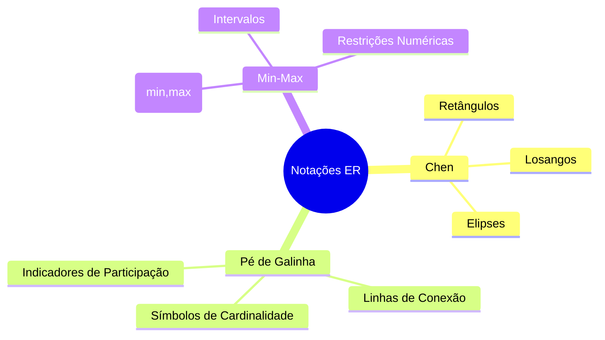
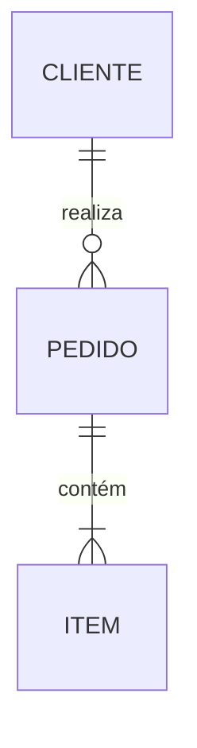
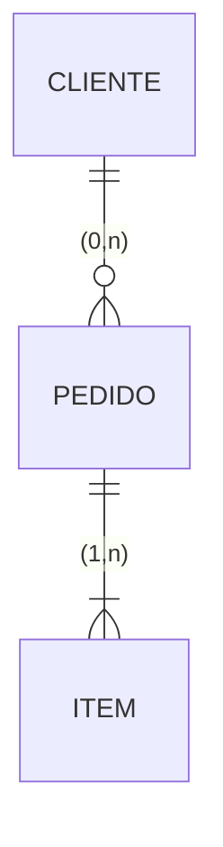
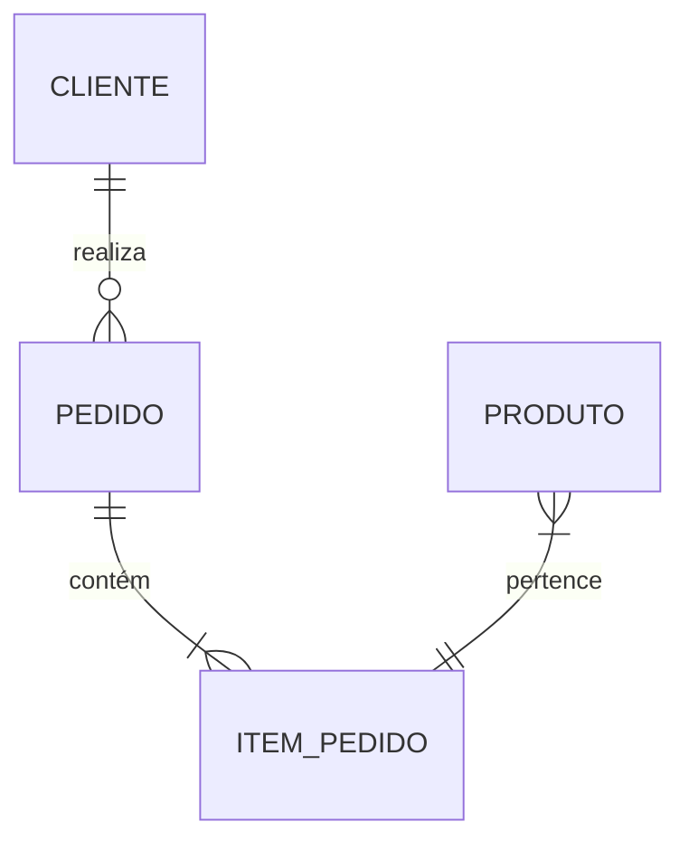
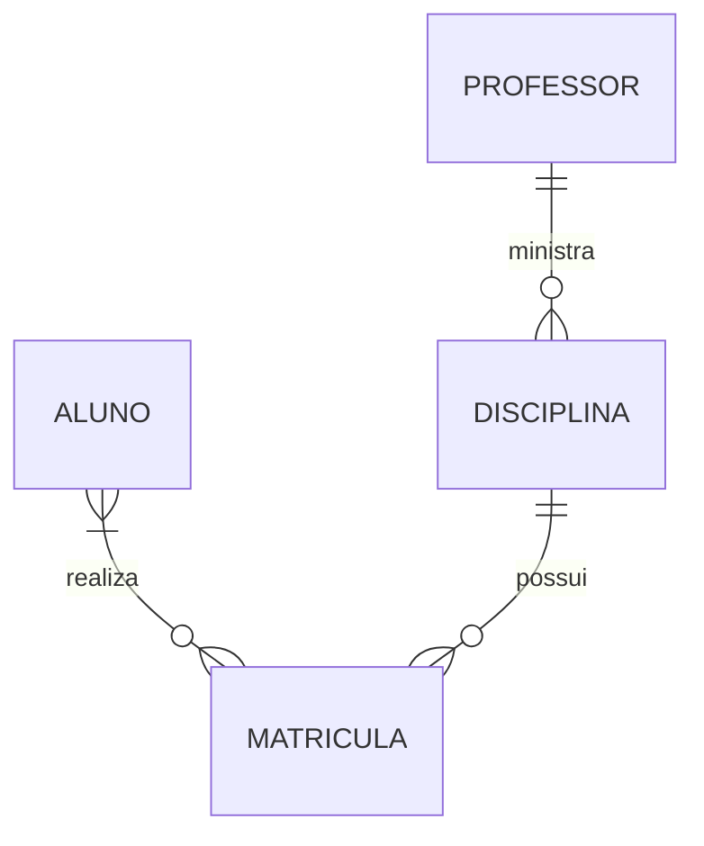

# Notações do Modelo ER

O Modelo Entidade-Relacionamento (ER) pode ser representado usando diferentes notações. Cada notação tem suas particularidades e é adequada para diferentes contextos.

## Visão Geral das Notações

## Comparação das Notações

### 1. Elementos Básicos

| Elemento | Chen | Pé de Galinha | Min-Max |
|----------|------|---------------|---------|
| Entidade | Retângulo | Retângulo | Retângulo |
| Relacionamento | Losango | Linha | Linha |
| Atributo | Elipse | Texto | Texto |
| Cardinalidade | Texto (1,N,M) | Símbolos | (min,max) |

### 2. Representação de Cardinalidade

#### Notação de Chen

#### Notação Pé de Galinha

#### Notação Min-Max

## Características das Notações

### 1. Notação de Chen

#### Vantagens
- Clara e intuitiva
- Boa para aprendizado
- Detalhada

#### Desvantagens
- Ocupa muito espaço
- Pode ficar confusa em modelos grandes
- Menos usada em ferramentas modernas

### 2. Notação Pé de Galinha

#### Vantagens
- Compacta
- Amplamente usada
- Suportada por muitas ferramentas

#### Desvantagens
- Símbolos podem ser confusos inicialmente
- Menos detalhada que Chen
- Variações entre ferramentas

### 3. Notação Min-Max

#### Vantagens
- Precisa
- Flexível
- Boa para restrições complexas

#### Desvantagens
- Mais complexa
- Menos intuitiva
- Requer mais explicação

## Exemplos Práticos

### 1. Sistema de Vendas

#### Chen

#### Pé de Galinha

### 2. Sistema Acadêmico

#### Chen

#### Pé de Galinha

## Escolhendo a Notação Adequada

### 1. Fatores a Considerar

- Público-alvo
- Complexidade do modelo
- Ferramentas disponíveis
- Padrões organizacionais
- Necessidade de detalhamento

### 2. Recomendações

#### Para Ensino
- Use notação de Chen
- Explique todos os elementos
- Mostre exemplos simples

#### Para Projetos
- Use notação Pé de Galinha
- Mantenha consistência
- Documente convenções

#### Para Especificações
- Use notação Min-Max
- Detalhe restrições
- Forneça exemplos

## Ferramentas e Suporte

### 1. Ferramentas Populares

- Draw.io
- Lucidchart
- Visual Paradigm
- MySQL Workbench
- Enterprise Architect

### 2. Recursos Online

- Editores online
- Plugins para IDEs
- Geradores de documentação
- Conversores entre notações

## Conclusão

A escolha da notação ER deve considerar:
- Necessidades do projeto
- Público-alvo
- Ferramentas disponíveis
- Padrões organizacionais

Independente da notação:
- Mantenha consistência
- Documente convenções
- Priorize clareza
- Considere manutenibilidade