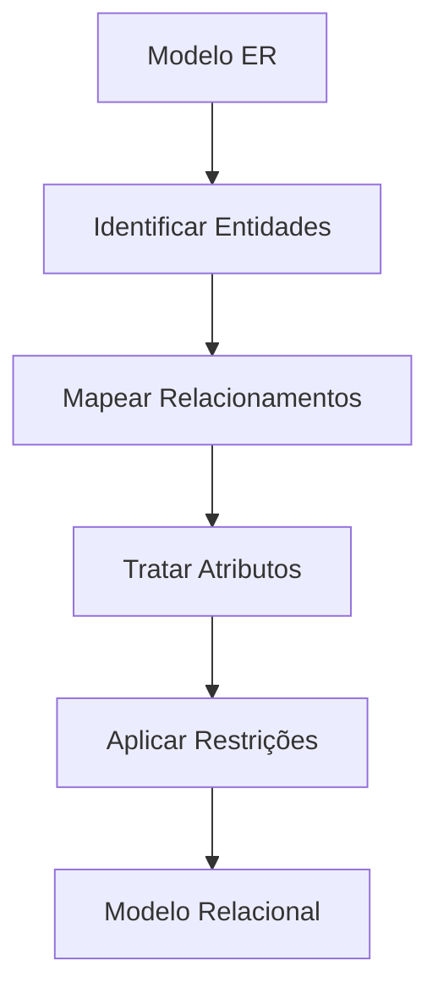
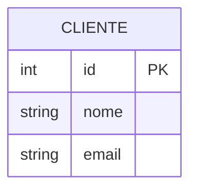
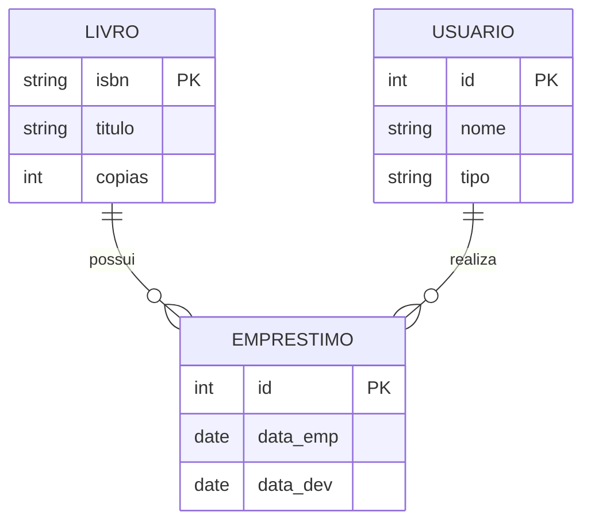

# Transformação ER para Relacional

A transformação de um modelo ER para o modelo relacional é um processo sistemático que segue regras bem definidas.

## Processo de Transformação



## Regras de Mapeamento

### 1. Entidades para Tabelas


↓ Transformação ↓
```sql
CREATE TABLE Cliente (
    id INT PRIMARY KEY,
    nome VARCHAR(100),
    email VARCHAR(100)
);
```

### 2. Relacionamentos

#### Cardinalidade 1:1
- Chave estrangeira em qualquer lado
- Preferência para o lado opcional

#### Cardinalidade 1:N
- Chave estrangeira no lado N
- Restrição de integridade referencial

#### Cardinalidade N:M
- Nova tabela de relacionamento
- Chaves estrangeiras para ambas entidades

## Exemplos Detalhados

### Sistema de Biblioteca



↓ Transformação ↓

```sql
CREATE TABLE Livro (
    isbn VARCHAR(13) PRIMARY KEY,
    titulo VARCHAR(200) NOT NULL,
    copias INT DEFAULT 1
);

CREATE TABLE Usuario (
    id INT PRIMARY KEY,
    nome VARCHAR(100) NOT NULL,
    tipo CHAR(1) CHECK (tipo IN ('A','P'))
);

CREATE TABLE Emprestimo (
    id INT PRIMARY KEY,
    livro_isbn VARCHAR(13),
    usuario_id INT,
    data_emp DATE NOT NULL,
    data_dev DATE,
    FOREIGN KEY (livro_isbn) REFERENCES Livro(isbn),
    FOREIGN KEY (usuario_id) REFERENCES Usuario(id)
);
```

## Checklist de Transformação

1. **Preparação**
   - [ ] Validar modelo ER
   - [ ] Identificar todas entidades
   - [ ] Listar relacionamentos
   - [ ] Catalogar atributos especiais

2. **Execução**
   - [ ] Criar tabelas base
   - [ ] Estabelecer chaves primárias
   - [ ] Mapear relacionamentos
   - [ ] Adicionar chaves estrangeiras

3. **Validação**
   - [ ] Verificar integridade referencial
   - [ ] Confirmar cardinalidades
   - [ ] Testar restrições
   - [ ] Validar normalização