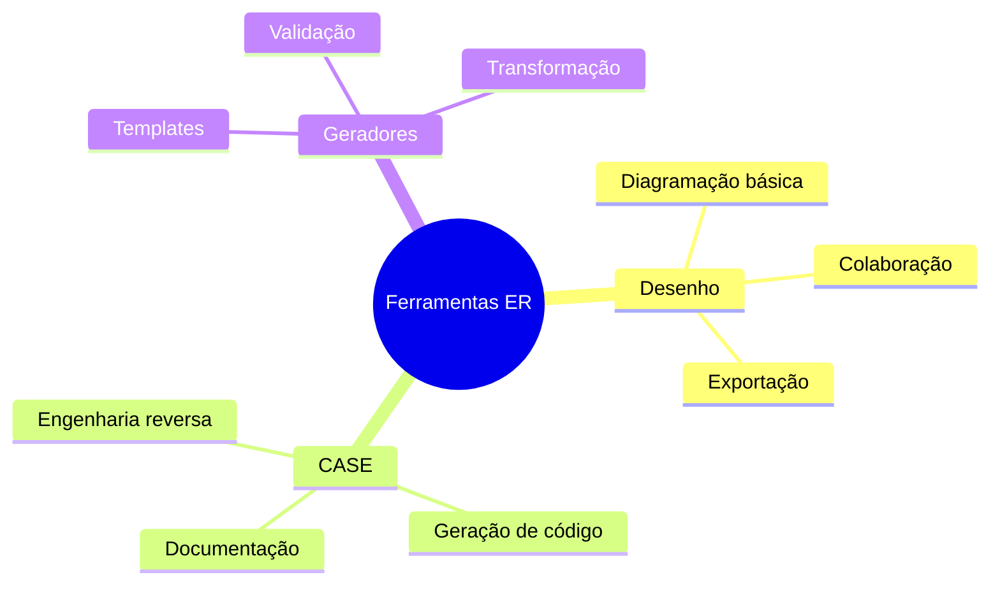

# Ferramentas para Modelagem ER

As ferramentas de modelagem Entidade-Relacionamento são essenciais para criar, manter e documentar modelos de dados de forma eficiente.

## Categorias Principais

## Critérios de Seleção

### 1. Aspectos Técnicos
- Suporte a notações (Chen, Crow's Foot, UML)
- Capacidade de exportação
- Integração com outros sistemas
- Validação de modelos

### 2. Aspectos Práticos
- Curva de aprendizado
- Custo x benefício
- Suporte e comunidade
- Atualizações regulares

## Recomendações Gerais

1. **Para Iniciantes**
   - Ferramentas online gratuitas
   - Interface intuitiva
   - Documentação em português
   - Comunidade ativa

2. **Para Profissionais**
   - Ferramentas enterprise
   - Recursos avançados
   - Integração com IDEs
   - Suporte empresarial

3. **Para Educação**
   - Ferramentas didáticas
   - Exemplos práticos
   - Material de apoio
   - Licenças acadêmicas