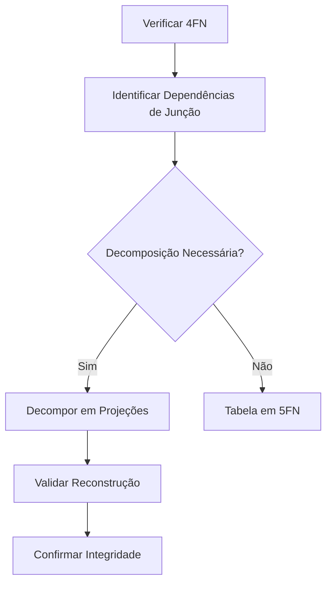

# Quinta Forma Normal (5FN)

## Definição

A Quinta Forma Normal (5FN), também conhecida como Forma Normal de Projeção-Junção (PJNF), é o nível mais alto de normalização que exige:
1. A tabela deve estar na 4FN
2. Não deve haver dependências de junção não-triviais

## Conceitos Fundamentais

### 1. Dependência de Junção
- Ocorre quando uma tabela pode ser reconstruída a partir de suas projeções
- Decomposição sem perda de informação
- Mais complexa que dependências multivaloradas

### 2. Decomposição por Junção
- Divisão em múltiplas tabelas menores
- Preservação completa da informação
- Reconstrução através de junções naturais

## Exemplos Práticos

### Exemplo 1: Representante, Fabricante e Produto

#### Violação da 5FN
```sql
-- Tabela não normalizada
CREATE TABLE Representante_Fabricante_Produto (
    representante VARCHAR(100),
    fabricante VARCHAR(100),
    produto VARCHAR(100),
    PRIMARY KEY (representante, fabricante, produto)
);
```

#### Aplicação da 5FN
```sql
-- Tabelas normalizadas
CREATE TABLE Representante_Fabricante (
    representante VARCHAR(100),
    fabricante VARCHAR(100),
    PRIMARY KEY (representante, fabricante)
);

CREATE TABLE Fabricante_Produto (
    fabricante VARCHAR(100),
    produto VARCHAR(100),
    PRIMARY KEY (fabricante, produto)
);

CREATE TABLE Representante_Produto (
    representante VARCHAR(100),
    produto VARCHAR(100),
    PRIMARY KEY (representante, produto)
);
```

## Processo de Normalização

### 1. Identificação de Dependências


### 2. Passos para Normalização
1. Confirmar 4FN
2. Identificar dependências de junção
3. Avaliar decomposição
4. Criar projeções
5. Validar reconstrução

## Benefícios

### 1. Qualidade dos Dados
- Eliminação total de redundância
- Máxima integridade
- Consistência garantida

### 2. Design
- Estrutura otimizada
- Relacionamentos puros
- Manutenção simplificada

## Considerações Práticas

### 1. Implementação
```sql
-- Exemplo de migração para 5FN
INSERT INTO Representante_Fabricante (representante, fabricante)
SELECT DISTINCT representante, fabricante
FROM representante_fabricante_produto;

INSERT INTO Fabricante_Produto (fabricante, produto)
SELECT DISTINCT fabricante, produto
FROM representante_fabricante_produto;

INSERT INTO Representante_Produto (representante, produto)
SELECT DISTINCT representante, produto
FROM representante_fabricante_produto;
```

### 2. Desafios
- Complexidade de queries
- Performance de junções
- Manutenção de integridade

## Quando Aplicar

### 1. Cenários Ideais
- Dados altamente inter-relacionados
- Necessidade de máxima integridade
- Atualizações frequentes
- Relacionamentos complexos

### 2. Considerações
- Custo de implementação
- Impacto na performance
- Complexidade de manutenção
- Necessidades do negócio

## Anti-Padrões

### 1. Violações Comuns
```sql
-- Anti-padrão: Dependências de junção não decompostas
CREATE TABLE Fornecedor_Peca_Projeto (
    fornecedor_id INT,
    peca_id INT,
    projeto_id INT,
    quantidade INT,
    PRIMARY KEY (fornecedor_id, peca_id, projeto_id)
);

-- Correção
CREATE TABLE Fornecedor_Peca (
    fornecedor_id INT,
    peca_id INT,
    PRIMARY KEY (fornecedor_id, peca_id)
);

CREATE TABLE Peca_Projeto (
    peca_id INT,
    projeto_id INT,
    PRIMARY KEY (peca_id, projeto_id)
);

CREATE TABLE Fornecedor_Projeto (
    fornecedor_id INT,
    projeto_id INT,
    PRIMARY KEY (fornecedor_id, projeto_id)
);
```

### 2. Soluções
- Análise cuidadosa de dependências
- Decomposição apropriada
- Validação de junções
- Documentação detalhada

## Conclusão

### 1. Importância
- Máximo nível de normalização
- Eliminação total de redundância
- Integridade absoluta dos dados
- Base teórica sólida

### 2. Aplicação Prática
- Avaliar necessidade real
- Considerar trade-offs
- Balancear com performance
- Documentar decisões

## Recomendações Finais

### 1. Avaliação
- Analisar requisitos do sistema
- Avaliar volume de dados
- Considerar padrões de acesso
- Medir impacto na performance

### 2. Implementação
- Planejar cuidadosamente
- Testar extensivamente
- Monitorar performance
- Manter documentação