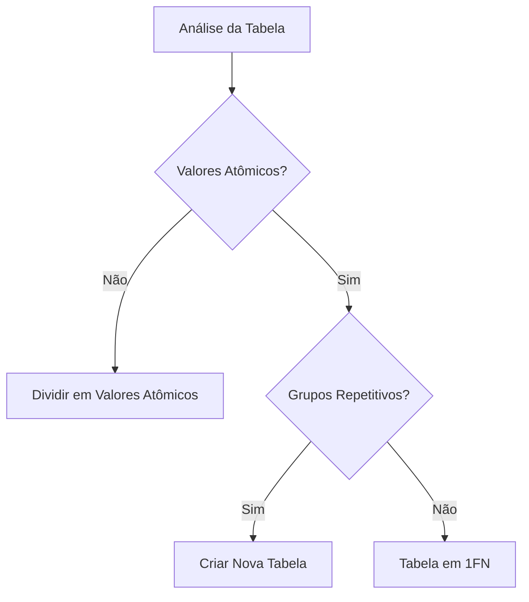

# Primeira Forma Normal (1FN)

## Definição

A Primeira Forma Normal (1FN) é o nível inicial de normalização de banco de dados que estabelece duas regras fundamentais:

1. Atomicidade dos valores
2. Eliminação de grupos repetitivos

## Regras Detalhadas

### 1. Atomicidade
- Cada coluna deve conter valores atômicos (indivisíveis)
- Não permitir múltiplos valores em uma única célula
- Não permitir arrays ou listas como valores

### 2. Grupos Repetitivos
- Eliminar colunas que contêm o mesmo tipo de informação
- Criar novas tabelas para grupos de dados repetitivos
- Estabelecer relacionamentos através de chaves

## Exemplos Práticos

### Exemplo 1: Dados de Contato

#### Violação da 1FN
```sql
-- Tabela não normalizada
Cliente(
    id INT,
    nome VARCHAR(100),
    telefones VARCHAR(200)  -- "999999999, 888888888"
)
```

#### Aplicação da 1FN
```sql
-- Tabelas normalizadas
Cliente(
    id INT PRIMARY KEY,
    nome VARCHAR(100)
)

Telefone(
    cliente_id INT,
    numero VARCHAR(20),
    FOREIGN KEY (cliente_id) REFERENCES Cliente(id)
)
```

### Exemplo 2: Endereços

#### Violação da 1FN
```sql
-- Tabela não normalizada
Funcionario(
    id INT,
    nome VARCHAR(100),
    endereco VARCHAR(500)  -- "Rua A, 123, São Paulo; Rua B, 456, Rio de Janeiro"
)
```

#### Aplicação da 1FN
```sql
-- Tabelas normalizadas
Funcionario(
    id INT PRIMARY KEY,
    nome VARCHAR(100)
)

Endereco(
    funcionario_id INT,
    rua VARCHAR(100),
    numero VARCHAR(10),
    cidade VARCHAR(100),
    FOREIGN KEY (funcionario_id) REFERENCES Funcionario(id)
)
```

## Processo de Normalização

### 1. Identificação de Violações


### 2. Passos para Normalização
1. Identificar colunas com múltiplos valores
2. Criar novas tabelas para dados repetitivos
3. Estabelecer relacionamentos
4. Validar atomicidade

## Benefícios

### 1. Integridade dos Dados
- Valores consistentes
- Busca facilitada
- Manipulação simplificada

### 2. Manutenção
- Atualizações mais simples
- Menor redundância
- Maior consistência

## Considerações Práticas

### 1. Performance
- Aumento no número de joins
- Mais tabelas para gerenciar
- Possível impacto em consultas complexas

### 2. Implementação
```sql
-- Exemplo de implementação prática
CREATE TABLE Cliente (
    id INT PRIMARY KEY,
    nome VARCHAR(100) NOT NULL
);

CREATE TABLE Telefone (
    id INT PRIMARY KEY,
    cliente_id INT NOT NULL,
    numero VARCHAR(20) NOT NULL,
    tipo VARCHAR(20),
    FOREIGN KEY (cliente_id) REFERENCES Cliente(id)
);

-- Inserção de dados
INSERT INTO Cliente (id, nome) VALUES (1, 'João Silva');

INSERT INTO Telefone (id, cliente_id, numero, tipo) VALUES
    (1, 1, '999999999', 'Celular'),
    (2, 1, '888888888', 'Residencial');
```

## Checklist de Validação

### 1. Verificação de Conformidade
- [ ] Todos os valores são atômicos?
- [ ] Não existem grupos repetitivos?
- [ ] Chaves primárias definidas?
- [ ] Relacionamentos estabelecidos?

### 2. Testes
- [ ] Inserção de dados
- [ ] Atualização de registros
- [ ] Exclusão de registros
- [ ] Consultas básicas

## Anti-Padrões Comuns

### 1. Violações Frequentes
```sql
-- Anti-padrão: Valores múltiplos em uma coluna
CREATE TABLE Produto (
    id INT PRIMARY KEY,
    nome VARCHAR(100),
    categorias VARCHAR(500)  -- "Eletrônicos, Informática, Acessórios"
);

-- Correção: Tabela separada para categorias
CREATE TABLE Categoria (
    produto_id INT,
    categoria VARCHAR(100),
    FOREIGN KEY (produto_id) REFERENCES Produto(id)
);
```

### 2. Soluções
- Identificar e corrigir valores não atômicos
- Normalizar grupos repetitivos
- Estabelecer relacionamentos adequados

## Conclusão

A Primeira Forma Normal é fundamental para:
- Garantir a integridade dos dados
- Facilitar a manutenção
- Estabelecer base para outras formas normais
- Promover boas práticas de modelagem

Deve ser aplicada considerando:
- Requisitos do sistema
- Necessidades de performance
- Complexidade aceitável
- Facilidade de manutenção